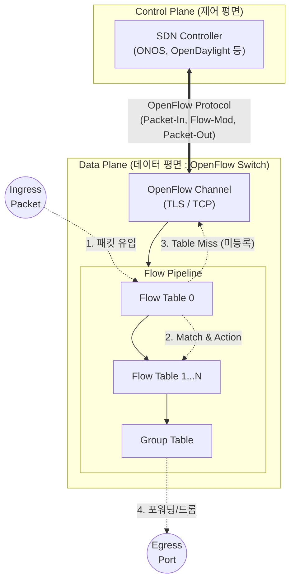

# OpenFlow

---

## I. 네트워크 제어와 전송의 분리, OpenFlow의 개요

### 가. OpenFlow의 정의

* [[SDN(Software Defined Network)|SDN]](Software Defined Networking) 아키텍처에서 논리적으로 중앙 집중화된 제어 평면(Control Plane)과 패킷을 전달하는 데이터 평면(Data Plane) 간의 통신을 제어하기 위한 개방형 표준 [[프로토콜]]
* 오픈 네트워킹 재단(ONF)에서 표준화하였으며, 스위치의 플로우 테이블(Flow Table)을 외부 컨트롤러가 직접 프로그래밍하여 패킷 전달 경로를 동적으로 제어하는 기술

### 나. OpenFlow의 등장배경 및 주요 특징

* **등장배경**: 기존 네트워크 장비의 폐쇄성(Vendor Lock-in) 극복, 클라우드 환경의 동적 트래픽 변화에 대응하기 위한 네트워크 유연성 및 민첩성 요구 증대
* **주요 특징**:
* **제어/데이터 평면 분리**: 라우팅 로직(Brain)과 포워딩 엔진(Brawn)의 분리
* **플로우(Flow) 기반 제어**: IP/[[MAC]] 단위가 아닌 패킷의 흐름(Flow) 단위의 세밀한 정책 적용
* **중앙 집중형 관리**: 글로벌 네트워크 뷰를 통한 트래픽 엔지니어링 최적화

---

## II. OpenFlow의 개념도 및 핵심 기술 요소

### 가. OpenFlow의 개념도 및 동작 원리

* SDN 컨트롤러가 OpenFlow 프로토콜(Flow-Mod 메시지)을 통해 스위치의 플로우 테이블을 동적으로 조작(추가/수정/삭제)하여 네트워크 전체의 패킷 흐름을 중앙 제어함.
* 미등록 패킷(Table Miss) 유입 시, Packet-In 메시지를 통해 컨트롤러에 정책을 질의함.

### 나. OpenFlow의 핵심 기술 및 구성 요소

| 구분 | 요소기술(키워드) | 세부 설명 |
| --- | --- | --- |
| **제어 주체** | **SDN Controller** | 네트워크 토폴로지를 수집하고 스위치의 라우팅 정책을 결정하는 논리적 중앙 제어기 |
| **전송 주체** | **OpenFlow Switch** | 컨트롤러의 명령(Flow Table)에 따라 패킷의 파싱, 매칭, 포워딩을 수행하는 데이터 평면 장비 |
| **정책 저장소** | **Flow Table** | 패킷 매칭 규칙(Match Fields)과 처리 지시(Action)의 목록을 저장하는 파이프라인 구조체 |
| **식별자** | **Match Fields** | Ingress Port, Ethernet MAC, [[IPv4]]/v6, [[TCP]]/UDP Port 등 패킷 헤더 기반의 다계층 매칭 조건 |
| **명령어** | **Action / Instruction** | 매칭된 패킷에 대한 구체적 처리 방법 (Forward, Drop, 헤더 Modify, 특정 포트 출력 등) |
| **통계 정보** | **Counters** | 특정 플로우(Flow)와 매칭된 패킷의 수, 바이트 수 등을 기록하여 트래픽 모니터링에 활용 |
| **보안 통신망** | **Secure Channel** | 컨트롤러와 [[스위치 (Layer 3 Switch)|스위치]] 간 제어 메시지를 안전하게 송수신하기 위한 [[암호화]] 채널 (TLS 지원) |
| **제어 메시지** | **Packet-In / Out** | 스위치가 모르는 패킷을 컨트롤러로 전송(In)하거나, 컨트롤러가 스위치를 통해 패킷을 방출(Out) |

---

## III. OpenFlow와 차세대 기술(P4) 비교 및 향후 전망

### 가. OpenFlow와 P4(Protocol-independent Packet Processors) 기술 비교

| 비교 항목 | OpenFlow (SDN 1.0) | P4 (차세대 Data Plane 프로그래밍) |
| --- | --- | --- |
| **설계 사상** | 프로토콜 종속적 제어 (정해진 헤더만 인식) | **프로토콜 독립적** 패킷 처리 정의 |
| **제어 대상** | 스위치 내장 **Flow Table의 엔트리 조작** | 데이터 평면의 **파서(Parser) 및 처리 로직 자체 컴파일** |
| **확장성** | 새로운 프로토콜(헤더) 추가 시 스위치 펌웨어 업데이트 필요 | 소프트웨어 컴파일러를 통해 **새로운 프로토콜 즉시 지원 가능** |
| **파이프라인** | 벤더가 하드웨어에 고정(Fixed)한 파이프라인 구조 | 개발자가 칩셋 레벨까지 유연하게 정의 가능 (Programmable) |
| **주요 활용** | 캠퍼스 망, 초기 데이터센터 SDN 환경 | SmartNIC 연동, [[클라우드 네이티브]] 초고속 라우팅(eBPF 결합) |

### 나. 최신 동향 및 산업 적용 방향

* **화이트박스(White-box) 생태계 정착**: OpenFlow는 벤더 종속적이었던 통신 장비 시장에 화이트박스 스위치와 오픈소스 NOS(Network Operating System) 도입을 촉발한 마중물 역할을 수행함.
* **데이터 평면의 프로그래머빌리티 진화**: 단순한 Flow Table 제어(OpenFlow)를 넘어, 칩셋 자체의 패킷 처리 방식을 재정의하는 **P4 프로그래밍 언어** 및 **DPU/SmartNIC** 중심으로 기술 패러다임이 전환됨.
* **클라우드 네이티브 네트워크 융합**: 최근에는 [[커널]] 레벨의 고속 패킷 처리를 위해 eBPF(extended BPF), Cilium 등과 결합하여 [[쿠버네티스]](Kubernetes) 환경의 CNI(Container Network Interface) 고도화 기술로 진화 중임.

---

### 🔗 연관 토픽

- **소속 도메인**: [[00_네트워크_MOC|🌐 네트워크]]
- **세부 분류**: `1. OSI 7계층 & 데이터링크 계층 (L1/L2)`
- **핵심 연관 토픽**:
  - [[SDN(Software Defined Network)]]
  - [[스위치 (Layer 3 Switch)]]
  - [[네트워크 계층|네트워크 계층 (Network Layer)]]
  - [[IPv4]]
  - [[Routing Protocol]]
