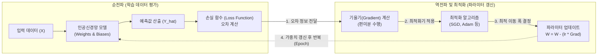

# 최적화 알고리즘 (Optimization Algorithm)

---

## I. AI 모델 성능 극대화의 핵심, 최적화 알고리즘의 개요

### 가. 최적화 알고리즘의 정의

* 기계학습 및 [[딥러닝]] 모델에서 손실 함수(Loss Function)의 결과값을 최소화(또는 보상 최대화)하기 위해 시스템의 파라미터(가중치, [[편향]])를 반복적으로 조정하여 최적해(Optimal Solution)를 탐색하는 수학적 [[알고리즘]]
* 다차원 데이터 공간에서 기울기(Gradient) 또는 휴리스틱(Heuristic)을 활용하여 글로벌 최소점(Global Minimum)으로 수렴하도록 유도하는 핵심 기법

### 나. 최적화 알고리즘의 필요성 및 특징

* **필요성**: 복잡한 비선형 문제에서 지역 최적해(Local Minima) 함정 탈피, 모델 학습 속도(Convergence Speed) 가속화 및 오버피팅(Overfitting) 방지
* **주요 특징**:
* **관성 적용 (Momentum)**: 과거의 가중치 업데이트 방향을 기억하여 학습의 안정성 확보
* **적응형 학습률 (Adaptive Learning Rate)**: 파라미터별 갱신 빈도에 따라 학습률(Step Size)을 동적으로 조절
* **탐험(Exploration)과 활용(Exploitation)의 균형**: 전역 최적해 탐색과 지역 최적해 정밀 탐색 간의 트레이드오프 조율

---

## II. 최적화 알고리즘의 개념도 및 핵심 기술 요소

### 가. 최적화 알고리즘의 개념도 및 동작 원리

* 순전파를 통해 예측값과 정답 간의 오차(Loss)를 계산한 후, [[역전파]] 과정에서 최적화 알고리즘이 손실 함수의 기울기를 역방향으로 추적하여 가중치를 최적의 값으로 갱신함

### 나. 최적화 알고리즘의 핵심 기술 요소

| 구분 | 요소기술(키워드) | 세부 설명 |
| --- | --- | --- |
| **1차 미분(기울기)** | **SGD** (확률적 경사 하강법) | 전체 데이터가 아닌 미니배치(Mini-batch) 단위로 기울기를 계산하여 파라미터를 빈번하고 빠르게 업데이트하는 알고리즘 |
| **방향(Step) 제어** | **Momentum** (모멘텀) | 현재 기울기뿐만 아니라 과거의 이동 방향(관성)을 누적 반영하여, 지그재그 현상을 줄이고 Local Minima를 탈피함 |
| **보폭(Size) 제어** | **AdaGrad / RMSProp** | 변수별로 업데이트 빈도를 기록하여 자주 변하는 가중치는 학습률을 작게, 적게 변하는 가중치는 학습률을 크게 자동 조절함 |
| **통합형 알고리즘** | **Adam** (Adaptive Moment) | Momentum(방향 제어)과 RMSProp(보폭 제어)의 장점을 결합한 현대 딥러닝의 표준 1차 미분 최적화 기법 |
| **2차 미분 기반** | **Newton's Method** | 함수의 1차 미분(Gradient)과 2차 미분(Hessian) 행렬을 동시에 활용하여 곡률을 반영, 수렴 속도를 극대화하는 기법 |
| **비미분 / 전역탐색** | **Metaheuristic** (메타휴리스틱) | [[유전 알고리즘]](GA), 입자 군집 최적화(PSO) 등 자연 생태계에서 영감을 얻어 미분 불가능한 공간의 최적해를 확률적으로 탐색함 |
| **핵심 하이퍼파라미터** | **Learning Rate** (학습률) | 최적점(Minimum)으로 다가가는 이동 보폭의 크기로, 너무 크면 발산하고 너무 작으면 수렴 속도가 저하됨 |
| **학습 안정화** | **Weight Decay** (가중치 감쇠) | 파라미터 값이 과도하게 커지는 것을 방지하기 위해 손실 함수에 페널티(L2 정규화 등)를 부여하여 [[일반화]](Generalization) 성능 향상 |

---

## III. 최적화 알고리즘의 비교 및 최신 발전 동향

### 가. 주요 딥러닝 최적화 알고리즘 진화 계보 비교

| 알고리즘 | 개선 방향 (Focus) | 장점 및 주요 특징 | 단점 및 한계점 |
| --- | --- | --- | --- |
| **SGD** | 기본 미니배치 적용 | 메모리 효율성 및 계산 속도 우수 | 학습 방향이 불안정(지그재그 현상) |
| **Momentum** | **스텝 방향(관성)** 유지 | 지역 최적해(Local Minima) 탈피 용이 | 스텝 사이즈(학습률)는 고정되어 있음 |
| **RMSProp** | **스텝 사이즈(학습률)** 적응 | AdaGrad의 단점(학습률 0으로 수렴) 해결 | 모든 파라미터에 동일한 관성 적용 |
| **Adam** | **방향(Momentum) + 보폭(RMSProp)** | 딥러닝 모델의 디팩토 표준(Defacto Standard) | L2 정규화(Weight Decay) 적용 시 구조적 오류 발생 |

### 나. 최신 최적화 알고리즘 발전 동향 및 산업 적용

* **AdamW (Adam + Weight Decay 분리)**: 기존 Adam이 L2 정규화를 계산할 때 발생하는 오류를 수정하여 가중치 감쇠 식을 독립적으로 적용, [[트랜스포머|트랜스포머(Transformer)]] 및 [[초거대 언어 모델|LLM]] 학습의 표준으로 자리매김
* **대규모 분산 학습 최적화 (LARS / LAMB)**: 초거대 AI 모델 학습 시 훈련 시간을 단축하기 위해 배치 크기(Batch Size)를 극단적으로 늘릴 때 발생하는 일반화 성능 저하를 방지하는 계층별 적응형 학습률 스케일링 기법 적용
* **2차 미분 근사 최적화 (Sophia)**: 거대 언어 모델(LLM) 사전 학습을 위해 스탠포드대에서 제안(2023)된 방식으로, 헤시안(Hessian) 대각 성분을 근사하여 추정함으로써 기존 Adam 대비 약 2배 빠른 학습 속도와 적은 컴퓨팅 자원 소모 달성

---

### 🔗 연관 토픽

- **소속 도메인**: [[00_인공지능_MOC|🤖 인공지능]]
- **세부 분류**: `1. 수학 · 통계학 & 데이터 전처리`
- **핵심 연관 토픽**:
  - [[딥러닝]]
  - [[편향]]
  - [[역전파|역전파(Backpropagation)]]
  - [[트랜스포머|트랜스포머(Transformer)]]
  - [[알고리즘]]
