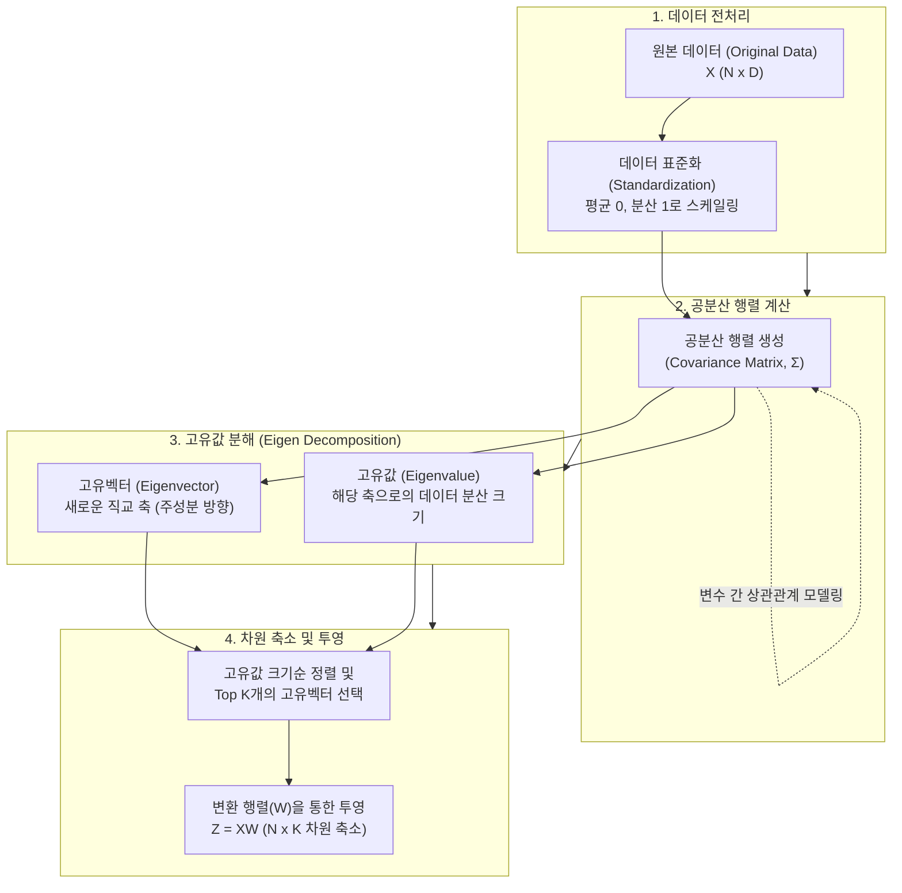

# PCA (Principal Component Analysis)

---

## I. 고차원 데이터의 정보 손실 최소화, PCA의 개요

### 가. PCA(주성분 분석)의 정의

* 고차원 데이터의 변수들을 선형 결합하여, 원본 데이터의 분산(Variance)을 최대한 보존하는 서로 직교하는 새로운 축(주성분)으로 데이터를 투영하여 차원을 축소하는 [[비지도 학습]] [[알고리즘]]
* 데이터의 상관관계를 나타내는 공분산 행렬(Covariance Matrix)의 고유값 분해(Eigen Decomposition)를 통해 고유벡터와 고유값을 도출하는 수학적 기법

### 나. PCA의 필요성 및 주요 특징

* **차원의 저주(Curse of Dimensionality) 해결**: 학습 데이터 공간의 희소성 문제 극복 및 연산량(Overfitting) 감소
* **[[다중공선성]](Multicollinearity) 제거**: 서로 직교하는(상관관계가 없는) 주성분을 도출하여 회귀 모델의 안정성 확보
* **정보 손실 최소화**: 가장 큰 분산을 가지는 축(PC1)부터 순차적으로 채택하여 원본 데이터의 특성을 최대한 보존

---

## II. PCA의 개념도 및 핵심 기술 요소

### 가. PCA의 수학적 도출 프로세스 및 동작 원리

* 원본 데이터의 공분산 행렬을 고유값 분해하여, 가장 분산을 크게 설명하는(고유값이 큰) 고유벡터 K개를 선별해 저차원 공간으로 데이터를 투영함

### 나. PCA의 핵심 구성 요소 및 기술

| 분류 | 요소기술(키워드) | 세부 설명 |
| --- | --- | --- |
| **수학적 기반** | **공분산 행렬 (Covariance Matrix)** | 다차원 데이터의 각 변수 쌍 간의 선형적 상관관계 및 분산 정도를 나타내는 정방 대칭 행렬 |
| **수학적 기반** | **고유값 분해 (Eigen Decomposition)** | 정방 행렬을 고유벡터와 고유값의 곱으로 분해하는 선형대수학 기법 ($Av = \lambda v$) |
| **변환 기준** | **고유벡터 (Eigenvector)** | 공분산 행렬에 의해 선형 변환될 때 방향이 변하지 않는 벡터로, 새로운 차원의 **주성분 축(방향)** |
| **변환 기준** | **고유값 (Eigenvalue)** | 각 고유벡터 방향으로 투영된 데이터의 **분산 크기(설명력)** 를 의미하며, 주성분의 중요도 척도 |
| **선택 지표** | **누적 기여율 (Cumulative Variance)** | 전체 고유값 합 대비 선택된 K개의 고유값 합의 비율로, 보통 80~90% 수준에서 절단(Truncation) |
| **[[데이터 전처리]]** | **표준화 (Standardization)** | 특정 변수의 스케일(Scale)이 전체 분산 계산을 왜곡하지 않도록 평균 0, 표준편차 1로 영점 조절 |
| **투영 기법** | **선형 결합 (Linear Combination)** | 기존 특징(Feature)들의 수치적 조합(가중합)을 통해 완전히 새로운 차원의 축(PC)을 생성하는 방식 |
| **대안 알고리즘** | **[[SVD(Singular Value Decomposition)|SVD]] (특이값 분해)** | 정방 행렬이 아닌 직사각형 행렬(M x N)에서도 차원 축소를 수행할 수 있는 선형대수 기법 (PCA 구현에 활용) |

---

## III. PCA와 주요 차원 축소 알고리즘(LDA) 비교 및 향후 전망

### 가. 대표적 차원 축소 기법 PCA와 LDA 비교

| 비교 항목 | PCA (Principal Component Analysis) | LDA ([[LDA(Linear Discriminant Analysis)|Linear Discriminant Analysis]]) |
| --- | --- | --- |
| **주요 목적** | 데이터 전체의 **분산(Variance) 최대화** | 데이터의 **분류(Classification) 성능 최대화** |
| **학습 방식** | **비지도 학습 (Unsupervised)** / 레이블 불필요 | **지도 학습 (Supervised)** / 레이블(Y) 필요 |
| **투영 기준** | 데이터 흩어짐이 가장 큰 축(직교 축) 탐색 | [[클래스]] 간 분산(Between) 최대화, 클래스 내 분산(Within) 최소화 |
| **활용 분야** | 노이즈 제거, 데이터 압축, 다중공선성 해결 | 이미지 인식(얼굴 인식), 텍스트 분류 등 데이터 분리 목적 |
| **주요 한계점** | 클래스 정보를 고려하지 않아 분류 문제에 취약 | [[정규분포]] 가정이 필요하며 비선형 분리에 취약 |

### 나. PCA의 최신 트렌드 및 향후 전망

* **비선형 차원 축소로의 진화**: 기존 선형 기반 PCA의 한계를 극복하기 위해, 커널 트릭([[커널|Kernel]] Trick)을 활용한 **Kernel PCA** 및 다양체 학습(Manifold Learning) 기반의 **t-SNE, UMAP, AutoEncoder** 등 [[딥러닝]]/비선형 [[차원 축소]] 알고리즘과 상호 보완적으로 활용됨
* **고차원 정형 데이터 전처리 표준**: 정형 데이터 분석 시 트리가 아닌 선형 회귀, [[서포트 벡터 머신|SVM]], KNN 모델 등을 사용할 때 다중공선성을 제거하고 모델의 강건성(Robustness)을 확보하기 위한 필수 파이프라인으로 지속 확산

---

### 🔗 연관 토픽

- **소속 도메인**: [[00_인공지능_MOC|🤖 인공지능]]
- **세부 분류**: `1. 수학 · 통계학 & 데이터 전처리`
- **핵심 연관 토픽**:
  - [[차원 축소|차원 축소(Dimensionality Reduction)]]
  - [[비지도 학습]]
  - [[다중공선성|다중공선성 (Multicolinearity)]]
  - [[SVD(Singular Value Decomposition)]]
  - [[데이터 전처리]]
