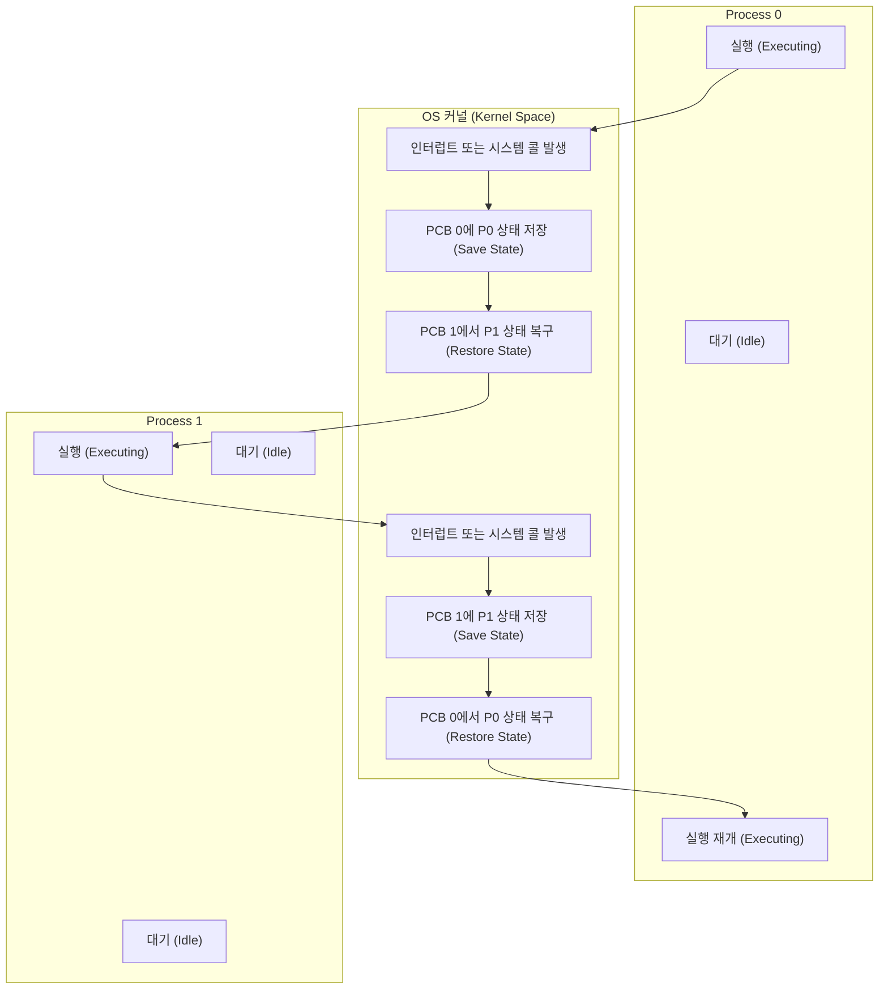

# PCB (Process Control Block)

---

## I. 프로세스 상태 정보 저장을 위한 핵심 자료구조, PCB의 개요

* **정의**: [[OS(운영체제)|운영체제]](OS)가 다중 프로그래밍 환경에서 프로세스의 제어 및 관리를 위해 필요한 모든 상태 정보와 문맥(Context)을 저장하는 [[커널]] 메모리 내의 핵심 자료구조
* **등장 배경 및 필요성**:
* 다중 [[프로세스]] 동시 실행 시, 시분할 처리를 위한 프로세스 [[문맥 교환]](Context Switching) 요구 증대
* [[CPU]]를 점유하다가 빼앗긴 후 다시 할당받았을 때, 이전의 작업 상태를 정확히 복원하고 재개하기 위한 정보 저장소 필요

* **특징**: 프로세스 생성 시 커널 주소 공간에 고유하게 생성되며 종료 시 소멸(Lifecycle 동기화), 연결 리스트(Linked List) 방식으로 [[스케줄링]] 큐([[Queue]])와 연동되어 관리됨

---

## II. PCB의 논리적 구조 및 핵심 구성요소

### 가. PCB 기반의 문맥 교환(Context Switching) 동작 원리

* 실행 중인 프로세스에서 [[인터럽트]] 발생 시, 현재 CPU 레지스터 값 등을 해당 프로세스의 PCB에 안전하게 저장(Save)함.
* 이후 스케줄러가 선택한 다음 프로세스의 PCB에서 정보를 읽어와 CPU에 적재(Restore)하여 실행의 연속성을 보장함.

### 나. PCB의 핵심 구성 요소

| 분류 | 요소기술(키워드) | 세부 설명 |
| --- | --- | --- |
| **식별 정보** | PID (Process ID) | 운영체제 내에서 각 프로세스를 고유하게 식별하기 위한 정수형 식별 번호 |
| **상태 정보** | Process State | 프로세스의 현재 주기 상태 (New, Ready, Running, Waiting/Blocked, Terminated) |
| **제어 흐름** | Program Counter (PC) | 해당 프로세스가 다음에 실행해야 할 명령어(Instruction)의 메모리 주소 |
| **연산 상태** | CPU Registers | 누산기(Accumulator), 인덱스 레지스터, 스택 포인터 등 문맥 교환 시 보존해야 할 레지스터 값 |
| **스케줄링** | Scheduling Information | 프로세스의 우선순위(Priority), 스케줄링 큐(Queue)를 가리키는 포인터 및 스케줄링 매개변수 |
| **[[메모리 관리]]** | Memory Mgmt Info | Base / Limit 레지스터 값, 페이지 테이블(Page Table) 또는 세그먼트 테이블 포인터 |
| **회계 정보** | Accounting Info | CPU 사용 시간, 실제 사용된 시간, 시간 제한, 프로세스 계정 번호 등 자원 사용 통계 |
| **입출력 정보** | I/O Status Info | 프로세스에 할당된 입출력 장치 목록 및 열려 있는 파일(Open File Descriptors) 목록 |

---

## III. PCB와 TCB 비교 및 최신 운영체제 적용 동향

### 가. 프로세스 문맥과 스레드 문맥 비교 (PCB vs TCB)

| 비교 항목 | PCB (Process Control Block) | TCB (Thread Control Block) |
| --- | --- | --- |
| **관리 단위** | 프로세스 (독립된 실행 주체) | 스레드 (프로세스 내의 경량화된 실행 흐름) |
| **주요 저장 정보** | 메모리 주소 공간, 파일 디스크립터, 전역 변수 | PC (프로그램 카운터), 레지스터 상태, 스레드 스택 |
| **메모리 공유 여부** | 다른 PCB와 메모리 공간 철저히 분리 (보안/격리) | 동일 프로세스 내 TCB 간 Code/Data/Heap 영역 공유 |
| **문맥 교환 오버헤드** | **매우 큼** ([[캐시 플러시]], [[MMU(Memory Management Unit)|MMU]]/TLB 갱신 등 발생) | **매우 작음** (동일 메모리 공간 사용으로 레지스터만 교체) |
| **스케줄링 영향도** | 독립적인 자원 할당의 최소 단위 | 현대 CPU 스케줄링 및 디스패치의 실질적 최소 단위 |

### 나. 최신 운영체제의 PCB 관리 및 최적화 동향

* **통합 태스크 관리 (Linux task_struct)**: 최신 리눅스 커널은 프로세스와 스레드를 엄격히 구분하지 않고 **태스크(Task)** 개념으로 통합하여 `task_struct`라는 단일 자료구조로 관리함.
* **리소스 공유 기반 경량화 (clone 시스템 콜)**: 새로운 실행 흐름 생성 시 `clone()` 플래그(`CLONE_VM`, `CLONE_FILES` 등)를 통해 부모 태스크의 메모리나 파일 디스크립터를 복사하지 않고 포인터로 공유하게 하여, PCB 생성 및 문맥 교환 비용을 극적으로 최소화하는 방향으로 진화하고 있음.

---

### 🔗 연관 토픽

- **소속 도메인**: [[00_운영체제_MOC|⚙️ 운영체제]]
- **세부 분류**: `1. 프로세스 & 스레드 관리`
- **핵심 연관 토픽**:
  - [[프로세스]]
  - [[인터럽트|인터럽트 (Interrupt)]]
  - [[문맥 교환|문맥 교환 (Context Switching)]]
  - [[커널|커널(Kernel)]]
  - [[OS(운영체제)]]
