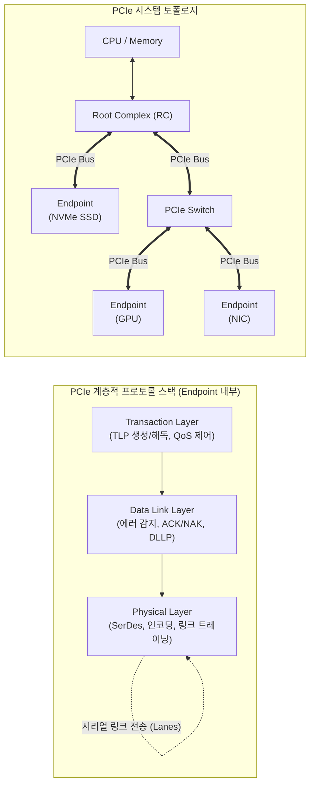

# PCI Express (PCIe)

---

## I. 고속 직렬 점대점 인터페이스, PCI Express의 개요

* **정의**: 기존 PCI/AGP 병렬 버스의 대역폭 한계와 신호 간섭 문제를 극복하기 위해 도입된, 레인(Lane) 기반의 패킷 전송을 수행하는 고속 직렬 점대점([[Point-to-Point]]) 확장 버스 표준 인터페이스
* **등장 배경 및 필요성**:
* 병렬 버스의 클럭 동기화 한계(Skew) 및 선로 간 간섭(Crosstalk) 문제로 인한 속도 향상 한계 직면
* 고성능 그래픽 카드([[GPU]]), 초고속 스토리지(NVMe) 등의 등장으로 막대한 데이터 대역폭 요구 증가

* **특징**: 점대점 토폴로지 구성, 전이중(Full-Duplex) 시리얼 통신, 레인(x1, x4, x8, x16) 배수를 통한 유연한 대역폭 확장성, 기존 PCI/PCI-X 소프트웨어와의 완벽한 하위 호환성 보장

---

## II. PCI Express의 아키텍처 및 핵심 기술 요소

### 가. PCI Express의 개념도 및 프로토콜 스택 동작 원리

* **토폴로지**: Root Complex를 중심으로 Switch를 통해 여러 Endpoint 디바이스들이 점대점(Point-to-Point) 방식으로 트리 구조를 형성하여 통신함.
* **동작 원리**: 데이터는 [[트랜잭션]] 계층에서 패킷화(TLP)되고, 데이터 링크 계층에서 [[신뢰성]]([[CRC]], 재전송)이 부여되며, 물리 계층에서 직렬 신호로 인코딩되어 레인(Lane)을 통해 전송됨.

### 나. PCI Express의 핵심 구성 및 기술 요소

| 분류 | 요소기술(키워드) | 세부 설명 |
| --- | --- | --- |
| **핵심 컴포넌트** | Root Complex (RC) | [[CPU]]와 메모리 서브시스템을 PCIe 패브릭에 연결하여 트랜잭션을 주도하는 최상위 인터페이스 |
| **핵심 컴포넌트** | Switch | 다수의 Endpoint 디바이스를 연결하기 위해 패킷을 라우팅하고 포워딩하는 확장 장치 |
| **핵심 컴포넌트** | Endpoint (EP) | 실제 PCIe 버스에 연결되어 기능을 수행하는 최종 I/O 디바이스 (GPU, NVMe, NIC 등) |
| **물리 계층** | Lane (레인) | 1개의 송신 쌍(TX, 2가닥)과 1개의 수신 쌍(RX, 2가닥)으로 구성된 기본 직렬 통신 채널 |
| **물리 계층** | 인코딩 기법 | 데이터 복원을 위해 8b/10b(PCIe 1.0~~2.0), 128b/130b(PCIe 3.0~~5.0), PAM4(PCIe 6.0~) 적용 |
| **데이터링크 계층** | DLLP & CRC | Data Link Layer Packet을 통한 링크 관리 및 Cyclic Redundancy Check 기반 오류 검출 |
| **트랜잭션 계층** | TLP (트랜잭션 패킷) | Memory, I/O, Configuration, Message 등 4가지 유형의 트랜잭션을 정의하고 페이로드 운반 |
| **성능/확장성** | Hot-Plug & [[QoS]] | 시스템 가동 중 장치 탈부착(Hot-Plug) 지원 및 트래픽 [[클래스]](TC) 기반 서비스 품질(QoS) 보장 |

---

## III. PCI Express의 세대별 진화 및 향후 전망

### 가. PCIe 세대별 주요 스펙 및 기술 변화 비교

| 비교 항목 | PCIe 4.0 | PCIe 5.0 | PCIe 6.0 |
| --- | --- | --- | --- |
| **출시 연도** | 2017년 | 2019년 | 2022년 |
| **전송 속도 (Lane당)** | 16 GT/s (초당 기가 트랜스퍼) | 32 GT/s | **64 GT/s** |
| **대역폭 (x16 기준)** | 64 GB/s | 128 GB/s | **256 GB/s** |
| **인코딩 방식** | 128b/130b (NRZ) | 128b/130b (NRZ) | **PAM4 (Pulse Amplitude Mod.)** |
| **오류 정정 기술** | CRC 및 재전송 의존 | CRC 및 재전송 의존 | **FEC (Forward Error Correction) 도입** |

### 나. 향후 발전 동향 및 활용 전망

* **PAM4 및 FEC 기술 안착**: PCIe 6.0부터 도입된 4레벨 펄스 진폭 변조(PAM4)를 통해 클럭 속도를 높이지 않고도 대역폭을 2배로 확장하였으며, 신호 [[무결성]] 보장을 위해 전방 오류 정정(FEC) 기술이 필수적으로 적용됨. (PCIe 7.0에서도 128 GT/s 달성을 위해 지속 채택)
* **[[CXL]] (Compute Express Link)의 근간 기술**: AI, 머신러닝, 인메모리 컴퓨팅 환경에서 이기종 프로세서(CPU, GPU, [[NPU]]) 간 메모리 공유 및 [[캐시 일관성]](Cache Coherency)을 제공하는 CXL 프로토콜의 물리적 연결 기반 기술로 그 중요성이 더욱 확대되고 있음.

---

### 🔗 연관 토픽

- **소속 도메인**: [[00_컴퓨터구조_MOC|💻 컴퓨터구조]]
- **세부 분류**: `3. 고성능 AI 가속기 & 입출력 시스템`
- **핵심 연관 토픽**:
  - [[Point-to-Point]]
  - [[CXL|CXL (Compute Express Link)]]
  - [[캐시 일관성|캐시 일관성(Cache Coherence)]]
  - [[CPU]]
  - [[GPU]]
