# PCM (Pulse-Code Modulation)

---

## I. 아날로그 신호의 디지털 변환 핵심 기술, PCM의 개요

* **정의**: 연속적인 시간과 진폭을 가진 아날로그 신호를 일정한 주기로 표본화(Sampling)하고, 진폭을 이산적인 값으로 양자화(Quantization)한 후, 0과 1의 2진 비트 스트림으로 부호화(Encoding)하는 디지털 변조 기술
* **등장 배경 및 필요성**:
* 통신망의 디지털화에 따라 아날로그 음성/영상 신호를 디지털 네트워크에서 전송하고 처리하기 위한 표준 규격 필요
* 아날로그 전송 시 발생하는 누적 잡음 문제를 해결하고, [[다중화]](TDM) 및 암호화를 통한 전송 효율 및 보안성 확보

* **특징**: 재생 중계(Regenerative Repeat)를 통한 잡음 내성 우수, 데이터의 저장 및 처리 용이, 대역폭 소모가 상대적으로 큼

---

## II. PCM의 동작 원리 및 핵심 기술 요소

### 가. PCM의 동작 원리 및 아키텍처

```mermaid
flowchart LR
    subgraph 송신부_AD변환 ["송신부 (A/D 변환 과정)"]
        direction LR
        Analog["아날로그 신호<br/>(음성, 영상)"]
        LPF["LPF<br/>(대역제한)"]
        Sampling["표본화<br/>(Sampling)"]
        Quantization["양자화<br/>(Quantization)"]
        Encoding["부호화<br/>(Encoding)"]
        
        Analog --> LPF --> Sampling --> Quantization --> Encoding
    end
    
    subgraph 전송로 ["전송 채널 (Transmission)"]
        direction LR
        Regenerator["재생 중계기<br/>(3R 기능)"]
    end
    
    subgraph 수신부_DA변환 ["수신부 (D/A 변환 과정)"]
        direction LR
        Decoding["복호화<br/>(Decoding)"]
        Reconstruct["재구성 필터<br/>(LPF)"]
        Output["아날로그 신호<br/>(복원)"]
        
        Decoding --> Reconstruct --> Output
    end
    
    Encoding == "디지털 펄스열<br/>(010011...)" ==> Regenerator
    Regenerator == "복원된 펄스열" ==> Decoding

```

* 아날로그 신호를 나이퀴스트 정리에 따라 표본화하여 PAM(Pulse Amplitude Modulation) 신호를 생성함.
* 생성된 PAM 신호의 진폭을 유한한 단계로 양자화한 뒤, 각 단계를 디지털 비트열로 부호화하여 전송함.

### 나. PCM의 핵심 기술 및 구성 요소

| 구분 | 요소기술(키워드) | 세부 설명 |
| --- | --- | --- |
| **전처리** | LPF (저역 통과 필터) | 표본화 전 최고 주파수를 제한하여, 신호 복원 시 발생하는 **에일리어싱(Aliasing)** 현상 원천 방지 |
| **변환 1단계** | 표본화 (Sampling) | 연속 신호를 일정 시간 간격으로 추출, **나이퀴스트 정리($f_s \geq 2f_m$)** 준수 필수 |
| **변환 2단계** | 양자화 (Quantization) | 표본화된 펄스의 진폭을 가장 가까운 이산적 레벨로 반올림, 이 과정에서 **양자화 잡음(Error)** 발생 |
| **변환 3단계** | 부호화 (Encoding) | 양자화된 이산값을 컴퓨터와 통신망이 처리할 수 있는 2진수 디지털 코드(비트 스트림)로 변환 |
| **신호 보정** | 비선형 양자화 (압신) | 작은 신호에는 조밀하게, 큰 신호에는 엉성하게 양자화 스텝을 부여(Companding)하여 S/N비 개선 |
| **전송/중계** | 3R 재생 중계 | 감쇠 및 왜곡된 펄스를 복원하는 **Reshaping, Retiming, Regeneration** 과정을 통해 전송 품질 유지 |
| **다중화** | TDM (시분할 다중화) | 여러 PCM 신호를 시간을 분할하여 하나의 고속 전송로를 통해 교대로 전송하는 다중화 기법 |
| **복원** | 표본화 정리 역산 | 수신부에서 복호화된 신호를 재구성 필터(Smoothing Filter)에 통과시켜 원래의 아날로그 신호로 평활화 |

---

## III. PCM 계열 변조 방식 비교 및 발전 동향

### 가. 대역폭 및 압축 효율에 따른 PCM 계열 변조 방식 비교

| 비교 항목 | PCM (Pulse-Code Modulation) | DPCM (Differential PCM) | ADPCM (Adaptive Differential PCM) |
| --- | --- | --- | --- |
| **변조 방식** | 신호의 절대적인 진폭 값을 있는 그대로 양자화 | **이전 표본값과 현재 표본값의 차이(예측 오차)**만 양자화 | 신호의 특성에 따라 **양자화 계단(Step) 크기를 동적응적(Adaptive)으로 조절** |
| **데이터 전송률** | 높음 (전송 대역폭 큼, 예: 64kbps) | 중간 (PCM 대비 대역폭 절감) | 낮음 (예: 32kbps, 대역폭 효율 극대화) |
| **구현 복잡도** | 단순함 | 비교적 복잡함 | 매우 복잡함 |
| **양자화 잡음** | 일정한 스텝으로 인한 고정적 잡음 | 입력 신호 급변 시 과부하 잡음 발생 가능 | 신호 크기에 적응하므로 잡음 억제 우수 |

### 나. 한계 극복 및 발전 동향

* **대역폭 한계 극복**: 기본 PCM은 64kbps(음성 기준)의 비교적 넓은 대역폭을 요구하므로, 전송 효율을 극대화하기 위해 차동(Differential) 및 적응형(Adaptive) 예측 알고리즘이 결합된 ADPCM, CELP 등의 고효율 음성 코덱으로 진화함.
* **초고음질(High-Res) 오디오 전송**: 네트워크 대역폭이 비약적으로 발전함에 따라, 스튜디오 마스터링 수준의 고음질을 보존하기 위해 표본화율(192kHz 이상)과 양자화 비트 심도(24-bit, 32-bit)를 극대화한 LPCM(Linear PCM) 포맷이 고급 오디오 및 미디어 스트리밍 환경의 표준으로 자리매김하고 있음.

---

### 🔗 연관 토픽

- **소속 도메인**: [[00_네트워크_MOC|🌐 네트워크]]
- **세부 분류**: `3. 전송 계층 & 트래픽 / 혼잡 제어 (L4)`
- **핵심 연관 토픽**:
  - [[다중화|다중화(Multiplexing)]]
  - [[QoS|QoS (Quality of Service)]]
  - [[혼잡 제어]]
  - [[Wi-Fi 7|WI-FI 7 (IEEE 802.11be)]]
  - [[CDN|CDN(Contents Delivery Network)]]
