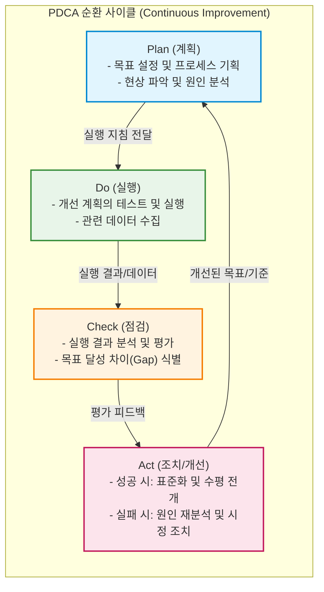

# PDCA (Plan-Do-Check-Act, Deming Cycle)

---

## I. 지속적 품질 개선 및 관리 체계의 근간, PDCA의 개요

* **정의**: [[프로세스]] 및 제품의 지속적인 개선을 위해 계획(Plan), 실행(Do), 점검(Check), 조치(Act)의 4단계를 반복적으로 수행하는 논리적이고 체계적인 품질 관리 및 문제 해결 [[프레임워크]]
* **등장 배경 및 필요성**:
* 미국의 통계학자 월터 슈하트(Walter Shewhart)가 창안하고, 에드워즈 데밍(W. Edwards Deming)이 대중화하여 '데밍 사이클(Deming Cycle)'로 명명됨
* 일회성 문제 해결에 그치지 않고, 업무 프로세스를 지속적으로 상향 표준화(Spiral-up)하기 위한 체계적인 피드백 루프 요구 증대

* **특징**:
* **반복성(Iteration)**: 한 번의 사이클로 끝나지 않고 끊임없이 반복하며 목표 수준을 높여가는 나선형 상향 진화
* **표준화(Standardization)**: 성공적인 개선 사항을 조직의 표준 프로세스로 내재화하여 성과 퇴보 방지
* **범용성**: 제조업의 TQM(전사적 품질경영)을 넘어, 현재는 ISO 9001/27001, ITIL([[ITSM(Information Technology Service Management)|ITSM]]), [[ISMS-P]] 등 거의 모든 IT 관리 및 보안 인증 체계의 핵심 동작 원리로 채택됨

---

## II. PDCA의 아키텍처 및 핵심 구성요소

### 가. PDCA 사이클의 동작 메커니즘 및 개념도

* 사이클이 한 바퀴 돌 때마다 프로세스의 품질 수준이 향상되며, Act 단계에서의 '표준화(Standardization)'가 받침대 역할을 하여 품질이 다시 떨어지는 것을 방지함 (이를 SDCA: Standardize-Do-Check-Act 로 부르기도 함).

### 나. PDCA의 단계별 핵심 활동 및 구성 요소

| 분류 | 요소기술(키워드) | 세부 설명 |
| --- | --- | --- |
| **Plan (계획)** | 목표 설정 (Goal Setting) | 조직의 비전이나 고객의 요구사항([[SLA]] 등)에 부합하는 명확하고 측정 가능한(SMART) 목표 수립 |
| **Plan (계획)** | 근본 원인 분석 (RCA) | 5-Whys, 피시본(Fishbone) 다이어그램 등을 활용하여 현재 문제의 근본 원인 도출 및 개선안 기획 |
| **Do (실행)** | 파일럿 테스트 (Pilot) | 전면 도입에 앞서 소규모의 통제된 환경(부서, 특정 라인)에서 기획된 프로세스를 우선 적용 |
| **Do (실행)** | 교육 및 훈련 (Training) | 새로운 프로세스가 계획대로 실행될 수 있도록 실무자들에게 필요한 교육과 자원 제공 |
| **Check (점검)** | 성과 측정 (Measurement) | KPI(핵심 성과 지표)를 기반으로 실행 결과를 정량적으로 측정하고 계획 수립 시점의 목표치와 비교 |
| **Check (점검)** | 차이 분석 (Gap Analysis) | 목표와 실제 결과 간의 차이(Variance)를 식별하고, 기대한 효과가 발생하지 않은 이유를 추적 |
| **Act (조치)** | 시정 조치 (Corrective Action) | 기대 성과에 미달한 경우, 문제점을 수정하고 보안하여 다음 Plan 단계의 입력 값으로 전달 |
| **Act (조치)** | 표준화 및 횡전개 (Roll-out) | 개선 효과가 검증된 경우, 이를 새로운 업무 표준(Standard)으로 제정하고 전사적으로 확산 적용 |

---

## III. 유사 관리 프레임워크 비교 및 IT 환경에서의 적용 동향

### 가. 지속적 개선 프레임워크 비교 (PDCA vs DMAIC vs OODA)

| 비교 항목 | PDCA (Deming Cycle) | DMAIC (Six Sigma) | OODA Loop ([[Agile]]/Military) |
| --- | --- | --- | --- |
| **주요 적용 분야** | ISO 인증, ITIL, 일반 경영 및 품질 관리 | 식스시그마, 대규모 프로세스 최적화 | 애자일(Agile) 조직, 군사/사이버 방어 |
| **핵심 목적** | 프로세스의 지속적이고 안정적인 품질 개선 | 통계적 데이터 기반의 불량률 최소화 및 낭비 제거 | 불확실하고 급변하는 환경에서의 신속한 의사결정 |
| **세부 단계** | Plan $\rightarrow$ Do $\rightarrow$ Check $\rightarrow$ Act | Define $\rightarrow$ Measure $\rightarrow$ Analyze $\rightarrow$ Improve $\rightarrow$ Control | Observe $\rightarrow$ Orient $\rightarrow$ Decide $\rightarrow$ Act |
| **접근 방식** | 반복적인 피드백 루프 (관리 중심) | 정량적 측정과 철저한 통계적 검증 (데이터 중심) | 상황 인식과 적응의 속도전 (민첩성 중심) |

### 나. IT 및 소프트웨어 공학에서의 발전 동향

* **Agile 및 [[DevOps]] CI/CD와의 융합**: 소프트웨어 개발 생명주기([[SDLC]])에서 PDCA는 애자일 스프린트(Sprint)의 근간이 됨. 계획(Plan)하고 개발(Do)한 뒤, 자동화된 테스트(Check)를 거쳐 배포 및 회고(Act)하는 **CI/CD 파이프라인 자체가 고속화된 기술적 PDCA 사이클**로 구현되고 있음.
* **정보보호 관리체계(ISMS-P)의 핵심 아키텍처**: 조직의 주요 정보자산을 보호하기 위한 ISMS-P 및 ISO 27001 인증은 보안 정책 수립(P), 보안 대책 구현(D), 내부 감사 및 모니터링(C), 경영진 검토 및 개선(A)의 순환 구조를 법적·제도적으로 의무화하고 있음.

---

### 🔗 연관 토픽

- **소속 도메인**: [[00_경영전략_MOC|📈 경영전략]]
- **세부 분류**: `5. IT 투자 성과 평가 & 비즈니스 연속성 계획 (BCP)`
- **핵심 연관 토픽**:
  - [[ISMS-P]]
  - [[SLA|SLA (Service Level Agreement)]]
  - [[ITSM(Information Technology Service Management)]]
  - [[SDLC]]
  - [[DevOps|데브옵스 (DevOps)]]
