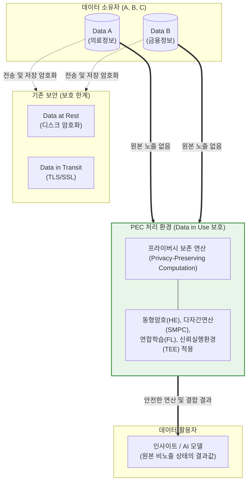

# PEC (Privacy-Enhancing Computation)

---

## I. 안전한 데이터 활용과 연산을 위한 보호 기술, PEC의 개요

* **정의**: 데이터를 암호화하거나 원본을 노출하지 않은 상태에서도 분석, 연산, 모델 학습 등의 정보 처리를 가능하게 하여, 데이터 프라이버시를 완벽히 보호하면서도 활용 가치를 추출하는 차세대 보안 연산 기술의 총칭
* **등장 배경 및 필요성**:
* **Data in Use(사용 중 데이터) 보호 한계**: 기존 [[암호화]] 기술은 저장(Rest) 및 전송(Transit) 구간의 보호에 국한되어, 메모리에 올라가 연산되는 순간 원본이 노출되는 취약점 존재
* **AI 및 데이터 협업 생태계 요구**: GDPR, 국내 [[데이터 3법]] 등 강력한 프라이버시 규제로 인해 기업 간(다자간) 데이터 결합 및 AI 학습용 데이터 공유가 위축되는 데이터 사일로(Silo) 현상 타개 필요

* **특징**: 하드웨어 기반 격리, 소프트웨어/수학적 암호화, 분산 처리 등 다양한 기술 접근법을 융합하여 영지식(Zero-Knowledge)에 가까운 상태로 상호 신뢰 불필요(Trustless) 환경에서의 데이터 협업을 지원함

---

## II. PEC의 아키텍처 및 핵심 구성요소

### 가. PEC 처리 개념도 및 Data in Use 보호 메커니즘

* 기존 보안 인프라는 연산을 위해 복호화가 필수적이나, PEC 환경에서는 데이터를 암호화된 상태 그대로 병합 및 연산하거나, 로컬에서 처리한 가중치만 전송하여 원본 유출 위험을 원천 차단함.

### 나. PEC의 핵심 기술 요소

| 분류 | 요소기술(키워드) | 세부 설명 |
| --- | --- | --- |
| **수학/암호학** | 동형암호 (Homomorphic Enc.) | 데이터를 복호화하지 않고 암호문 상태 그대로 덧셈/곱셈 등 수학적 연산을 수행하고 그 결과를 도출하는 기술 |
| **수학/암호학** | 안전한 다자간 연산 (SMPC) | 2명 이상의 참여자가 자신의 원본 데이터를 서로에게 공개하지 않고도, 데이터의 결합된 결과값을 공동으로 계산하는 [[알고리즘]] |
| **수학/암호학** | 영지식 증명 ([[영지식증명|ZKP]]) | 자신이 특정 정보(비밀값 등)를 알고 있다는 사실을 그 정보 자체를 노출하지 않고도 타인에게 암호학적으로 증명하는 기술 |
| **분산 처리** | 연합학습 (Federated Learning) | 원본 데이터를 중앙 서버로 집중시키지 않고 각 기기(로컬)에서 AI 모델을 학습한 뒤, 그 '가중치 업데이트' 결과만 중앙에서 병합하는 기술 |
| **데이터 변형** | [[차분 프라이버시]] (DP) | 데이터셋에 정교하게 계산된 통계적 노이즈(Noise)를 의도적으로 주입하여, 개인을 식별할 수 없게 하면서도 전체 데이터의 통계적 유효성은 유지하는 기술 |
| **하드웨어 기반** | 신뢰 실행 환경 (TEE) | [[CPU]] 내부(예: Intel SGX, ARM TrustZone)에 하드웨어적으로 격리된 보안 영역(Enclave)을 생성하여 연산 중인 데이터와 코드를 OS 접근으로부터 방어 |

---

## III. PEC 주요 기술 간 비교 및 향후 동향

### 가. PEC 세부 기술의 접근 방식 및 특성 비교

| 비교 항목 | 동형암호 (FHE) | 다자간 연산 (SMPC) | 연합학습 (Federated Learning) | 신뢰 실행 환경 (TEE) |
| --- | --- | --- | --- | --- |
| **접근 방식** | 수학적 [[암호 알고리즘]] | 암호학적 [[프로토콜]] | 분산 머신러닝 아키텍처 | 하드웨어 기반 물리적 격리 |
| **핵심 목적** | 암호문 상태의 직접 연산 | 상호 데이터 비노출 결합 연산 | 데이터 이동 없는 AI 분산 학습 | 연산 영역의 외부 접근 원천 차단 |
| **프라이버시 수준** | **매우 높음** | 매우 높음 | 보통~높음 | 높음 (칩 제조사 신뢰 필요) |
| **연산 오버헤드** | **매우 높음** (엄청난 컴퓨팅 자원 필요) | 높음 (막대한 네트워크 통신량 발생) | 중간 (가중치 전송 주기 최적화 필요) | 낮음 (네이티브 성능에 근접) |
| **실무 적용 한계** | 복잡한 비선형 연산 및 속도 한계 | 통신 지연시간 및 참여자 수 제약 | 참여 노드 간 데이터 불균형(Non-IID) | 특정 하드웨어 벤더 종속성 존재 |

### 나. 한계 극복 및 최신 발전 동향

* **하이브리드 PEC 아키텍처의 부상**: 단일 PEC 기술의 한계(동형암호의 속도, 연합학습의 정보 유출 가능성 등)를 극복하기 위해, **'연합학습 + 차분 프라이버시(DP-FL)'** 또는 'SMPC + TEE'와 같이 여러 PEC 기술을 상호 보완적으로 융합한 솔루션이 주류로 자리잡고 있음.
* **하드웨어 가속기(FHE Accelerator) 개발**: 완전동형암호(FHE)의 가장 큰 단점인 극심한 연산 지연을 해결하기 위해, FHE 연산에 특화된 전용 ASIC 칩 및 [[GPU]] 가속 기술 연구가 DARPA 주도 프로젝트 등을 통해 활발히 상용화 단계로 진입 중임.
* **거대 언어 모델([[초거대 언어 모델|LLM]])과 프라이버시 보존 추론(Private Inference)**: 기업의 민감한 프롬프트나 내부 문서가 LLM 서비스 제공자에게 노출되지 않도록 하는 기밀 컴퓨팅([[기밀컴퓨팅|Confidential Computing]]) 기반의 클라우드 추론 인프라 도입이 엔터프라이즈 AI 시장의 필수 요건으로 대두됨.

---

### 🔗 연관 토픽

- **소속 도메인**: [[00_보안_MOC|🛡️ 보안]]
- **세부 분류**: `2. 현대 암호학 & 키 관리 · 전자서명`
- **핵심 연관 토픽**:
  - [[영지식증명|영지식증명(Zero Knowledge Proof)]]
  - [[암호화|암호화 (Encryption)]]
  - [[암호 알고리즘]]
  - [[GPU]]
  - [[데이터 3법|데이터 3법 (Data 3 Acts)]]
