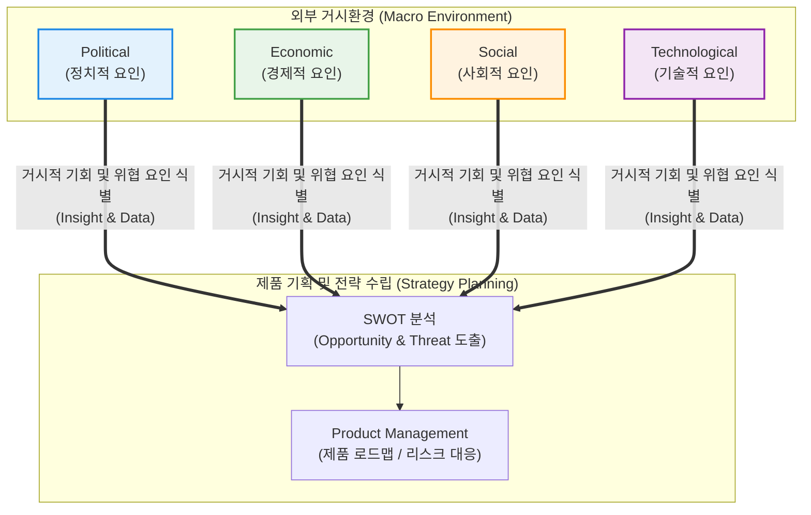

# PEST 분석 (PEST Analysis)

---

## I. 거시환경 분석을 위한 경영 전략 프레임워크, PEST의 개요

* **정의**: 기업이 신사업 기획, 제품 개발 또는 시장 진입 전략을 수립할 때, 조직에 영향을 미치는 거시적 외부 환경 요인을 정치(Political), 경제(Economic), 사회(Social), 기술(Technological)의 4가지 관점에서 입체적으로 분석하는 전략적 [[프레임워크]]
* **등장 배경 및 필요성**:
* 기업 내부 역량만으로는 예측 및 통제가 불가능한 거시적 환경 변화에 선제적으로 대응할 필요성 대두
* 불확실성이 높은 글로벌 시장 및 급변하는 IT/기술 생태계에서 리스크(Risk)를 최소화하고 새로운 비즈니스 기회(Opportunity)를 발굴하기 위한 기초 자료 요구

* **특징**: 내부 역량(점유율, 기술력 등)이 아닌 **외부 거시환경**에 초점을 맞추며, 일반적으로 **SWOT 분석**의 외부 요인(기회와 위협)을 도출하기 위한 선행 분석 도구로 강력하게 활용됨

---

## II. PEST의 아키텍처 및 핵심 구성요소

### 가. PEST 분석의 개념도 및 전략 도출 메커니즘

* 4대 거시환경 요인(P, E, S, T)에서 유의미한 데이터를 수집하여, 제품이나 기업에 미치는 긍정적 요인(기회)과 부정적 요인(위협)을 필터링함.
* 도출된 인사이트는 내부 역량(강점, 약점)과 결합되어 최종적인 프로덕트 로드맵이나 사업 전략으로 구체화됨.

### 나. PEST 분석의 핵심 구성 요소 (4대 요인)

| 분류 | 분석 요인(키워드) | 세부 분석 지표 및 고려 사항 |
| --- | --- | --- |
| **P** | Political (정치적 요인) | 정부의 정책 방향, 세제 혜택/규제, 노동법, 무역 관세, 정치적 안정성, 글로벌 외교 마찰 (예: 미·중 반도체 패권 경쟁) |
| **E** | Economic (경제적 요인) | 경제 성장률, 금리 및 인플레이션, 환율 변동, 실업률, 소비자 가처분 소득, 경기 순환 주기 (예: 고금리에 따른 IT 투자 위축) |
| **S** | Social (사회적 요인) | 인구 통계학적 변화(고령화, 1인 가구 등), 라이프스타일 트렌드, 교육 수준, 문화적 가치관 (예: 워라밸 중시, 비대면 문화 확산) |
| **T** | Technological (기술적 요인) | 신기술의 등장(AI, [[01_IT Tech/블록체인]] 등), R&D 투자 규모, 기술 인프라 성숙도, 특허 및 지적재산권 보호, 기술 진부화 속도 |
| **E** | Environmental (환경적 요인)* | *(PESTEL 확장)* 기후 변화, 탄소 배출 규제, 친환경 에너지 정책, 지속가능성(ESG) 요구 수위 |
| **L** | Legal (법률적 요인)* | *(PESTEL 확장)* 독점금지법, [[개인정보보호법]](GDPR, 보호법 등), 소비자 보호법, 산업안전보건법 |

---

## III. 유사 경영/기획 프레임워크 비교 및 최신 동향

### 가. 주요 전략 분석 프레임워크 비교 (PEST vs SWOT vs 3C)

| 비교 항목 | PEST 분석 | SWOT 분석 | 3C 분석 |
| --- | --- | --- | --- |
| **분석 대상** | **거시적 외부 환경** (Macro) | 내부 역량(S/W) + 외부 환경(O/T) | **미시적 시장 환경** (Micro) |
| **핵심 구성 요소** | Political, Economic, Social, Technological | Strength, Weakness, Opportunity, Threat | Company, Competitor, Customer |
| **주요 목적** | 시장의 큰 흐름과 통제 불가능한 리스크 파악 | 현재의 경쟁력 진단 및 종합적인 전략 방향 설정 | 타깃 시장 내에서의 자사 경쟁 우위 및 포지셔닝 도출 |
| **활용 시점** | 신규 시장 진입 및 사업 타당성 검토의 **최초 단계** | PEST 및 3C 분석 결과를 종합하는 **중간/최종 단계** | 구체적인 마케팅 및 제품 경쟁 전략 수립 **초기 단계** |

### 나. 프레임워크의 진화 및 최신 적용 동향

* **PESTEL / STEEPLE로의 확장**: 최근 ESG 경영이 기업의 생존 필수로 대두됨에 따라, 환경(Environmental)과 법률(Legal), 나아가 윤리(Ethical) 요인까지 포함하는 PESTEL이나 STEEPLE 분석으로 프레임워크가 확장되어 실무에 적용되고 있음. (예: EU AI Act, 망 사용료 법안, 탄소국경세 등)
* **데이터 기반의 동적 PEST 분석 ([[Agile]] PEST)**: 과거에는 연간 사업계획 시 1회성으로 수행되던 정태적 분석이었으나, 최근에는 빅데이터, 소셜 리스닝(Social Listening), 위협 인텔리전스([[CTI]]) 플랫폼과 연동하여 거시환경의 변화를 실시간 대시보드 형태로 모니터링하고 프로덕트 백로그(Backlog)에 즉각 반영하는 **데이터 기반의 애자일 기획 체계**로 진화 중임.

---

### 🔗 연관 토픽

- **소속 도메인**: [[00_경영전략_MOC|📈 경영전략]]
- **세부 분류**: `1. 경영 환경 분석 & 전략 수립 프레임워크`
- **핵심 연관 토픽**:
  - [[3C 4C 분석|3C  4C 분석]]
  - [[ISP (Information Strategy Plan)]]
  - [[CTI]]
  - [[ESG 경영]]
  - [[IT 거버넌스]]
