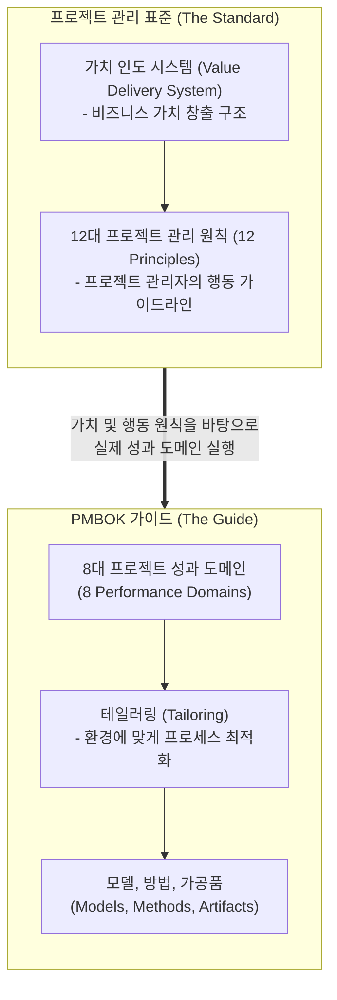

# PMBOK 7판 (Project Management Body of Knowledge 7th Ed.)

---

## I. 가치 인도 중심의 프로젝트 관리 표준, PMBOK 7판의 개요

* **정의**: PMI(Project Management Institute)에서 발행한 글로벌 프로젝트 관리 표준서로, 기존의 49개 [[프로세스]](ITTO) 중심 접근법에서 벗어나 '원칙(Principle)'과 '성과 도메인(Performance Domain)' 중심으로 전면 개편된 7번째 가이드
* **등장 배경 및 필요성**:
* **VUCA 환경의 심화**: [[변동성]](Volatility), 불확실성(Uncertainty), 복잡성(Complexity), 모호성(Ambiguity)이 높은 비즈니스 환경에서 기존의 경직된 [[워터폴|폭포수]](Waterfall) 모델만으로는 대응 한계 발생
* **가치 중심의 패러다임 전환**: 지정된 산출물(Output)을 기한 내에 만드는 것을 넘어, 실제 비즈니스에 기여하는 '가치 및 성과(Outcome)' 창출이 프로젝트의 진정한 성공 기준으로 대두됨

* **특징**: 예측형, 애자일([[Agile]]), 하이브리드 등 어떠한 생명주기 모델에도 적용할 수 있는 보편적 원칙을 제시하며, 프로젝트 환경에 맞게 기법을 조정하는 테일러링(Tailoring)을 극도로 강조함

---

## II. PMBOK 7판의 아키텍처 및 핵심 구성요소

### 가. PMBOK 7판의 구조 및 동작 개념도

* **프로젝트 관리 표준**은 시스템적 관점에서 가치를 인도하는 방법론과 관리자가 갖추어야 할 12가지 철학적 원칙을 정의함.
* **PMBOK 가이드**는 이러한 원칙을 바탕으로 실제 실무에서 성과를 내기 위해 집중해야 할 8개 영역(도메인)을 제시하고, 상황에 맞게 테일러링하여 구체적 도구(MMA)를 적용하도록 유도함.

### 나. PMBOK 7판의 핵심 구성 요소

| 분류 | 요소기술(키워드) | 세부 설명 |
| --- | --- | --- |
| **핵심 가치** | 가치 인도 시스템 (Value Delivery System) | 프로젝트, 프로그램, 포트폴리오가 조직의 전략과 연결되어 고객과 비즈니스에 실질적 가치를 인도하는 상호작용 체계 |
| **12대 원칙** | 스튜어드십 (Stewardship) | 단순한 관리를 넘어 조직과 사회의 자원을 책임감 있게 관리하고 윤리적으로 행동하는 청지기 의식 |
| **12대 원칙** | 시스템 사고 (Systems Thinking) | 프로젝트를 고립된 작업이 아닌, 상호작용하는 여러 요소들의 복잡한 시스템으로 인식하고 대응하는 역량 |
| **12대 원칙** | 적응성과 회복탄력성 (Adaptability & Resilience) | 변화에 신속하게 적응(Adaptability)하고, 실패나 충격으로부터 빠르게 정상 궤도로 회복(Resilience)하는 능력 |
| **8대 도메인** | 개발 접근법 및 생명주기 | 프로젝트의 특성에 따라 예측형, 적응형(Agile), 하이브리드 중 최적의 접근법을 선택하여 생명주기를 구성 |
| **8대 도메인** | 불확실성 (Uncertainty) | 기존의 리스크 관리를 확장하여, 모호성, 복잡성, 변동성 등 예측 불가능한 불확실성 전반을 선제적으로 통제 |
| **실행 체계** | [[테일러링|테일러링 (Tailoring)]] | 프로젝트의 규모, 조직 문화, 규제 환경 등을 고려하여 접근법, 거버넌스, 프로세스를 맞춤 재단하는 과정 |
| **도구 및 기법** | MMA (Models, Methods, Artifacts) | 리더십 모델, [[동기부여 이론]] 등 널리 쓰이는 '모델'과 구체적 기법인 '방법', 그리고 그 결과물인 '가공품(문서 등)'의 묶음 |

---

## III. PMBOK 6판과의 비교 및 실무 적용 전망

### 가. 패러다임 전환: PMBOK 6판 vs PMBOK 7판 비교

| 비교 항목 | PMBOK 6판 (이전) | PMBOK 7판 (현재) |
| --- | --- | --- |
| **구조의 핵심** | 프로세스 그룹(5개) 및 지식 영역(10개) | **원칙(12개) 및 성과 도메인(8개)** |
| **지향점 / 목표** | 산출물(Outputs) 중심, 일관성 유지 | **성과(Outcomes) 중심, 가치 창출** |
| **프로젝트 접근법** | 주로 예측형(Waterfall) 방법에 초점 | 예측형, 적응형(Agile), 하이브리드 **포괄 지원** |
| **도구 및 기법** | ITTO (입력, 도구/기법, 출력) 엄격히 규정 | MMA 및 테일러링을 통한 **자율적 선택 권장** |
| **관리의 주체** | 통제와 지시를 내리는 관리자 (Manager) | 팀을 이끌고 비전을 제시하는 리더 및 서번트 리더십 |

### 나. 한계 극복 및 최신 실무 발전 동향

* **프로덕트 매니저(PM) 및 제품 소유자(PO) 역할과의 융합**: 과거의 프로젝트 관리가 정해진 납기와 예산 준수에 갇혀 있었다면, PMBOK 7판은 지속적인 비즈니스 가치 창출을 목표로 함. 이에 따라 전통적인 프로젝트 관리자의 역할이, 최상의 사용자 경험(UX/UI)을 기획하고 제품의 방향성을 애자일하게 주도하는 **제품 소유자(PO) 및 프로덕트 매니저(PM)의 영역과 경계 없이 결합**되어 다기능(Cross-functional) 리더십으로 진화하고 있음.
* **디지털 플랫폼 기반의 실시간 방법론(PMIstandards+) 체계화**: 고정된 인쇄물 가이드의 한계를 극복하기 위해, 산업별(건설, IT 등) 맞춤형 애자일/하이브리드 적용 사례와 MMA(Models, Methods, Artifacts) 데이터베이스를 디지털 플랫폼을 통해 실시간으로 업데이트 및 제공하는 생태계로 발전함.

---

### 🔗 연관 토픽

- **소속 도메인**: [[00_프로젝트관리_MOC|📋 프로젝트관리]]
- **세부 분류**: `1. PMBOK 표준 & 프로젝트 거버넌스`
- **핵심 연관 토픽**:
  - [[PMBOK 8개 성과 영역 및 프로젝트 관리 12원칙(PMBOK 7판)]]
  - [[갈등관리]]
  - [[워터폴]]
  - [[테일러링|테일러링 (Tailoring)]]
  - [[Agile]]
