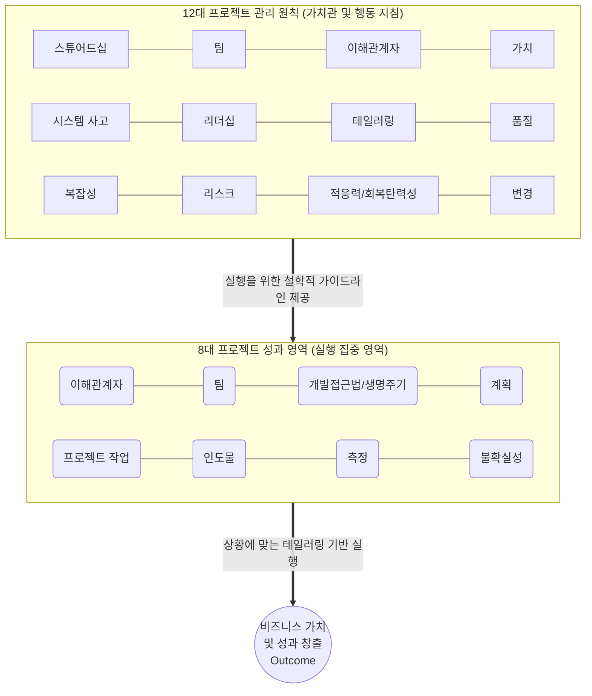

# PMBOK 7판: 12대 원칙과 8대 성과 영역

---

## I. 가치 인도 중심의 프로젝트 관리 체계의 핵심, 개요

* **정의**: PMBOK 7판에서 제시하는 프로젝트 관리의 철학적 기반인 12가지 프로젝트 관리 원칙(12 Principles)과, 이를 바탕으로 프로젝트를 성공적으로 수행하기 위해 집중해야 할 8가지 실행 성과 영역(8 Performance Domains)의 상호보완적 [[프레임워크]]
* **배경 및 필요성**:
* 기존 [[프로세스]] 중심(ITTO: 입력, 도구/기법, 출력)의 6판 체계는 변화가 극심한 현대 IT 비즈니스 환경(VUCA)에 유연하게 대응하기 어려움
* 단순히 '정해진 산출물'을 납기 내에 만드는 것을 넘어, 실제 비즈니스와 고객에게 '어떤 가치(Outcome)'를 전달했는지가 프로젝트 성공의 핵심 기준으로 전환됨

* **특징**: 12대 원칙이 프로젝트 팀의 '마인드셋과 행동 지침(Why & How)'을 규정한다면, 8대 성과 영역은 실제로 성과를 창출하기 위한 '실행 집중 영역(What)'을 정의함

---

## II. 12대 원칙과 8대 성과 영역의 아키텍처 및 세부 구성

### 가. 원칙과 성과 영역의 상호작용 개념도

### 나. 12대 프로젝트 관리 원칙 (12 Principles)

프로젝트 담당자(PM, 팀원 등)가 가져야 할 근본적인 태도와 행동 가이드라인입니다.

| 분류 | 원칙명 (Keyword) | 핵심 내용 |
| --- | --- | --- |
| **태도/가치** | **1. 스튜어드십** (Stewardship) | 부지런하고 존중하며 배려하는 청지기 의식을 바탕으로 윤리적으로 행동 |
| **태도/가치** | **2. 팀** (Team) | 상호 책임감과 존중을 바탕으로 협력적인 프로젝트 팀 환경 조성 |
| **관계/소통** | **3. 이해관계자** (Stakeholders) | 프로젝트 성공을 위해 이해관계자의 효과적이고 적극적인 참여 유도 |
| **관계/소통** | **4. 가치** (Value) | 프로세스나 산출물이 아닌, 궁극적으로 전달할 **비즈니스 가치에 초점** |
| **인지/분석** | **5. 시스템 사고** (Systems Thinking) | 프로젝트를 고립된 작업이 아닌, 조직 내외의 다양한 요소가 상호작용하는 복잡한 시스템으로 인식 |
| **인지/분석** | **6. 리더십** (Leadership) | 지위고하를 막론하고 동기를 부여하고 팀을 이끄는 서번트 리더십 행동 입증 |
| **인지/분석** | **7. [[테일러링]]** (Tailoring) | 주어진 환경, 규모, 조직 문화에 맞게 최적의 방법론을 맞춤 재단하여 적용 |
| **실행/대응** | **8. 품질** (Quality) | 이해관계자의 요구사항을 충족하도록 프로세스와 인도물에 품질을 구축 |
| **실행/대응** | **9. 복잡성** (Complexity) | 인간의 행동, 시스템의 상호작용, 불확실성에서 기인하는 복잡성을 탐색하고 대처 |
| **실행/대응** | **10. 리스크** (Risk) | 위협은 최소화하고 기회는 극대화하도록 지속적으로 리스크 대응 최적화 |
| **변화 관리** | **11. 적응/회복** (Adaptability/Resilience) | 변화에 신속히 적응하고, 실패나 충격으로부터 빠르게 정상 궤도로 회복하는 능력 수용 |
| **변화 관리** | **12. 변경** (Change) | 조직이 예상된 미래 상태로 성공적으로 전환할 수 있도록 변경을 수용하고 활성화 |

### 다. 8대 프로젝트 성과 영역 (8 Performance Domains)

성공적인 가치 인도를 위해 실무적으로 집중하고 관리해야 하는 실행 영역입니다.

| 성과 영역 | 영문명 | 실무 집중 포인트 및 목표 |
| --- | --- | --- |
| **1. 이해관계자** | Stakeholders | 이해관계자를 식별, 이해, 분석하고 프로젝트 전반에 걸쳐 지속적으로 소통 및 참여 유도 |
| **2. 팀** | Team | 팀 문화 조성, 갈등 해결, 팀원 역량 강화 및 권한 위임을 통한 고성과 팀(High-performing Team) 구축 |
| **3. 개발 접근법 및 생명주기** | Dev. Approach & Life Cycle | 프로젝트 특성에 가장 적합한 모델(예측형/[[워터폴|폭포수]], 적응형/애자일, 하이브리드)과 페이즈(Phase) 구성 |
| **4. 계획** | Planning | 범위, 일정, 예산, 자원 등에 대한 진화하는 계획 수립 (초기 확정이 아닌 점진적 구체화 지향) |
| **5. 프로젝트 작업** | Project Work | 자원 조달, 팀 학습 유도, 물리적/디지털 업무 환경 조성 등 원활한 프로젝트 실행 환경 관리 |
| **6. 인도물** | Delivery | 요구사항이 반영된 결과물을 완성하고, 이것이 실제로 의도한 비즈니스 가치와 품질을 실현하는지 검증 |
| **7. 측정** | Measurement | 작업 진행 상황을 정량적/정성적으로 측정(대시보드 등)하여, 성과 목표 달성 여부를 평가하고 시정 조치 도출 |
| **8. 불확실성** | Uncertainty | 리스크(Risk)를 포함하여 모호성, 복잡성, [[변동성]] 등 프로젝트에 영향을 미치는 모든 불확실성 요인 탐색 및 방어 |

---

## III. 과거 체계(6판)와의 패러다임 비교 및 현대 실무 적용

### 가. 지식 영역(6판)과 성과 영역(7판)의 비교

| 비교 항목 | PMBOK 6판 (10대 지식 영역) | [[PMBOK 7판 (Project Management Body of Knowledge 7th Ed.)|PMBOK 7판]] (8대 성과 영역) |
| --- | --- | --- |
| **구분 기준** | 통합, 범위, 일정, 원가, 품질, 자원, 의사소통, 리스크, 조달, 이해관계자 | 이해관계자, 팀, 개발접근법/생명주기, 계획, 프로젝트 작업, 인도물, 측정, 불확실성 |
| **성격** | "무엇을 관리할 것인가?" (기능적 분할) | "어디서 성과를 낼 것인가?" (목표 중심적 분할) |
| **상호작용** | 개별 지식 영역 간 선형적 결합 형태 | 8개 도메인이 동시에 유기적으로 상호작용 |

### 나. 프로덕트 매니지먼트 및 UX/UI 환경과의 실무적 융합

전통적인 프로젝트 관리자(PM)가 '주어진 기한과 예산 내의 개발 완료'를 최우선으로 여겼다면, PMBOK 7판의 가치(Value)와 **적응성(Adaptability)** 원칙은 현대 IT 환경의 **프로덕트 오너(PO)** 및 프로덕트 매니저(PM)의 역할과 본질적으로 일치합니다.

특히 '인도물'과 '불확실성' 성과 영역은 고객의 숨겨진 니즈를 파악하여 최적의 UX/UI를 설계하고, 애자일 스프린트 방식과 가설 검증(A/B 테스트 등)을 통해 비즈니스 임팩트를 극대화하는 프로덕트 기획 실무의 핵심 지침으로 강력하게 작용하고 있습니다.

---

### 🔗 연관 토픽

- **소속 도메인**: [[00_프로젝트관리_MOC|📋 프로젝트관리]]
- **세부 분류**: `1. PMBOK 표준 & 프로젝트 거버넌스`
- **핵심 연관 토픽**:
  - [[PMBOK 7판 (Project Management Body of Knowledge 7th Ed.)]]
  - [[워터폴]]
  - [[PMBOK 프로세스 그룹 (5단계)]]
  - [[테일러링|테일러링 (Tailoring)]]
  - [[ISO 21500]]
