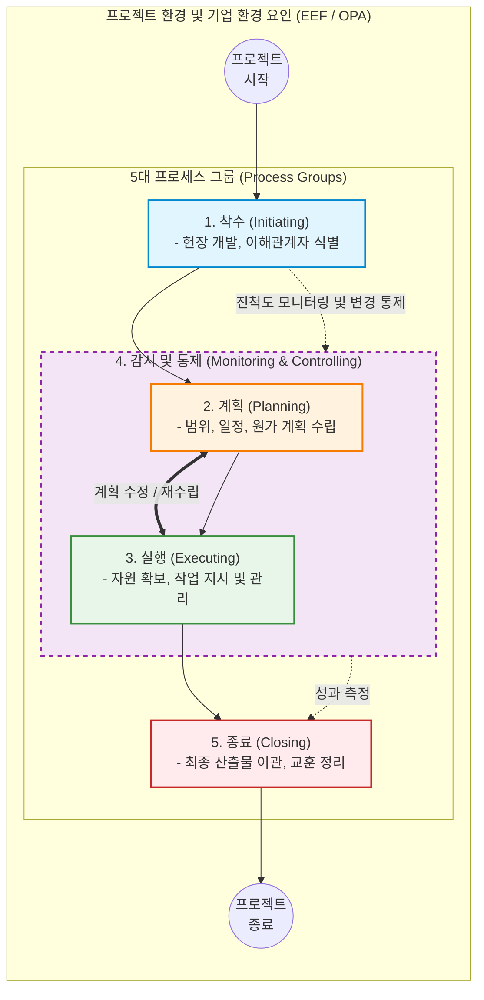

# PMBOK 5대 프로세스 그룹 (Process Groups)

---

## I. 프로젝트 생명주기 관리를 위한 체계적 흐름, PMBOK 프로세스 그룹의 개요

* **정의**: 프로젝트를 성공적으로 시작, 기획, 수행, 통제, 완료하기 위해 논리적으로 그룹화된 5단계(착수, 계획, 실행, 감시 및 통제, 종료)의 프로젝트 관리 활동 흐름 (PMBOK 6판 체계의 근간)
* **등장 배경 및 필요성**:
* 대규모 프로젝트의 복잡성 증가에 따라 범위, 일정, 원가(Iron Triangle)를 체계적으로 관리하고 통제할 표준화된 생명주기 모델 필요
* 프로젝트의 목표를 명확히 하고, 이해관계자의 기대를 관리하며, 성공적인 산출물(Deliverables)을 인도하기 위한 구조적 [[프레임워크]] 요구

* **특징**:
* **상호 중첩성**: 각 단계는 단방향의 폭포수처럼 완전히 분절된 것이 아니라, 프로젝트 전반에 걸쳐 지속적으로 상호 작용하고 반복(Iterative)됨.
* **ITTO 기반**: 각 프로세스는 입력(Input), 도구 및 기법(Tools & Techniques), 출력(Output)의 엄격한 인과관계를 통해 구체적인 산출물을 생성함.

---

## II. 5대 프로세스 그룹의 아키텍처 및 핵심 구성요소

### 가. 5대 프로세스 그룹 간의 상호작용 개념도

* **착수** 단계에서 승인된 프로젝트는 **계획**과 **실행** 단계를 반복하며 점진적으로 구체화됨.
* **감시 및 통제** 그룹은 특정 시점에만 수행되는 것이 아니라, 착수부터 종료까지 전체 생명주기를 감싸고돌며 성과를 측정하고 변경 요청(Change Request)을 처리함.

### 나. 5대 프로세스 그룹의 핵심 활동 및 주요 산출물

| [[프로세스]] 그룹 | 핵심 활동 및 목표 | 주요 산출물 (Outputs) |
| --- | --- | --- |
| **1. 착수 (Initiating)** | 신규 프로젝트나 새로운 페이즈(Phase)를 공식적으로 승인하고 초기 자원을 확보 | **프로젝트 헌장 (Project Charter)**, 

 이해관계자 관리 대장 |
| **2. 계획 (Planning)** | 프로젝트 목표 달성을 위한 범위, 일정, 원가, 품질, 리스크 등의 총체적인 작업 방향 설정 | **[[프로젝트 관리 계획서]] (PMP)**, 

 [[WBS]], 일정망도, 예산 베이스라인 |
| **3. 실행 (Executing)** | 계획서에 정의된 작업을 수행하기 위해 인력 및 자원을 조달하고 팀을 관리하며 프로젝트 지휘 | **인도물 (Deliverables)**, 

 작업 성과 데이터, 품질 통제 측정치 |
| **4. 감시 및 통제 (Monitoring & Controlling)** | 진행 상황을 추적/검토하고, 기준선(Baseline)과 비교하여 차이 발생 시 시정 및 예방 조치 수행 | **작업 성과 보고서 (Report)**, 

 승인된 변경 요청 (Change Request) |
| **5. 종료 (Closing)** | 프로젝트나 페이즈의 모든 활동을 공식적으로 완료하고, 산출물을 인계하며 팀을 해산 | **최종 제품/서비스 이관**, 

 교훈 등록부 (Lessons Learned) |

---

## III. 전통적 방법론과 애자일 생명주기의 비교 및 최신 동향

### 가. 프로세스 그룹(예측형)과 애자일(Scrum) 프레임워크 매핑

| 비교 항목 | PMBOK 5대 프로세스 그룹 (예측형/[[워터폴|폭포수]]) | [[Agile]] ([[SCRUM|Scrum]]) 프레임워크 대응 요소 |
| --- | --- | --- |
| **사전 준비 (착수)** | 프로젝트 헌장 발행, 이해관계자 식별 | 제품 비전 수립, 초기 제품 백로그(Product Backlog) 생성 |
| **계획 수립 (계획)** | 프로젝트 전체를 아우르는 통합 관리 계획 (PMP) | 스프린트 계획 미팅 (Sprint Planning), 스프린트 백로그 도출 |
| **작업 수행 (실행)** | WBS 기반의 작업 패키지 개발 및 산출물 생성 | 1~4주 주기의 스프린트(Sprint) 실행, 잠재적 출시 가능 제품(Increment) 개발 |
| **추적/통제 (감시 및 통제)** | 획득가치관리([[EVM(Earned Value Management, 획득 가치 관리)|EVM]]), 공식적인 변경 통제 위원회(CCB) | 일일 [[스크럼]](Daily Scrum), 스프린트 리뷰(Sprint Review) |
| **프로젝트 마무리 (종료)** | 공식 인수 서명, 교훈 도출 및 행정적 종료 | 스프린트 회고(Sprint Retrospective)를 통한 지속적 개선 |

### 나. 5대 프로세스 그룹의 실무적 진화 및 활용 전망

* **실무 가이드(Practice Guide)로서의 영속성**: PMBOK 7판이 '원칙'과 '도메인' 중심의 철학적 가이드로 전면 개편되었으나, PMI는 전통적인 5대 프로세스 그룹이 여전히 산업계(건설, 대형 IT 인프라, e커머스 플랫폼 구축 등)에서 강력한 실무 표준임을 인정하여 "Process Groups: A Practice Guide"라는 독립된 실무 지침서로 분리하여 유지하고 있음.
* **하이브리드(Hybrid) [[PMO]] 체계의 근간**: 제품 기획과 UX/UI 디자인 등 사용자 반응이 즉각적으로 필요한 프론트엔드 영역은 애자일하게 운영하되, 백엔드 코어 시스템 마이그레이션이나 대규모 인프라 아키텍처 구축은 5대 프로세스 그룹 기반의 철저한 예측형 관리를 적용하는 '투 트랙(Two-Track) 하이브리드 방법론'이 대형 엔터프라이즈의 표준으로 정착하고 있음.

---

### 🔗 연관 토픽

- **소속 도메인**: [[00_프로젝트관리_MOC|📋 프로젝트관리]]
- **세부 분류**: `1. PMBOK 표준 & 프로젝트 거버넌스`
- **핵심 연관 토픽**:
  - [[SCRUM]]
  - [[프로젝트 관리 계획서]]
  - [[PMO|(E)PMO]]
  - [[EVM(Earned Value Management, 획득 가치 관리)]]
  - [[스크럼|스크럼 (SCRUM)]]
