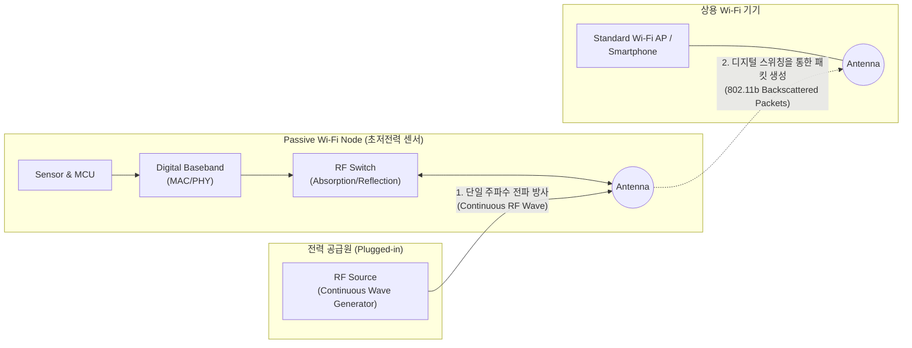

# Passive Wi-Fi

---

## I. 초저전력 IoT 통신 기술, Passive Wi-Fi의 개요

### 가. Passive Wi-Fi의 정의

* 전력 소모가 큰 RF 아날로그 송신부 대신 후방산란(Backscatter) 기법을 활용하여, 기존 상용 Wi-Fi 통신 대비 1만 배 이하의 초저전력(수십 µW)으로 802.11b 패킷을 전송하는 무선 통신 기술임.

### 나. Passive Wi-Fi의 등장배경 및 주요 특징

* **등장배경**: 기존 Active Wi-Fi의 과도한 배터리 소모로 인한 IoT 센서 적용의 한계 극복, BLE/Zigbee를 대체하고 별도의 [[게이트웨이]] 없이 직접 통신이 가능한 범용 무선망 필요성 대두.
* **주요 특징**:
* **후방산란(Backscatter)**: 입사된 전파를 반사하여 데이터를 변조함 (전송 전력 극소화).
* **상용 기기 호환성**: COTS(상용 기성품) 스마트폰, 공유기 등 기존 Wi-Fi 수신기와 직접 통신 가능.
* **배터리 프리(Battery-Free)**: 에너지 하베스팅 기술과 결합하여 영구적인 동작을 지원하는 Ambient IoT 구현.

---

## II. Passive Wi-Fi의 아키텍처 및 핵심 기술 요소

### 가. Passive Wi-Fi의 아키텍처 및 동작 원리

* 외부 전원이 연결된 RF Source가 끊임없이 전파를 쏘면, 초저전력 Passive Node는 디지털 스위치만으로 신호를 반사/흡수하여 상용 AP가 읽을 수 있는 Wi-Fi 패킷으로 변조(Backscatter)하여 전송함.

### 나. Passive Wi-Fi의 핵심 기술 요소

| 분류 | 요소기술(키워드) | 세부 설명 |
| --- | --- | --- |
| **아키텍처** | **RF-Digital 디커플링** | 전력 소모가 극심한 아날로그 RF 송신부(전원 인가)와 디지털 기저대역(저전력) 처리 과정을 물리적으로 분리하는 설계 |
| **통신 기법** | **후방산란 (Backscatter)** | 스스로 전파를 생성하지 않고, RF Source로부터 입사된 전파를 흡수 또는 반사(위상 변환)하여 데이터를 실어 보내는 기술 |
| **주파수 제어** | **주파수 천이 (Frequency Shift)** | 반사된 신호가 원본 RF 신호에 묻히는 간섭(Self-Interference)을 방지하기 위해 백스캐터링 시 주파수 대역을 이동시켜 전송 |
| **표준 호환성** | **802.11b 패킷 합성** | 별도의 복호화 장비 없이 기존 Wi-Fi 기기가 인식할 수 있도록 1Mbps 및 11Mbps DSSS(DBPSK/DQPSK) 변조 패킷을 생성 |
| **하드웨어** | **저전력 디지털 [[스위치 (Layer 3 Switch)|스위치]]** | 수십 µW 수준의 전력만으로 동작하며 베이스밴드 신호에 따라 임피던스를 변경하는 RF 스위칭 소자 (IC) |
| **신호원** | **CW (Continuous Wave)** | Passive Node가 신호를 반사할 수 있도록 끊임없이 단일 주파수(Single Tone) 전파를 방사하는 전용 RF 발생기 |
| **수신망** | **COTS Wi-Fi Receiver** | 별도의 전용 게이트웨이 설치 없이 이미 구축된 스마트폰, 태블릿, 무선 AP 등을 수신기로 즉시 활용 |
| **전력 공급** | **에너지 하베스팅 연계** | 환경 에너지(RF, 태양광 등)를 수집하는 무전원 기술(Passive IoT)과 결합하여 배터리 교체가 불필요한 시스템 구축 |

---

## III. 무선 통신 기술 비교 및 향후 전망

### 가. Passive Wi-Fi와 기존 무선 통신 기술 비교

| 비교 항목 | Passive Wi-Fi | Active Wi-Fi (802.11 b/g/n/ac) | BLE (Bluetooth Low Energy) |
| --- | --- | --- | --- |
| **무선 전송 방식** | **Backscatter (전파 반사)** | Active RF Transceiver (전파 생성) | Active RF Transceiver (전파 생성) |
| **전송 전력 소모** | **수십 µW (초저전력)** | 100 ~ 500 mW (고전력) | ~ 10 mW (저전력) |
| **인프라 호환성** | **상용 Wi-Fi 기기 직접 통신** | 상용 Wi-Fi 기기 직접 통신 | 스마트폰 또는 전용 게이트웨이 필요 |
| **신호 생성 제약** | 별도의 RF Source 필수 | 기기 자체에서 독립적 신호 발생 | 기기 자체에서 독립적 신호 발생 |
| **주요 활용 분야** | 스마트홈 센서, 물류 패키징, 의료 태그 | 초고속 대용량 데이터 전송, 스트리밍 | 웨어러블(스마트워치), 비콘, 헬스케어 |

### 나. Passive Wi-Fi의 최신 동향 및 산업 적용 전망

* **Ambient IoT 시대의 핵심 기술**: 배터리 제약을 없애는 'Passive IoT' 구현을 위해 6G 및 차세대 네트워크 표준(IEEE 802.11ba Wake-up Radio 등)과 결합하여 산업용 엣지 센싱, 물류 혁신 등 상용화 가속.
* **한계점 극복 방향**: 현재는 전파를 방사해줄 전용 RF Source가 필수적이라는 제약이 있으나, 향후 기존 Wi-Fi 라우터나 스마트폰이 스스로 RF Source 역할을 동시에 수행할 수 있도록 하는 기술 최적화 연구가 활발히 진행 중임.

---

### 🔗 연관 토픽

- **소속 도메인**: [[00_네트워크_MOC|🌐 네트워크]]
- **세부 분류**: `3. 전송 계층 & 트래픽 / 혼잡 제어 (L4)`
- **핵심 연관 토픽**:
  - [[스위치 (Layer 3 Switch)]]
  - [[게이트웨이]]
  - [[Point-to-Point]]
  - [[QoS|QoS (Quality of Service)]]
  - [[혼잡 제어]]
