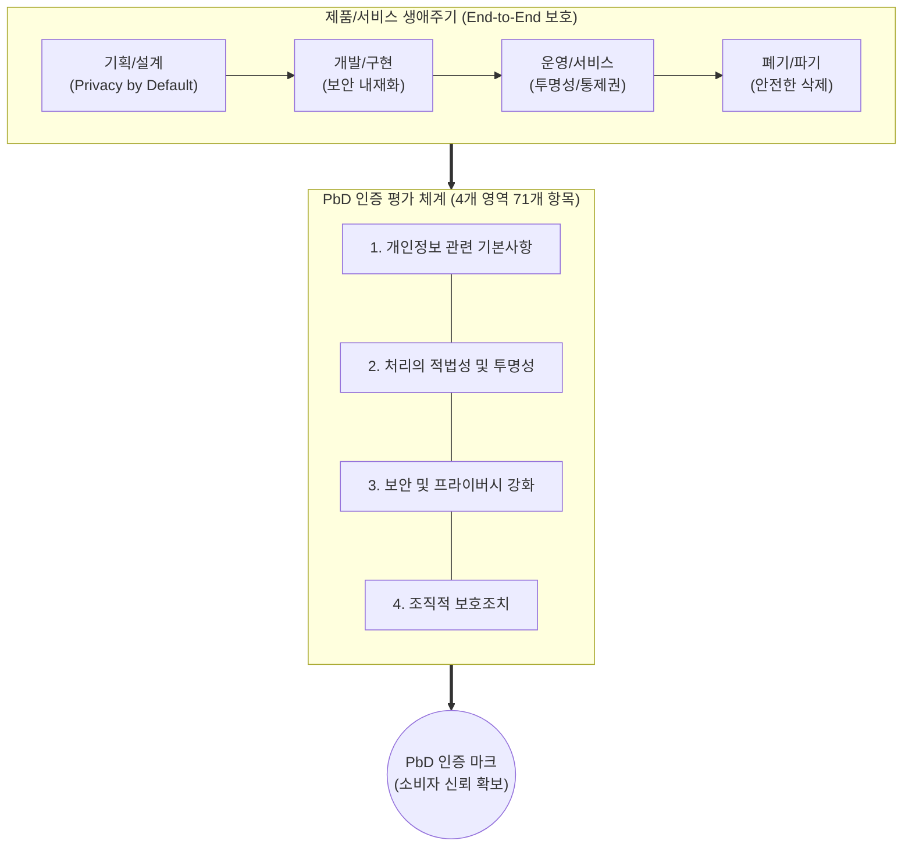

# PbD(Privacy by Design) 인증제도

---

## I. 개인정보 사전 예방, PbD(Privacy by Design) 인증제도의 개요

### 가. PbD 인증제도의 정의

* 제품이나 서비스의 기획, 설계, 제조, 폐기 등 전 생애주기([[End-to-End]])에 걸쳐 개인정보보호 요소를 내재화하여 사전 예방적 보호 수준을 검증하고 인증하는 제도
* 사후 대응 위주의 개인정보 보호에서 벗어나, 기본값(Default)으로 프라이버시를 보장하는 설계 철학(Ann Cavoukian 제안) 기반의 선제적 인증 체계

### 나. PbD 인증제도의 등장배경 및 주요 특징

* **등장배경**: 스마트홈, IoT 기기(홈카메라, 월패드 등) 확산에 따른 사생활 침해 위험 급증, 사후 규제 한계 돌파를 위한 선제적 대응 요구
* **주요 특징**: 7대 기본 원칙 준수, 제로섬(Zero-Sum)이 아닌 프라이버시와 기능성을 모두 달성하는 포지티브섬(Positive-Sum) 지향, 글로벌 표준(ISO 31700) 연계

---

## II. PbD 인증제도의 개념도 및 핵심 심사 기준

### 가. PbD 인증제도의 적용 개념도 및 동작 원리

* 제품 설계(Shift-Left) 단계부터 프라이버시 강화 기술(PET)과 7대 원칙을 적용하며, 이를 4개 인증 영역(71개 항목)을 통해 객관적으로 검증함

### 나. PbD 인증제도의 핵심 평가 영역 및 구성 요소

| 구분 | 요소기술(키워드) | 세부 설명 |
| --- | --- | --- |
| **평가 영역 1** | **개인정보 관련 기본사항** | 개인정보 수집 목적의 명확성, 처리의 비례성, 데이터 최소 수집 원칙 준수 여부 검증 |
| **평가 영역 2** | **처리의 적법성/투명성** | 정보주체에 대한 명확한 고지, 적법한 동의 확보, 권리 보장(열람, 파기 등) 체계 확인 |
| **평가 영역 3** | **보안 및 프라이버시 강화** | 종단간(End-to-End) 데이터 [[암호화]], 강력한 접근통제, [[비식별화]](가명/익명 처리) 등 기술적 보안 조치 |
| **평가 영역 4** | **조직적 보호조치** | 개인정보보호 책임자 지정, 침해사고 대응 매뉴얼, 소비자와의 원활한 의사소통 채널 구비 |
| **핵심 원칙 1** | **Proactive (사전 예방)** | 프라이버시 침해 사고가 발생한 뒤 조치하는 것이 아닌, 위협을 사전에 예측하고 차단하는 설계 |
| **핵심 원칙 2** | **Default (기본값 보호)** | 사용자가 별도의 보안 설정을 켜지 않아도, 시스템 초기 설정 자체로 최대의 프라이버시 보장 |
| **핵심 원칙 3** | **Positive-Sum (포지티브섬)** | 보안을 위해 편의성을 희생하는 트레이드오프를 지양하고, 기능성과 프라이버시의 양립 추구 |
| **구현 기술** | **PET (프라이버시 강화 기술)** | 동형암호, 다자간 계산(MPC), [[차분 프라이버시]] 등 PbD를 시스템 레벨에서 실제 구현하기 위한 보호 기술 |

---

## III. PbD 인증과 타 인증제도 비교 및 향후 전망

### 가. PbD 인증과 기존 정보보호 인증제도 비교

| 비교 항목 | PbD ([[개인정보보호 중심 설계|Privacy by Design]]) 인증 | [[ISMS-P]] 인증 | IoT 보안인증 |
| --- | --- | --- | --- |
| **인증 목적** | **제품/서비스 자체의 프라이버시 설계 검증** | 조직의 정보보호 및 개인정보 관리체계 검증 | IoT 기기의 네트워크/시스템 보안성 검증 |
| **주요 대상** | 스마트 가전, 홈카메라, S/W 솔루션 등 | 기업/기관의 주요 정보시스템 및 인프라 전체 | 월패드, 공유기 등 IoT 하드웨어 기기 |
| **적용 시점** | **기획 및 설계 단계 (Shift-Left 최우선)** | 운영 및 [[유지보수]] 단계 (매년 사후 심사) | 제품 개발 완료 후 출시 전/후 테스트 |
| **핵심 포커스** | **개인정보보호 원칙 내재화 및 사용자 권리** | 관리적/기술적/물리적 통합 보안 체계 유지 | 기기 자체 취약점 분석 및 해킹 방어 |

### 나. 국내 PbD 인증제도 최신 동향 및 산업 시사점

* **인증 제품 확대 및 법제화 추진**: 2023년 개인정보위 주관 시범 시행 이후, 최근 홈카메라, 가정용 서비스 로봇, 로봇청소기 등 생활밀착형 AI 기기로 인증이 확정(삼성전자, LG전자 등 참여)되었으며, 향후 IT 솔루션 분야로 대상 확대 및 『[[개인정보보호법]]』 개정을 통한 제도 법제화 추진 중
* **글로벌 표준 연계 및 무역 경쟁력 강화**: ISO 31700(개인정보보호 중심 설계 국제표준) 및 GDPR 컴플라이언스와 직접적으로 연계되어, 국내 제조사 및 서비스 기업의 해외 진출 시 프라이버시 신뢰성을 입증하는 핵심 비관세 장벽 극복 수단으로 활용 기대
* **AI 거버넌스와의 융합**: AI 환경에서 과도한 데이터 학습을 방지하기 위해 데이터 최소화, 투명성, 설명 가능성([[XAI]])을 시스템에 사전에 심어두는 AI 데이터 거버넌스의 핵심 도구로 정착 전망

---

### 🔗 연관 토픽

- **소속 도메인**: [[00_보안_MOC|🛡️ 보안]]
- **세부 분류**: `2. 현대 암호학 & 키 관리 · 전자서명`
- **핵심 연관 토픽**:
  - [[개인정보보호 중심 설계|개인정보보호 중심 설계(Privacy by Design)]]
  - [[비식별화]]
  - [[개인정보보호법]]
  - [[ISMS-P]]
  - [[차분 프라이버시]]
