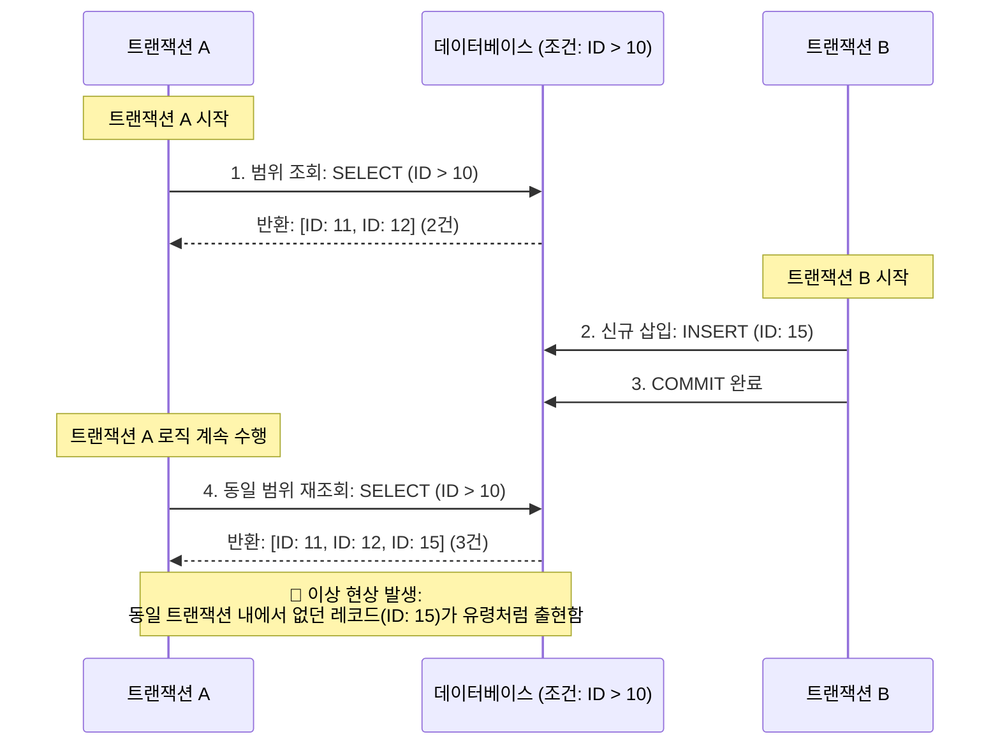

# 팬텀 리드 (Phantom Read)

---

## I. 트랜잭션 동시성 환경의 유령 레코드 현상, Phantom Read의 개요

* **정의**: 하나의 [[트랜잭션]] 내에서 동일한 조건식(Range Query)으로 두 번 이상 데이터를 조회할 때, 다른 병행 트랜잭션이 해당 조건에 맞는 새로운 데이터를 삽입(Insert)하거나 삭제(Delete)하여 **이전 결과에 없던 유령(Phantom) 데이터가 나타나거나 기존 데이터가 사라지는 데이터 불일치 현상**
* **등장 배경 및 원인**:
* 다중 사용자 환경([[DBMS]])에서 성능(동시성)을 극대화하기 위해 트랜잭션 격리 수준([[Isolation Level (격리 레벨고립성 수준)|Isolation Level]])을 완화할 때 발생하는 구조적 이상([[Anomaly(이상현상)|Anomaly]]) 현상 중 하나임.
* 특정 행(Row)에 대한 잠금(Record Lock)은 수행하지만, 조건에 해당하는 범위(Range)나 빈 공간(Gap)에 대한 잠금 처리를 하지 않을 때 발생함.

* **특징**: 단순한 값의 변경(Update)이 아닌, 레코드 건수(튜플의 수)가 변동되는 것이 핵심이며, ANSI [[SQL(Structured Query Language)|SQL]] 표준 기준 `REPEATABLE READ` 격리 수준 이하에서 발생할 수 있음.

---

## II. Phantom Read의 발생 메커니즘 및 핵심 기술 요소

### 가. Phantom Read 발생 개념도 (Sequence Diagram)

* 트랜잭션 A가 특정 조건(`ID > 10`)으로 데이터를 읽은 후, 트랜잭션 B가 해당 범위 내에 들어가는 새로운 데이터를 삽입(Insert)하고 커밋함.
* 트랜잭션 A가 동일한 조건으로 다시 조회하면, 처음에 보이지 않던 레코드(Phantom)가 조회되어 데이터 정합성이 깨지게 됨.

### 나. Phantom Read 제어와 관련된 핵심 기술 요소

| 분류 | 요소기술(키워드) | 세부 설명 |
| --- | --- | --- |
| **현상 조건** | Range Query (범위 검색) | `BETWEEN`, `>`, `<`, `LIKE` 등 여러 건의 레코드를 스캔하는 조건절을 사용할 때 주로 발생 |
| **방어 수준** | SERIALIZABLE (직렬화 가능) | ANSI SQL 표준 상 Phantom Read를 완벽히 방어할 수 있는 가장 엄격한 최고 단계의 격리 수준 |
| **잠금 기법** | 갭 락 (Gap Lock) | 인덱스 레코드 사이의 빈 공간(Gap)에 잠금을 걸어, 타 트랜잭션이 해당 범위 내에 Insert 하는 것을 방지 |
| **잠금 기법** | 넥스트 키 락 (Next-Key Lock) | 레코드 락(Record Lock)과 갭 락(Gap Lock)을 결합한 형태로, MySQL(InnoDB)에서 Phantom Read를 막는 핵심 기법 |
| **대안 기법** | MVCC (다중 버전 동시성 제어) | 데이터 변경 시 Undo 로그에 이전 버전을 유지하여, 읽기 작업 시 락(Lock) 없이 특정 스냅샷(시점)의 데이터만 일관되게 제공 |
| **관련 이상 현상** | Lost Update (갱신 분실) | 두 트랜잭션이 동시에 같은 데이터를 갱신할 때, 하나의 갱신 내용이 다른 하나에 의해 덮어씌워져 유실되는 현상 |

---

## III. 데이터 읽기 이상 현상(Read Anomaly) 비교 및 현대 DBMS 동향

### 가. 3대 트랜잭션 읽기 이상 현상(Read Anomaly) 비교

| 비교 항목 | [[Dirty Read]] (오독) | Non-Repeatable Read (반복 불가능 읽기) | Phantom Read (유령 읽기) |
| --- | --- | --- | --- |
| **발생 원인** | 타 트랜잭션이 **Commit 하지 않은** 데이터를 읽음 | 타 트랜잭션이 데이터를 **수정(Update)** 하고 Commit 함 | 타 트랜잭션이 데이터를 **삽입(Insert)/삭제(Delete)** 하고 Commit 함 |
| **증상** | 비정상적인 임시 데이터를 읽어 잘못된 로직 수행 (이후 롤백될 수 있음) | 동일한 조회 결과의 **'값(Value)'**이 변경됨 | 동일한 조건 검색 결과의 **'행(Row) 개수'**가 변경됨 |
| **최소 방어 수준** | `READ COMMITTED` | `REPEATABLE READ` | `SERIALIZABLE` |
| **대상 단위** | Row (행) 단위 | Row (행) 단위 | Range (범위) 단위 |

### 나. 한계 극복 및 최신 DBMS 벤더 구현 동향

* **표준과 실제 구현의 차이**: ANSI SQL-92 표준에서는 `REPEATABLE READ` 격리 수준에서 Phantom Read가 발생하는 것으로 정의되어 있으나, 현대의 주요 RDBMS 벤더들은 이를 자체적인 기술로 방어하고 있음.
* **MySQL (InnoDB)**: 기본 격리 수준이 `REPEATABLE READ`임에도 불구하고, 인덱스 기반의 **Next-Key Lock**과 **MVCC**를 혼합 적용하여 사실상 Phantom Read가 발생하지 않음.
* **PostgreSQL**: `REPEATABLE READ` 수준에서 **SI(Snapshot Isolation)** 기법을 사용하여, 트랜잭션 시작 시점의 스냅샷만 참조하게 함으로써 Phantom Read를 원천 차단함.

* **전망**: 고도의 동시성(성능)과 데이터 [[무결성]](일관성)의 Trade-off 관계 속에서, 최근의 분산/클라우드 데이터베이스들은 분산 락(Distributed Lock)과 MVCC 아키텍처를 고도화하여 Serializable 수준의 일관성을 제공하면서도 락 경합을 최소화(Lock-free read)하는 논블로킹(Non-blocking) 구조를 지향하고 있음.

---

### 🔗 연관 토픽

- **소속 도메인**: [[00_데이터베이스_MOC|🗄️ 데이터베이스]]
- **세부 분류**: `2. 트랜잭션 & 동시성 제어 (Concurrency)`
- **핵심 연관 토픽**:
  - [[Dirty Read]]
  - [[Isolation Level (격리 레벨고립성 수준)]]
  - [[무결성]]
  - [[트랜잭션]]
  - [[CockroachDB|CockroachDB(코크로치DB)]]
