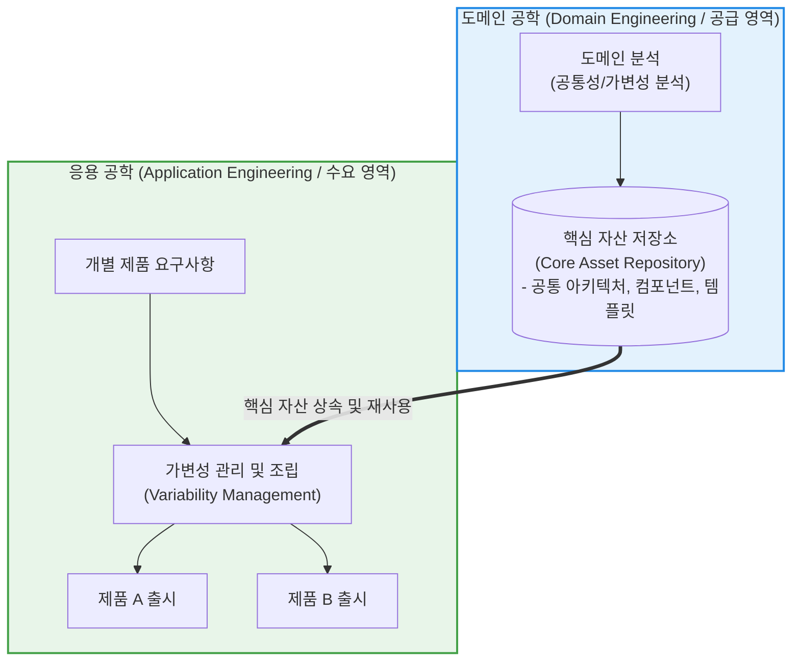

# 소프트웨어 제품 라인 (Software Product Line, SPL)

---

## I. 대규모 재사용을 통한 소프트웨어 공학의 혁신, SPL의 개요

* **정의**: 공통된 요구사항을 가진 일련의 관련 소프트웨어 제품 군(Family of Products)을 효율적으로 개발하기 위해, 핵심 자산(Core Assets)을 공유하고 대규모 [[재사용]](Large-scale Reuse)을 수행하는 체계적인 소프트웨어 공학 방법론
* **등장 배경 및 필요성**:
* 유사한 기능과 구조를 가진 여러 소프트웨어(예: 스마트폰 기종별 펌웨어, 가전제품 제어 소프트웨어)를 개별적으로 개발(One-off)할 경우 발생하는 비용 증가, 중복 투자, [[유지보수]] 복잡성 한계 극복
* 시장 출시 속도(Time-to-Market)를 획기적으로 단축하고, 제품 전반의 품질 균일성을 확보하기 위한 전사적 재사용 패러다임 도입 필요

* **특징**: 단순 코드 복사·붙여넣기 수준이 아닌, 요구사항, 아키텍처, 테스트 케이스 등 소프트웨어 생명주기 전반의 산출물(Core Asset)을 구조화하여 대규모로 재사용함

---

## II. SPL의 아키텍처 및 핵심 구성요소

### 가. SPL의 이중 공학(Dual Life Cycle) 구조 및 동작 개념도

* **도메인 공학(Domain Engineering)**: 제품군 전체가 공유하는 핵심 자산(Core Assets)을 미리 개발하고 구축하는 공급(Supply) 중심 [[프로세스]]
* **응용 공학(Application Engineering)**: 도메인 공학에서 구축한 핵심 자산 저장소로부터 필요한 부품을 가져와 개별 제품의 가변성(Variability)을 조립·반영하여 제품을 생산하는 수요(Demand) 중심 프로세스

### 나. SPL의 핵심 구성 요소 및 기술

| 분류 | 요소기술(키워드) | 세부 설명 |
| --- | --- | --- |
| **핵심 자산** | Core Asset Repository | 제품군 전체에서 재사용할 수 있도록 승인된 아키텍처, 컴포넌트, 테스트 스위트 등의 중앙 저장소 |
| **분석 기법** | 공통성/가변성 분석 (Commonality & Variability) | 제품군 전체에 공통으로 들어가는 기능(Commonality)과 제품별로 달라야 하는 특성(Variability)을 식별하고 분류 |
| **아키텍처** | 제품 라인 아키텍처 (PLA) | 다양한 변종(Variant)을 수용할 수 있도록 설계된 확장 가능하고 모듈화된 공통 [[소프트웨어 아키텍처]] |
| **변이 관리** | 가변성 관리 (Variability Mgmt) | 기능 선택 매커니즘을 통해 컴파일 타임(Compile-time) 또는 런타임(Runtime)에 특정 제품의 기능을 조립하는 기법 |
| **생산 공정** | 조립 기반 개발 (CBD) | 새로 코딩하는 비중을 줄이고, 검증된 코어 자산을 레고 블록처럼 결합하여 완제품을 신속히 찍어내는 공정 |
| **재사용 범위** | 전 생명주기 재사용 | 소스 코드뿐만 아니라 [[요구사항 명세서]], 아키텍처 설계서, 테스트 케이스까지 모든 산출물의 재사용 보장 |

---

## III. 전통적 개발 방식과 SPL의 비교 및 발전 동향

### 가. 개별 개발 방식 vs 소프트웨어 제품 라인 비교

| 비교 항목 | 개별 시스템 개발 (One-off Development) | 소프트웨어 제품 라인 (SPL) |
| --- | --- | --- |
| **개발 관점** | 단일 제품(Single Product) 중심 개발 | 제품군(Product Family) 전체를 아우르는 **도메인 중심 개발** |
| **자산 재사용** | 제한적 (라이브러리, 일부 코드 복사 수준) | **체계적이고 전사적인 대규모 재사용** (요구사항~테스트) |
| **초기 투자 비용** | 낮음 (즉시 개발 착수 가능) | **높음** (공통 코어 자산 및 PLA 설계 선행 투자 필요) |
| **유지보수 비용** | 제품이 늘어날수록 파편화로 인해 비용 급증 | **대폭 절감** (공통 코어 수정 시 전체 제품군에 일괄 반영) |
| **타임 투 마켓** | 후속 제품 개발 시 기간 단축 효과 미미 | **극적으로 단축** (표준 자산 조립으로 신제품 신속 출시) |

### 나. 한계 극복 및 최신 현대화 동향

* **초기 투자 비용(ROI 장벽) 극복**: 전사적 규모의 완벽한 제품 라인을 구축하려면 막대한 초기 비용과 조직 변화 관리가 요구되어 도입 장벽이 높았음. 이를 극복하기 위해 최근에는 오픈소스 컴포넌트와 점진적 도메인 분석([[Agile]] SPL)을 결합한 경량화 도입 방식이 확산됨.
* **마이크로서비스([[MSA (Micro Service Architecture)|MSA]]) 및 클라우드 네이티브와의 융합**: 과거 임베디드(가전, 자동차) 도메인 중심이었던 SPL 개념이, 클라우드 환경에서 멀티 테넌시(Multi-tenancy)를 지원하고 기능별 독립 배포가 가능한 **마이크로서비스 아키텍처 내 컴포넌트 공유 및 설정 관리 체계**로 진화하여 적용되고 있음.

---

다음으로 이어서 다루어 주기를 원하시는 기술 용어나 개념이 있으신가요?

---

### 🔗 연관 토픽

- **소속 도메인**: [[00_소프트웨어공학_MOC|🏗️ 소프트웨어공학]]
- **세부 분류**: `3. 요구사항 공학 & UML 객체지향 분석/설계`
- **핵심 연관 토픽**:
  - [[소프트웨어 프로덕트 라인]]
  - [[재사용]]
  - [[소프트웨어 아키텍처|소프트웨어 아키텍쳐]]
  - [[Agile]]
  - [[추상화|추상화 (Abstraction)]]
