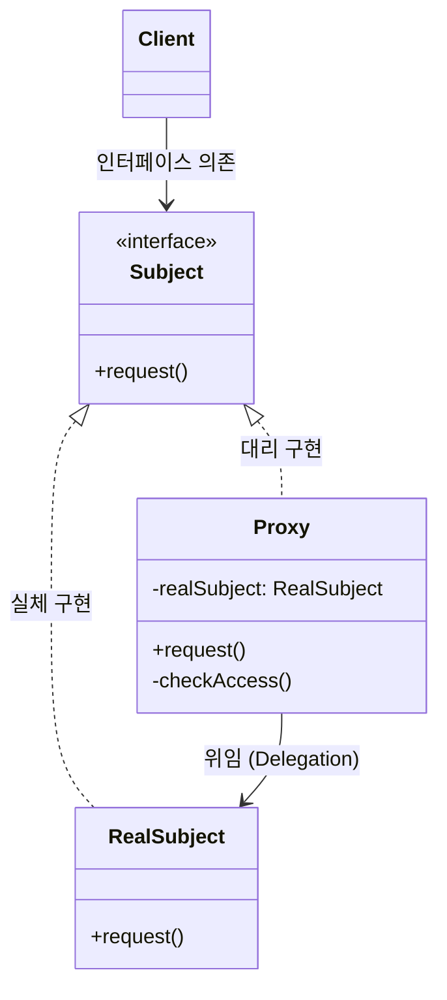

# 프록시 패턴 (Proxy Pattern)

---

## I. 객체 접근 제어와 대리인을 위한 디자인 패턴, 프록시 패턴의 개요

* **정의**: 타겟 객체에 대한 직접적인 접근을 제어하거나 부가적인 기능을 제공하기 위해, 타겟 객체와 동일한 인터페이스를 구현한 대리인(Proxy) 객체를 두어 클라이언트의 요청을 대신 처리하는 구조적(Structural) [[디자인 패턴]]
* **등장 배경 및 필요성**:
* 원본 객체의 생성 비용이 매우 크거나(대용량 이미지, [[데이터베이스]] 커넥션 등) 원격에 위치하여 즉시 접근하기 어려운 경우
* 클라이언트가 원본 객체에 접근하기 전 권한 검증, 로깅, 지연 로딩(Lazy Loading) 등의 공통 관심사를 투명하게 개입시켜야 할 필요성 대두

* **특징**: 클라이언트는 실제 객체인지 프록시인지 의식하지 않고 동일한 인터페이스를 통해 상호작용하며(투명성), 원본 객체의 수정 없이 부가 기능을 확장할 수 있음

---

## II. 프록시 패턴의 아키텍처 및 핵심 구성요소

### 가. 프록시 패턴의 구조 및 동작 개념도

* **Subject**: RealSubject와 Proxy가 공통으로 구현하는 인터페이스로, 클라이언트는 이를 통해 대상 객체에 접근함.
* **RealSubject**: 실질적인 비즈니스 로직을 수행하고 무거운 작업을 처리하는 원본 객체.
* **Proxy**: Subject를 구현하며 내부적으로 RealSubject의 레퍼런스를 보유함. 접근 제어, 캐싱, 지연 로딩 등을 수행한 뒤 필요할 때 RealSubject의 메서드를 호출함.

### 나. 프록시의 주요 유형 및 활용 목적

| 프록시 유형 (Type) | 핵심 역할 및 동작 설명 | 주요 활용 사례 |
| --- | --- | --- |
| **가상 프록시 (Virtual Proxy)** | 무거운 객체의 생성을 실제로 필요한 시점까지 지연시키는 **지연 로딩(Lazy Loading)** 수행 | 대용량 이미지 로딩 전 가짜 로딩 바 표시 후, 필요 시 원본 객체 생성 |
| **보호 프록시 (Protection Proxy)** | 클라이언트의 요청 권한을 검증하여 허가된 경우에만 원본 객체로 접근 허용 | 보안이 필요한 시스템 자원 호출 전 사용자 권한(Role) 체크 |
| **원격 프록시 (Remote Proxy)** | 네트워크로 격리된 다른 주소 공간에 존재하는 객체를 로컬에 있는 것처럼 참조할 수 있게 대리 | RMI(Remote Method Invocation)나 gRPC/RPC 클라이언트 stub 구현 |
| **캐싱 프록시 (Caching Proxy)** | 비용이 큰 연산이나 네트워크 요청의 결과물을 캐시에 저장해 두고, 동일 요청 시 원본 호출 없이 반환 | DB 조회 결과 캐싱, 웹 서버 리버스 프록시(Nginx 등) |
| **로깅/모니터링 프록시** | 원본 객체 호출 전후로 실행 시간 측정, 로깅, [[트랜잭션]] 관리 등의 부가 기능 추가 | [[AOP (Aspect Oriented Programming)|AOP]](Aspect-Oriented Programming) 기반 트랜잭션 및 로그 처리 |

---

## III. 유사 디자인 패턴 비교 및 현대적 발전 동향

### 가. 구조가 유사한 디자인 패턴 비교 (Proxy vs Decorator vs Adapter)

| 비교 항목 | 프록시 패턴 (Proxy) | 데코레이터 패턴 (Decorator) | [[어댑터 패턴]] (Adapter) |
| --- | --- | --- | --- |
| **핵심 목적** | **접근 제어 및 대리** (Access Control) | **기능 추가 및 확장** (Additional Behavior) | **인터페이스 호환성** (Interface Conversion) |
| **인터페이스** | 타겟과 동일한 인터페이스 구현 | 타겟과 동일한 인터페이스 구현 | 기존 인터페이스를 새로운 인터페이스로 변환 |
| **객체 관계** | 대리인이 원본을 통제 (누가 접근하는가에 집중) | 객체에 새로운 책임을 동적으로 덧붙임 (기능이 어떻게 확장되는가에 집중) | 호환되지 않는 두 인터페이스를 연결하여 [[재사용]] |

### 나. 현대 소프트웨어 공학 및 프레임워크에서의 발전 동향

* **Spring AOP와 동적 프록시(Dynamic Proxy)**: 스프링 프레임워크는 트랜잭션(`@Transactional`)이나 보안 검증을 처리할 때 개발자가 직접 Proxy 클래스를 코딩하지 않도록, JDK Dynamic Proxy나 CGLIB 라이브러리를 활용해 런타임에 **동적 프록시 객체**를 자동으로 생성하여 주입하는 AOP 아키텍처를 핵심으로 채택하고 있음.
* **마이크로서비스([[MSA (Micro Service Architecture)|MSA]])의 [[API Gateway]]**: 분산 환경에서 개별 백엔드 마이크로서비스들의 인증(Authentication), 속도 제한(Rate Limiting), 부하 분산(Load Balancing), 라우팅을 일괄 대행하는 API Gateway 패턴은 본질적으로 **네트워크 레벨의 거대 분산 프록시 패턴**으로 진화한 형태임.

---

### 🔗 연관 토픽

- **소속 도메인**: [[00_소프트웨어공학_MOC|🏗️ 소프트웨어공학]]
- **세부 분류**: `4. 아키텍처 스타일 & 객체지향 설계 원리`
- **핵심 연관 토픽**:
  - [[MSA (Micro Service Architecture)]]
  - [[재사용]]
  - [[디자인 패턴|디자인 패턴 (Design Pattern)]]
  - [[AOP (Aspect Oriented Programming)]]
  - [[어댑터 패턴|어댑터 패턴 (Adapter Pattern)]]
