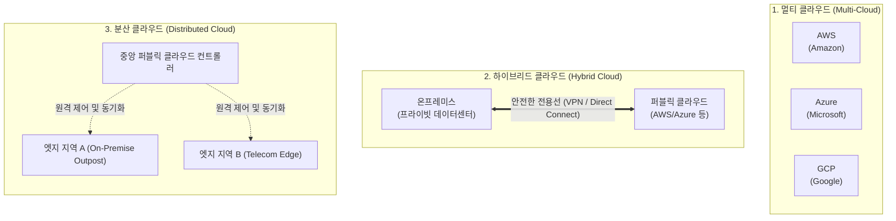

# 퍼블릭 클라우드 배치 분류 (Deployment Models) 3가지

---

## I. 클라우드 인프라 활용 목적에 따른 배치 분류, 퍼블릭 클라우드의 개요

* **정의**: 클라우드 서비스 제공자([[CSP]])가 소유하고 운영하는 컴퓨팅 자원(서버, 스토리지, 네트워크 등)을 공중(Public) 인터넷을 통해 일반 기업이나 개인 사용자에게 서비스 형태로 공유 제공하는 [[클라우드 컴퓨팅]] 모델
* **등장 배경 및 필요성**:
* 자체 데이터센터를 직접 구축하고 유지보수하는 데 드는 막대한 초기 자본 비용(CapEx)과 운영 인력 부담 해소
* 비즈니스 트래픽 변동에 맞춰 컴퓨팅 자원을 신속하고 탄력적으로 확장(Scalability)하거나 축소할 수 있는 유연성 확보

* **특징**: 높은 자원 공유율에 따른 경제성, 종량제(Pay-as-you-go) 기반 운영 비용(OpEx) 전환, 인프라 구축 지연 없는 즉각적인 [[프로비저닝]] 지원

---

## II. 퍼블릭 클라우드의 주요 배치(배포 및 아키텍처) 분류 3가지

퍼블릭 클라우드를 활용하는 기업의 보안 요구사항, 데이터 주권(Data Sovereignty), 인프라 아키텍처 전략에 따라 대표적으로 분류되는 **3가지 배치 형태**는 다음과 같습니다.

### 가. 퍼블릭 클라우드 배치 분류 3가지의 구조적 개념도

### 나. 3가지 배치 분류별 상세 비교
|**분류 (Model)**|**핵심 정의 및 아키텍처**|**주요 활용 목적 및 장점**|**대표적인 사례 및 기술**|
|---|---|---|---|
|1. 멀티 클라우드      (Multi-Cloud)|단일 CSP에 종속되지 않고, **둘 이상의 서로 다른 퍼블릭 클라우드(예: AWS + Azure + GCP)**를 동시에 도입하여 조합·운영하는 배치 방식|• 특정 벤더 종속(Vendor Lock-in) 회피      • 각 클라우드별 강점 서비스(예: AI는 GCP, 인프라는 AWS) 조합      • 장애 발생 시 이중화 및 [[HA(High Availability)|가용성]] 극대화|테라폼(Terraform) 등 IaC 도구를 활용한 멀티 클라우드 인프라 통합 관리|
|2. 하이브리드 클라우드      (Hybrid Cloud)|기업 내부의 자체 데이터센터(**온프레미스**)와 **퍼블릭 클라우드**를 전용선([[VPN]] 등)으로 상호 연동하여 유기적으로 통합 운영하는 배치 방식|• 민감한 핵심 데이터는 온프레미스에 유지      • 대규모 트래픽 분산 및 연산 처리는 퍼블릭 클라우드의 탄력성 활용      • 단계적 클라우드 전환(Migration) 추진|AWS Outposts, Azure [[Stack]], 금융권 핵심계정계(On-Prem) + 대고객 웹(Cloud) 연동|
|3. 분산 클라우드      (Distributed Cloud)|퍼블릭 클라우드 서비스 제공자의 중앙 제어 체계를 유지하면서, 실제 **클라우드 인프라를 고객의 물리적 데이터센터, 엣지([[EDGE|Edge]]) 로케이션, 타사 데이터센터 등 외부로 분산** 배치하는 방식|• 초저지연(Ultra-low latency) 요구 서비스 지원 ([[Smart Car(자율주행)|자율주행]], 스마트팩토리)      • 데이터 지역화(Data Localization) 규제 준수      • 물리적 분산 환경에서도 중앙과 동일한 API 활용|AWS Local Zones, AWS Outposts, Google Distributed Cloud|

---

## III. 퍼블릭 클라우드 배치 모델별 트레이드오프 및 최신 동향

### 가. 배치 모델별 장단점 비교

| 비교 항목 | 멀티 클라우드 (Multi-Cloud) | 하이브리드 클라우드 (Hybrid Cloud) | 분산 클라우드 (Distributed Cloud) |
| --- | --- | --- | --- |
| **구축 및 운영 복잡도** | **매우 높음** (상이한 플랫폼 전문 인력 필요) | 높음 (네트워크 연동 및 보안 정책 일원화 난이도 상) | **매우 높음** (하드웨어 제어 및 동기화 복잡) |
| **비용 효율성** | 벤더 간 요금 협상 유리하나 관리 오버헤드 존재 | 기존 온프레미스 자원 재활용으로 초기 비용 절감 | 초기 인프라 설치 및 관리 비용 상당함 |
| **보안 및 컴플라이언스** | 분산 분산에 따른 보안 정책 파편화 우려 | 내부망 보호와 외부 연계의 철저한 격리 가능 | 물리적 제어권 확보로 규제 준수에 유리 |

### 나. 현대 엔터프라이즈 아키텍처 발전 동향

* **클라우드 네이티브와 [[쿠버네티스]](Kubernetes) 표준화**: 멀티 클라우드와 하이브리드 클라우드 환경에서 인프라 종속성을 없애기 위해, 쿠버네티스를 표준 제어 플레인(Control Plane)으로 채택하여 어느 클라우드 환경에서나 동일한 애플리케이션을 배포·관리하는 **[[컨테이너]] 기반 이식성**이 대세로 자리 잡았습니다.
* **엣지 컴퓨팅 및 AI 연계 가속화**: 초저지연 대화형 AI, 실시간 비디오 분석 등 엣지 단의 연산 수요가 폭증함에 따라, 퍼블릭 클라우드의 지능형 서비스를 물리적으로 가까운 곳에 분산 배치하는 **분산 클라우드 및 엣지 클라우드 아키텍처** 도입이 전 산업군으로 빠르게 확산되고 있습니다.

---

### 🔗 연관 토픽

- **소속 도메인**: [[00_디지털서비스_MOC|🚀 디지털서비스]]
- **세부 분류**: `1. 클라우드 컴퓨팅 & 가상화 인프라`
- **핵심 연관 토픽**:
  - [[CSP|CSP (Cloud Service Provider)]]
  - [[클라우드 컴퓨팅|클라우드 컴퓨팅 (Cloud Computing)]]
  - [[쿠버네티스|쿠버네티스(Kubernates)]]
  - [[컨테이너|컨테이너 (Container)]]
  - [[클라우드 네이티브]]
