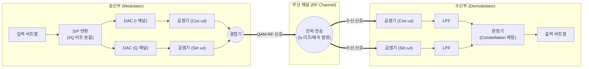

# QAM (Quadrature Amplitude Modulation)

---

## I. 디지털 무선통신의 주파수 효율 극대화, QAM의 개요

### 가. QAM의 정의

* 위상이 90도 차이나는 두 개의 직교 반송파(In-phase, Quadrature)에 진폭 변조(ASK)와 위상 변조(PSK)를 동시에 적용하여, 하나의 심볼에 더 많은 디지털 데이터를 실어 전송하는 고효율 디지털 변조 방식
* 주파수 대역폭이 제한된 무선 및 유선 통신 환경에서 스펙트럼 효율성(Spectral Efficiency)을 극대화하여 초고속 데이터 전송을 가능하게 하는 핵심 물리계층 기술

### 나. QAM의 필요성 및 주요 특징

* **주파수 효율성 증대**: 진폭과 위상을 동시에 활용함으로써 좁은 대역폭 내에서 다중 비트(Bits/Symbol) 전송 가능
* **고차 변조 진화**: 통신 기술의 발전과 함께 16, 64, 256을 넘어 [[Wi-Fi 7]] 및 5G-Advanced 환경의 4096-QAM(4K-QAM)으로 고도화
* **채널 환경 민감성**: 성상도(Constellation) 점 간의 간격이 조밀해져 높은 SNR(신호 대 잡음비)과 우수한 채널 상태 필수

---

## II. QAM의 개념도 및 핵심 기술 요소

### 가. QAM의 변복조 아키텍처 및 동작 원리

* 입력 비트열을 I(In-phase)와 Q(Quadrature) 채널로 분할하고, 각각 직교하는 반송파와 곱한 뒤 결합하여 전송함.
* 수신단에서는 국부 발진기와 곱하고 LPF(저역 통과 필터)를 거쳐 성상도 좌표 판정(Decision)을 통해 원래의 비트열로 복원함.

### 나. QAM의 핵심 구성 요소

| 분류 | 요소기술(키워드) | 세부 설명 |
| --- | --- | --- |
| **변조 채널** | **I/Q 채널 (In-phase / Quadrature)** | 90도의 위상 차이를 가지는 두 직교 반송파를 이용해 독립적으로 신호를 실어 나르는 기본 축 |
| **신호 표현** | **성상도 (Constellation Diagram)** | 2차원 평면상에 진폭과 위상을 좌표(점) 형태로 표시하여 QAM 상태와 심볼 에러율을 나타내는 도표 |
| **심볼 매핑** | **그레이 코딩 (Gray Coding)** | 인접한 성상도 점 간에 단 1개의 비트만 다르게 매핑하여, 심볼 오류 발생 시 비트 오류율(BER)을 최소화 |
| **신호 제어** | **적응형 변조 (AMC)** | 채널의 SNR(신호 대 잡음비) 상태에 따라 64, 256, 4096-QAM 수준을 실시간 동적 조절하는 기술 |
| **수신 기술** | **등화기 (Equalizer)** | 다중 경로 페이딩이나 채널 왜곡으로 인해 흐트러진 성상도 좌표를 원래 위치로 보정하는 회로 |
| **오류 제어** | **FEC (Forward Error Correction)** | 고차 QAM 환경에서 노이즈로 인한 비트 오류를 수신측에서 자가 복구하기 위한 순방향 오류 정정 |
| **최신 표준** | **4096-QAM (4K-QAM)** | Wi-Fi 7 및 5G-Advanced 표준에 도입되어 1개 심볼당 12비트를 처리하며 전송 속도 20% 향상 |
| **제약 사항** | **PAPR 및 고선형성 요구** | 성상도가 조밀해짐에 따라 높은 피크 전력비(PAPR)가 발생하며, 고선형성 RF 전력 증폭기(PA) 필수 |

---

## III. 고차 QAM 비교 및 최신 동향 (Wi-Fi 7 & 5G)

### 가. QAM 차수별(16 ~ 4096 QAM) 특성 비교

| 비교 항목 | 16-QAM | 256-QAM | 4096-QAM (4K-QAM) |
| --- | --- | --- | --- |
| **심볼당 비트 수** | 4 비트 ($2^4$) | 8 비트 ($2^8$) | **12 비트** ($2^{12}$) |
| **성상도 점 개수** | 16 개 | 256 개 | **4,096 개** |
| **주파수 효율성** | 낮음 (기본형) | 높음 (Wi-Fi 6 / LTE 표준) | **매우 높음 (Wi-Fi 7 / 5G-Advanced)** |
| **요구 SNR (잡음비)** | 낮음 (잡음에 강함) | 중간 수준 | **매우 높음 (깨끗한 신호 환경 필수)** |
| **주요 활용 분야** | 마이크로웨이브 통신, 레거시 | LTE, Wi-Fi 6, 디지털 케이블 | **Wi-Fi 7 (802.11be), 5G-Advanced, DOCSIS 4.0** |

### 나. QAM의 최신 기술 동향 및 향후 전망

* **Wi-Fi 7 및 차세대 유무선 표준 상용화**: 최신 무선 표준인 Wi-Fi 7(IEEE 802.11be)과 DOCSIS 4.0 케이블 모뎀 등에서 4096-QAM이 전면 상용화되어, 기존 Wi-Fi 6 대비 20% 이상 향상된 초고속 멀티기가바이트 스루풋 제공
* **AI 기반 비선형 왜곡 보상**: 고차 QAM으로 갈수록 위상 잡음과 비선형성에 취약해지므로, [[딥러닝]] 기반의 디지털 전치왜곡(DPD) 및 AI 수신기(AI Receiver)를 결합하여 고차 성상도의 에러를 실시간 교정하는 기술 연구 활발

---

### 🔗 연관 토픽

- **소속 도메인**: [[00_네트워크_MOC|🌐 네트워크]]
- **세부 분류**: `3. 전송 계층 & 트래픽 / 혼잡 제어 (L4)`
- **핵심 연관 토픽**:
  - [[Wi-Fi 7|WI-FI 7 (IEEE 802.11be)]]
  - [[딥러닝]]
  - [[QoS|QoS (Quality of Service)]]
  - [[Traffic Shaping (트래픽 쉐이핑)]]
  - [[Traffic Policing (트래픽 정책처리)]]
