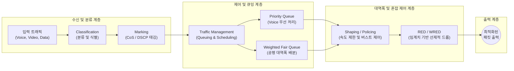

# QoS (Quality of Service)

---

## I. 네트워크 자원 제어 및 성능 보장, QoS의 개요

### 가. QoS의 정의

* 네트워크 대역폭이 제한된 환경에서 음성, 영상, 실시간 스트리밍 등 서비스의 중요도와 특성에 따라 트래픽 우선순위를 부여하여 일정한 수준의 전송 성능(지연, 손실률 등)을 보장하는 기술
* 단순히 Best-Effort 기반으로 패킷을 평등하게 처리하던 기존 방식에서 벗어나, 중요 트래픽에 대한 차별화된 서비스를 제공하는 핵심 제어 메커니즘

### 나. QoS의 필요성 및 핵심 특징

* **실시간 트래픽 보장**: VoIP, 화상회의, 온라인 게임 등 지연에 민감한 서비스의 패킷 손실 및 지연(Jitter) 최소화
* **네트워크 [[자원 최적화]]**: 트래픽 폭주(Congestion) 시 무분별한 드롭 방지 및 대역폭의 효율적 분배
* **주요 특징**: 서비스 등급 분류(Classification), 마킹(Marking), 트래픽 제어([[Traffic Shaping (트래픽 쉐이핑)|Traffic Shaping]]/Policing) 기능 통합 수행

---

## II. QoS의 아키텍처 및 핵심 기술 요소

### 가. QoS의 트래픽 제어 아키텍처 및 동작 원리

* 입력된 패킷은 분류와 마킹(DSCP 태깅)을 거쳐 큐([[Queue]])에 적재되며, 우선순위 및 공정 [[스케줄링]](PQ, [[WFQ]])과 [[혼잡 제어]](WRED)를 통해 최적의 상태로 출력됨.

### 나. QoS의 핵심 구성 요소 및 기술

| 분류 | 요소기술(키워드) | 세부 설명 |
| --- | --- | --- |
| **식별 단계** | **Classification** | 패킷의 출발지/목적지 IP, 포트, L7 애플리케이션 정보를 바탕으로 트래픽 유형 판별 |
| **태깅 단계** | **Marking (DSCP/CoS)** | L2(이더넷 802.1p, CoS) 또는 L3(IP 헤더, DSCP) 필드에 서비스 등급 값을 기록하여 식별 보장 |
| **제한 단계** | **Policing & Shaping** | 트래픽 속도 초과 시 초과 패킷을 폐기(Policing)하거나 버퍼에 담아 전송 속도를 부드럽게 지연(Shaping) |
| **큐잉 방식** | **PQ (Priority Queue)** | 중요 트래픽(음성 등)에 절대적 우선순위를 부여하여 대기 시간 없이 즉시 처리하는 방식 |
| **큐잉 방식** | **WFQ (Weighted Fair Q)** | 대역폭을 세션별 가중치에 따라 공평하게 나누어 분배함으로써 하위 트래픽 고갈 방지 |
| **혼잡 제어** | **WRED (Weighted RED)** | 큐가 완전히 차기 전에 임계치를 두어 중요도가 낮은 패킷을 선제적으로 폐기하여 [[TCP]] 윈도우 조절 유도 |
| **아키텍처** | **IntServ (Integrated)** | 세션마다 자원을 사전에 예약(RSVP)하는 방식이나, 대규모 네트워크에서 확장성 한계 존재 |
| **아키텍처** | **DiffServ (Differentiated)** | 패킷 단위로 등급(Class)을 지정하여 그룹별로 차등 처리하는 확장성 높은 현재의 표준 모델 |

---

## III. QoS 모델 비교 및 최신 트렌드

### 가. 전통적 QoS 아키텍처 (IntServ vs DiffServ) 비교

| 비교 항목 | [[IntServ (Integrated Services)]] | [[DiffServ (Differentiated Services)]] |
| --- | --- | --- |
| **제어 단위** | **플로우(Flow) 단위** 세션별 개별 관리 | **[[클래스]](Class) 단위** 그룹별 집단 관리 |
| **자원 예약** | RSVP 프로토콜을 이용한 명시적 자원 예약 | 사전 정의된 정책 기반 패킷 마킹(DSCP) |
| **확장성** | 낮음 (라우터마다 모든 [[세션]] 상태 유지 필요) | **매우 높음** (라우터가 플로우 상태를 저장하지 않음) |
| **구현 복잡도** | 매우 복잡함 | 비교적 단순함 |
| **주요 활용** | 특수 목적의 폐쇄망, 실시간 가상 회선 | **현대 인터넷 및 엔터프라이즈 [[백본망]] 표준** |

### 나. 최신 기술 동향 및 산업 적용 방향

* **AI 기반 자율형 QoS (Intent-Based QoS)**: 애플리케이션의 실시간 요구사항([[SLA]])을 [[딥러닝]] 모델이 동적으로 분석하여, 네트워크 혼잡 상황에서도 AI 에이전트가 QoS 정책과 대역폭을 자동 최적화하는 소프트웨어 정의 네트워킹([[SDN(Software Defined Network)|SDN]]) 연계 기술 도입 가속화
* **5G Network Slicing과의 융합**: 모바일 코어 네트워크에서 단순히 패킷 등급을 나누는 것을 넘어, 물리적 인프라를 논리적으로 분리하여 초저지연(URLLC)과 대규모 연결(mMTC)별로 전용 가상 네트워크와 맞춤형 QoS 보장 체계 제공

---

### 🔗 연관 토픽

- **소속 도메인**: [[00_네트워크_MOC|🌐 네트워크]]
- **세부 분류**: `3. 전송 계층 & 트래픽 / 혼잡 제어 (L4)`
- **핵심 연관 토픽**:
  - [[Traffic Shaping (트래픽 쉐이핑)]]
  - [[DiffServ (Differentiated Services)]]
  - [[WFQ|WFQ (Weighted Fair Queuing)]]
  - [[IntServ (Integrated Services)]]
  - [[백본망]]
