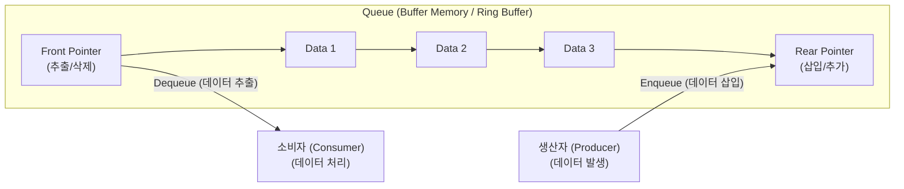

# Queue (큐)

---

## I. 선입선출 기반 자료구조 및 비동기 메시징 완충기, Queue의 개요

* **정의**: 데이터의 삽입은 한쪽 끝(Rear)에서, 삭제는 반대쪽 끝(Front)에서 이루어져 먼저 들어온 데이터가 먼저 나가는 **[[FIFO]] (First-In, First-Out)** 방식의 선형 자료구조이자 분산 시스템의 비동기 메시지 버퍼
* **등장배경**: 멀티스레드 환경 및 분산 시스템에서 생산자(Producer)와 소비자(Consumer) 간의 처리 속도 차이로 발생하는 병목 현상을 해소하고 작업 순서를 보장할 필요성 대두
* **특징**: 순서 보장성, 선입선출 구조, 메모리 효율성을 위한 원형 큐(Circular Queue) 및 락프리(Lock-free) 동시성 제어 지원

---

## II. Queue의 아키텍처 및 핵심 기술 요소

### 가. Queue의 구조 및 동작 원리

* 데이터가 삽입(Enqueue)되면 Rear 포인터가 이동하고, 추출(Dequeue)되면 Front 포인터가 이동하여 순차적인 FIFO 흐름을 유지함
* 고정 배열 기반의 공간 낭비 문제를 해결하기 위해 시작과 끝이 연결된 **원형 큐(Circular Queue)** 구조를 적용함

### 나. Queue의 핵심 기술 요소

| 분류 | 요소기술(키워드) | 세부 설명 |
| --- | --- | --- |
| **기본 연산** | **Enqueue / Dequeue** | 큐의 Rear에 데이터를 추가(Enqueue)하고 Front에서 데이터를 제거 및 반환(Dequeue)하는 핵심 연산 |
| **포인터 관리** | **Front / Rear** | 데이터의 읽기 위치(Front)와 쓰기 위치(Rear)를 추적하여 오버플로우 및 언더플로우를 판정하는 인덱스 |
| **구조 최적화** | **Circular Queue** | 선형 큐의 공간 [[재사용]] 한계를 극복하기 위해 배열의 끝과 처음을 논리적으로 연결한 원형 버퍼 구조 |
| **동시성 제어** | **Lock-free Queue** | 멀티스레드 환경에서 Mutex 락(Lock) 없이 **CAS (Compare-And-Swap)** 원자적 연산으로 경합을 최소화한 큐 |
| **고성능 버퍼** | **Ring Buffer** | 메모리를 고정 크기로 할당하고 순환 재사용하여 가비지 컬렉션(GC) 부하를 없앤 초고속 버퍼 |
| **우선순위 처리** | **Priority Queue** | FIFO 원칙을 깨고 우선순위가 높은 데이터를 먼저 처리하는 힙(Heap) 기반의 특수 큐 |
| **분산 아키텍처** | **Message Queue** | 시스템 간 결합도를 낮추고 비동기 이벤트 처리를 보장하는 분산형 미들웨어 (예: Kafka, RabbitMQ) |
| **메모리 보호** | **Bounded Queue** | 최대 수용 가능한 크기를 제한하여 시스템 메모리 고갈(OOM) 및 폭주(Surge) 방지 |

---

## III. Stack vs Queue 비교 및 최신 동향

### 가. Stack과 Queue 자료구조 비교

| 비교 항목 | [[Stack]] (스택) | Queue (큐) |
| --- | --- | --- |
| **입출력 방식** | **LIFO (Last-In, First-Out)** | **FIFO (First-In, First-Out)** |
| **삽입/삭제 위치** | 한쪽 끝(Top)에서만 수행 | 양쪽 끝 (Front와 Rear)에서 각각 분리 수행 |
| **주요 연산** | Push / Pop | Enqueue / Dequeue |
| **구현 방식** | 배열(Array) 또는 단일 연결 리스트 | 원형 배열, 양방향 연결 리스트, 링 버퍼 |
| **주요 활용 분야** | 함수 호출 스택, DFS 탐색, 실행 취소(Undo) | OS [[프로세스]] [[스케줄링]], BFS 탐색, 비동기 메시지 버퍼 |

### 나. Queue의 최신 기술 동향 및 산업 적용 방향

* **이벤트 드라이븐 아키텍처([[EDA]]) 중심 메시징 큐**: [[MSA (Micro Service Architecture)|MSA]] 환경에서 서비스 간 동기 통신의 한계를 극복하기 위해 Apache Kafka, RabbitMQ 등 분산 메시지 큐를 활용한 실시간 이벤트 스트리밍 및 이벤트 소싱(Event Sourcing) 보편화
* **고성능 저지연 락프리(Lock-Free) 링버퍼 적용**: 금융 고빈도 매매(HFT) 및 초저지연 대용량 트래픽 처리를 위해 락(Lock)으로 인한 컨텍스트 스위칭 비용을 제거한 LMAX Disruptor 등 차세대 링버퍼 기반 큐 아키텍처 도입 급증

---

### 🔗 연관 토픽

- **소속 도메인**: [[00_컴퓨터구조_MOC|💻 컴퓨터구조]]
- **세부 분류**: `4. 기본 자료구조 (Data Structures)`
- **핵심 연관 토픽**:
  - [[Stack]]
  - [[FIFO]]
  - [[트리 순회|트리 순회 (Tree Traversal)]]
  - [[다익스트라 알고리즘|다익스트라 (Dijkstra) 알고리즘]]
  - [[최소 신장 트리|최소 신장 트리 (MST, Minimum Spanning Tree)]]
