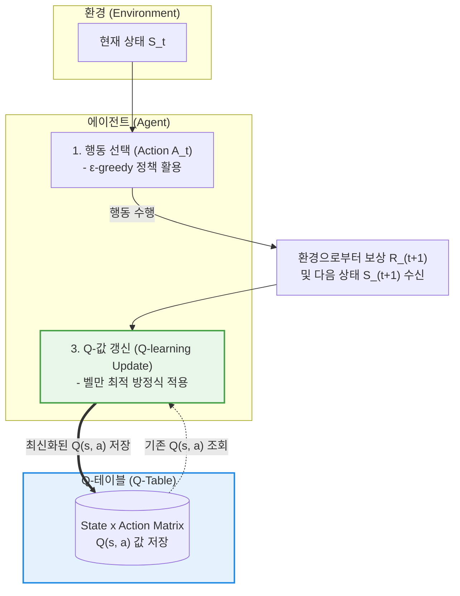

# Q-러닝 (Q-Learning)

---

## I. 모델 프리 강화학습의 대표적 가치 기반 알고리즘, Q-러닝의 개요

* **정의**: 에이전트(Agent)가 환경(Environment)에 대한 사전 모델(Transition/Reward Probability Model) 없이, 시행착오(Trial-and-Error)를 통해 각 상태(State)에서 특정 행동(Action)을 취했을 때 기대되는 미래 보상의 최대값, 즉 상태-행동 가치 함수(Q-Value)를 반복적으로 갱신하여 최적의 정책을 찾아내는 [[모델 프리]](Model-Free) 오프 폴리시(Off-Policy) [[강화학습]] [[알고리즘]]
* **등장 배경 및 필요성**:
* 복잡한 현실 세계에서는 환경의 상태 전이 확률과 보상 함수를 수학적 모델로 완벽히 정의하기 어려움 (Model-Free 접근 필요)
* [[동적 계획법]](Dynamic Programming)의 한계를 극복하고, 에이전트가 직접 환경과 상호작용하며 최적의 행동 지침을 스스로 학습할 수 있는 메커니즘 요구

* **특징**: MDP(마르코프 결정 과정) 기반, 환경 모델 불필요, **오프 폴리시(Off-Policy)** 학습(현재 따르는 행동 정책과 무관하게 최적의 가치 함수 수렴 보장), 벨만 최적 방정식을 기반으로 한 반복적 갱신(TD 학습)

---

## II. Q-러닝의 아키텍처 및 핵심 구성요소

### 가. Q-러닝의 동작 메커니즘 및 갱신 흐름도

* 에이전트는 상태 $S_t$에서 **$\epsilon$-greedy 정책** 등을 통해 행동 $A_t$를 선택하고, 환경으로부터 보상 $R_{t+1}$과 다음 상태 $S_{t+1}$을 얻습니다.
* 얻은 경험을 바탕으로 벨만 최적 방정식(Bellman Optimality Equation)에 기반한 **TD(Temporal Difference) 오차**를 계산하여 Q-테이블의 값을 갱신합니다.

### 나. Q-러닝의 핵심 수학적 모델링 및 구성 요소

| 분류 | 요소기술(키워드) | 세부 설명 및 공식 |
| --- | --- | --- |
| **핵심 가치** | Q-Value ($Q(s, a)$) | 상태 $s$에서 행동 $a$를 선택했을 때 얻을 수 있는 할인된 미래 누적 보상의 기댓값 |
| **갱신 규칙** | Q-Learning Update Equation | $Q(s_t, a_t) \leftarrow Q(s_t, a_t) + \alpha \left[ R_{t+1} + \gamma \max_{a} Q(s_{t+1}, a) - Q(s_t, a_t) \right]$ |
| **학습률** | Learning Rate ($\alpha$) | 새롭게 학습한 정보가 기존 Q-값에 반영되는 비율 ($0 < \alpha \le 1$). 값이 클수록 최신 경험을 신뢰 |
| **할인율** | Discount Factor ($\gamma$) | 미래 보상을 현재 가치로 환산하는 비율 ($0 \le \gamma < 1$). 1에 가까울수록 장기적 보상 중시 |
| **탐험 제어** | $\epsilon$-greedy 정책 | 확률 $\epsilon$으로는 무작위 행동(Exploration)을 하고, $1-\epsilon$으로는 현재 가장 높은 Q값을 가진 행동(Exploitation)을 선택 |
| **오프 폴리시** | Off-Policy 특성 | 행동을 선택하는 정책(Behavior Policy, $\epsilon$-greedy)과 최적 가치를 학습하는 정책(Target Policy, $\max$)이 서로 다름 |

---

## III. 가치 기반 강화학습 알고리즘 비교 및 최신 동향

### 가. 대표적 가치 기반 강화학습 알고리즘 비교 (Q-learning vs SARSA vs DQN)

| 비교 항목 | Q-learning | SARSA | DQN (Deep Q-Network) |
| --- | --- | --- | --- |
| **정책 유형** | **오프 폴리시 (Off-Policy)** | 온 폴리시 (On-Policy) | 오프 폴리시 (Off-Policy) |
| **갱신 기준** | 다음 상태에서의 **최대 Q값 ($\max Q$)** 이용 | 다음 상태에서 실제 취할 **행동의 Q값 ($Q(s', a')$)** 이용 | 신경망(Neural Network) 기반 비선형 Q함수 근사 |
| **대상 공간** | 이산적(Discrete) 상태-행동 공간 (테이블 형태) | 이산적 상태-행동 공간 | **고차원 연속적 상태 공간 (아atari 게임 등)** |
| **안정성** | 수렴성 보장되나 상태가 커지면 메모리 한계 | 정책 내 탐험 요소가 반영되어 안전한 경로 학습 | **경험 재현(Experience Replay)**과 타겟 네트워크로 안정성 확보 |

### 나. 한계 극복 및 최신 발전 동향

* **차원의 저주(Curse of Dimensionality) 한계**: 상태와 행동의 경우의 수가 수십억 개를 넘어가면 Q-테이블을 메모리에 유지할 수 없고 학습이 불가능해집니다. 이를 극복하기 위해 딥러닝을 결합한 DQN(Deep Q-Network)이 등장하여 심층 신경망이 직접 Q-값을 추정하도록 진화했습니다.
* **최신 심층 강화학습으로의 확장**: DQN의 과대평가(Overestimation) 문제를 해결한 **Double DQN**, 학습 안정성을 극대화한 **Dueling DQN**, 연속적이고 복잡한 제어 문제에 강한 **DDPG, PPO, SAC** 등 액터-크리틱(Actor-Critic) 계열 알고리즘으로 발전하여 [[Smart Car(자율주행)|자율주행]], 로보틱스, [[초거대 언어 모델|LLM]] 정렬(RLHF) 등의 핵심 기술로 광범위하게 활용되고 있습니다.

---

다음으로 이어서 다루어 주기를 원하시는 기술 용어나 개념이 있으신가요?

---

### 🔗 연관 토픽

- **소속 도메인**: [[00_인공지능_MOC|🤖 인공지능]]
- **세부 분류**: `2. 머신러닝 기초 & 핵심 알고리즘`
- **핵심 연관 토픽**:
  - [[강화학습]]
  - [[모델 프리]]
  - [[동적 계획법|동적 계획법 (Dynamic Programming)]]
  - [[초거대 언어 모델|초거대 언어 모델(Large Language Model)]]
  - [[Smart Car(자율주행)]]
