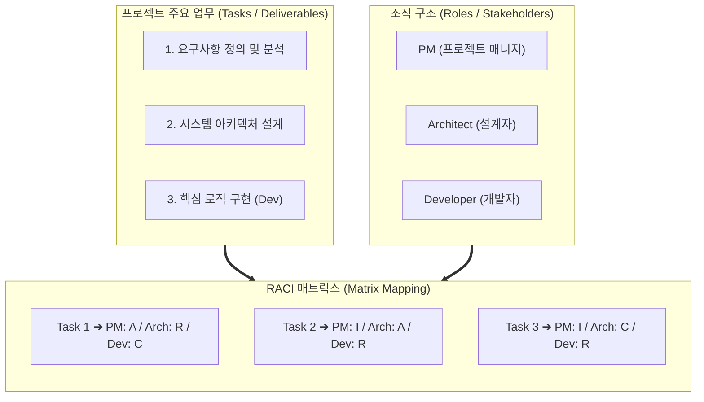

# RACI 매트릭스

---

## I. 프로젝트 책임 명확화 및 의사결정 최적화, RACI 매트릭스의 개요

* **정의**: 프로젝트 조직 내 업무별 역할과 책임을 **R(Responsible), A(Accountable), C(Consulted), I(Informed)** 4가지 유형으로 매핑하여 정의하는 책임 할당 매트릭스(RAM, Responsibility Assignment Matrix) 기법
* **등장배경**: 복잡한 이해관계자 간 책임 소재 불분명으로 인한 커뮤니케이션 왜곡, 의사결정 지연 및 사일로(Silo) 현상을 방지하고 효율적 거버넌스 체계를 확립하기 위함
* **특징**: 직무 중복 및 공백 방지, 명확한 의사결정 한계선 설정, 단일 책임 원칙(Single Accountable) 보장

---

## II. RACI 매트릭스의 개념도 및 핵심 기술 요소

### 가. RACI 매트릭스의 구조 및 동작 원리

* 업무([[WBS]])와 조직(OBS)의 교차점에 RACI 코드를 할당하여 실행 주체와 승인 권한을 시각적으로 명확히 정의함
* 모든 작업 항목(Task)에는 최종 책임자인 **A**가 반드시 단 1명만 존재하도록 통제함

### 나. RACI 매트릭스의 핵심 구성 요소 및 규칙

| 분류 | 요소기술(키워드) | 세부 설명 |
| --- | --- | --- |
| **역할 정의** | **R (Responsible)** | 실제로 작업을 수행하여 결과물을 완성하는 실행 책임자 (여러 명 지정 가능) |
| **역할 정의** | **A (Accountable)** | 최종 결과에 대한 실질적/법적 책임을 지고 승인(Approval)하는 단 한 명의 의사결정권자 |
| **역할 정의** | **C (Consulted)** | 의사결정 및 작업 수행 전 양방향 소통을 통해 전문 지식과 자문을 제공하는 이해관계자 |
| **역할 정의** | **I (Informed)** | 작업 진행 상황, 의사결정 결과 등을 일방향으로 통보받고 공유받는 이해관계자 |
| **매트릭스 기법** | **RAM (Responsibility Assignment)** | WBS 작업 항목과 조직 구조를 교차 매핑하여 역할 공백을 사전에 방지하는 상위 [[프레임워크]] |
| **작성 원칙** | **Single Accountable Rule** | 모든 Task 행에 대해 'A'는 오직 1개만 존재해야 하며, '책임 전가(Passing the Buck)' 방지 |
| **품질 검증** | **No-Empty / No-Double** | 각 Task에 R이 누락되지 않거나(No-Empty), 불필요하게 A가 중복(No-Double)되지 않도록 검증 |
| **확장 모델** | **RASCI (Support 추가)** | 실무 실행 시 적극적으로 협력하고 지원하는 'Support(S)' 역할을 분리하여 명시한 확장형 모델 |

---

## III. RACI 매트릭스의 확장 모델 비교 및 최신 동향

### 가. 전통적 RACI vs 애자일 및 AI 거버넌스 환경의 진화 비교

| 비교 항목 | 전통적 RACI 매트릭스 | 애자일 및 [[AI 거버넌스]] 적용 (Modern RACI) |
| --- | --- | --- |
| **조직 환경** | 하향식(Top-down) 관료제 및 계층형 조직 | 수평적 애자일 스쿼드(Squad) 및 자율 조직 |
| **권한 구조** | 부서 간 명확한 경계와 승인 절차 중시 | 빠른 프로토타이핑과 자율적 의사결정(Delegate) |
| **AI/디지털 적용** | 데이터 관리, 시스템 구축 단계 중심 | **[[AI 윤리]], [[데이터 거버넌스]], 모델 배포 승인 체계** |
| **한계점** | 급변하는 환경에서 매트릭스 갱신 지연 우려 | 역할의 모호성 발생 시 책임 소재 규명 혼선 |

### 나. 최신 트렌드 및 산업 적용 방향 (AI 거버넌스 연계)

* **AI 윤리 및 컴플라이언스(AI RACI)**: 생성형 AI 및 [[초거대 언어 모델|LLM]] 도입 시, 데이터 수집(Data Curation), 모델 파인튜닝, [[프롬프트 엔지니어링]], 보안 검토 단계별로 AI 윤리 책임자 및 법무팀을 A/C로 명시하는 'AI 거버넌스용 RACI' 프레임워크 도입 가속화
* **실시간 다이내믹 RAM**: 고정된 엑셀 기반 매트릭스 형태에서 벗어나, Jira 및 Confluence 등 협업 툴과 연계하여 이슈별 작업자 변경 시 실시간으로 RACI 권한이 동기화되는 디지털 프로젝트 관리 도구 연동 확산

---

### 🔗 연관 토픽

- **소속 도메인**: [[00_프로젝트관리_MOC|📋 프로젝트관리]]
- **세부 분류**: `1. PMBOK 표준 & 프로젝트 거버넌스`
- **핵심 연관 토픽**:
  - [[AI 거버넌스|AI 거버넌스 (AI Governance)]]
  - [[데이터 거버넌스|데이터 거버넌스 (Data Governance)]]
  - [[WBS|WBS (Work Breakdown Structure)]]
  - [[SCRUM]]
  - [[프롬프트 엔지니어링|프롬프트 엔지니어링(Prompt Engineering)]]
