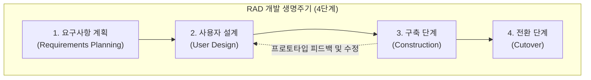

# RAD (Rapid Application Development)

---

## I. 신속한 프로토타이핑 기반 응용 개발, RAD의 개요

* **정의**: 엄격한 사전 계획 대신 짧은 타임박스(Timebox) 내에 프로토타이핑과 사용자 참여를 반복하여 응용 프로그램을 신속하게 개발하는 애자일의 선구적 소프트웨어 개발 생명주기([[SDLC]]) 모델
* **등장배경**: 전통적 [[워터폴]](Waterfall) 모델의 긴 개발 주기로 인한 비즈니스 환경 변화 대응 한계 극복, JAD(Joint Application Development)를 통한 사용자 요구사항 즉시 반영 필요성 대두
* **특징**: 타임박싱 기반 일정 엄수, 프로토타입을 통한 가시적 검증, 현업 사용자의 전 과정 상시 참여, 컴포넌트 [[재사용]] 극대화

---

## II. RAD의 아키텍처 및 핵심 기술 요소

### 가. RAD의 개발 생명주기(4단계) 및 동작 원리

* 비즈니스 범위 설정(요구사항 계획) 후, 사용자와 함께 설계 및 구축을 반복(Prototyping)하여 피드백을 즉시 반영하고 최종 시스템으로 전환함

### 나. RAD의 핵심 기술 및 구성 요소

| 분류 | 요소기술(키워드) | 세부 설명 |
| --- | --- | --- |
| **일정 관리** | **타임박스 (Timeboxing)** | 추가 기능 구현보다 정해진 짧은 기간(예: 60~90일) 내에 반드시 결과물을 완성하는 엄격한 일정 관리 기법 |
| **개발 기법** | **프로토타이핑 (Prototyping)** | 핵심 기능을 가진 시제품을 빠르게 만들어 사용자가 직접 조작하며 요구사항을 확정하는 방식 |
| **협업 체계** | **JAD (Joint App Design)** | 개발자와 현업 사용자가 집중 워크숍 형태로 모여 실시간으로 설계와 요구사항을 조율하는 협업 기법 |
| **자동화 도구** | **CASE 도구 (Computer-Aided SE)** | 시각적 UI 설계, 코드 자동 생성, [[데이터베이스]] [[스키마]] 구축을 지원하는 개발 자동화 소프트웨어 |
| **재사용성** | **컴포넌트 재사용 (Reuse)** | 기성 소프트웨어 모듈, API, 오픈소스 라이브러리를 적극 활용하여 직접 코딩하는 공수 최소화 |
| **주기 모델** | **반복적 생명주기 (Iterative)** | 순차적 진행이 아닌, 설계-구축-테스트의 반복 주기를 통해 점진적으로 시스템 완성도 제고 |
| **참여 체계** | **사용자 중심 참여 (User Involvement)** | 최종 사용자가 개발 전 과정에 상시 참여하여 품질 검증 및 의사결정 수행 |
| **아키텍처** | **애자일 선구 모델 ([[Agile]] Precursor)** | 현대 소프트웨어 공학의 [[스크럼]]([[SCRUM|Scrum]]) 및 익스트림 프로그래밍(XP) 등 애자일 방법론의 모태가 됨 |

---

## III. RAD의 방법론 비교 및 최신 동향

### 가. 전통적 워터폴 vs RAD vs 현대 애자일 비교

| 비교 항목 | 워터폴 (Waterfall) | RAD (Rapid App Dev) | 현대 애자일 (Agile) |
| --- | --- | --- | --- |
| **개발 주기** | 장기 (수개월 ~ 수년) | 중단기 (수주 ~ 수개월) | 단기 (스프린트 단위, 1~4주) |
| **사용자 참여** | 초기(요구사항) 및 최종 단계 집중 | 전 과정 상시 참여 (JAD 중심) | 매 스프린트 리뷰 및 지속적 피드백 |
| **변화 대응** | 매우 취약 (변경 비용 높음) | 유연함 (프로토타입 중심) | 매우 유연함 (지속적 개선 및 피벗) |
| **주요 한계** | 요구사항 변경 반영 및 중도 수정 곤란 | 대규모 엔터프라이즈 시스템 확장성 한계 | 철저한 사전 아키텍처 설계 부려 우려 |

### 나. RAD의 최신 동향 및 산업 적용 방향

* **로우코드/노코드(Low-Code/No-Code) 플랫폼과의 결합**: 과거의 프로토타이핑 개념이 현대에 이르러 시각적 드래그앤드롭 기반의 LCNC 플랫폼(OutSystems, Microsoft Power Platform 등)과 결합하여 비즈니스 애자일 구현의 핵심 수단으로 부활함.
* **생성형 AI 기반 RAD 가속화**: [[초거대 언어 모델|LLM]] 기반 코드 생성 도구(Copilot 등)와 AI 에이전트를 통해 요구사항 명세 단계에서 곧바로 UI 프로토타입과 백엔드 코드를 자동 생성하는 초고속 AI 기반 RAD 생태계로 진화 중.

---

### 🔗 연관 토픽

- **소속 도메인**: [[00_소프트웨어공학_MOC|🏗️ 소프트웨어공학]]
- **세부 분류**: `1. 소프트웨어 개발 생명주기(SDLC) & 방법론`
- **핵심 연관 토픽**:
  - [[SDLC]]
  - [[Agile]]
  - [[워터폴]]
  - [[SCRUM]]
  - [[데이터베이스]]
