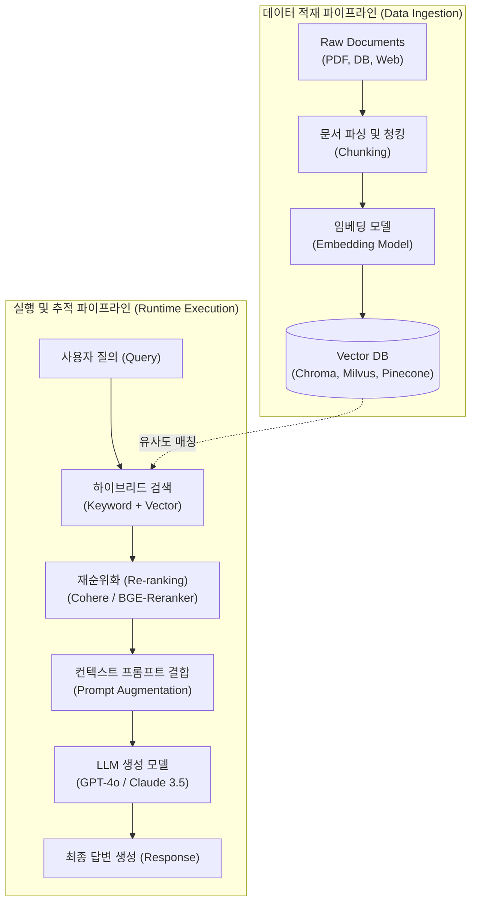

# RAG (Retrieval-Augmented Generation)

---

## I. 환각 현상 극복 및 최신 지식 결합, RAG의 개요

* **정의**: 거대 언어 모델([[초거대 언어 모델|LLM]])의 고유 한계인 환각(Hallucination) 현상을 방지하고 최신 정보 반영을 위해, 사용자 질의와 관련된 외부 문서나 데이터를 검색(Retrieval)하여 프롬프트에 맥락(Context)으로 주입(Augmented)한 뒤 답변을 생성(Generation)하는 AI 아키텍처
* **등장배경**: LLM 사전 학습 데이터의 시점 한계(Cut-off date) 극복, 기업 내부 기밀 데이터의 보안 유지 및 파인튜닝 비용 절감 필요성 대두
* **핵심 특징**: 외부 지식베이스 연동을 통한 사실 기반(Fact-based) 응답 보장, 도메인 특화 지식 확장 용이성, 추적 가능성(Citations) 확보

---

## II. RAG의 아키텍처 및 핵심 기술 요소

### 가. RAG의 엔드투엔드 파이프라인 아키텍처 및 동작 원리

* 문서 수집 단계에서 청킹과 벡터화를 거쳐 Vector DB에 적재하고, 런타임 시 사용자의 질의를 기반으로 하이브리드 검색과 재순위화(Re-ranking)를 거쳐 LLM에 컨텍스트를 주입함.

### 나. RAG의 핵심 기술 요소

| 분류 | 요소기술(키워드) | 세부 설명 |
| --- | --- | --- |
| **데이터 준비** | **Chunking (청킹)** | 대용량 문서를 LLM의 토큰 제한과 의미 보존을 고려하여 적절한 크기(예: 512 토큰)로 분할하는 기술 |
| **벡터 변환** | **Embedding Model** | 텍스트의 의미적(Semantic) 특성을 다차원 수치 벡터 공간으로 변환하여 표현하는 인공신경망 |
| **저장소** | **Vector Database** | 고차원 벡터 간의 [[유사도]](코사인 유사도, 유클리디안 거리 등)를 초고속으로 검색하는 특화 [[데이터베이스]] |
| **검색 기법** | **Hybrid Search** | 전통적인 키워드 검색(BM25)과 의미 기반 벡터 검색(Dense Retrieval)을 결합하여 검색 누락 최소화 |
| **고도화 검색** | **Re-ranking (재순위화)** | 1차 검색된 문서 중 질의와의 관련성이 가장 높은 문서를 교차 인코더(Cross-Encoder)로 정밀 재정렬 |
| **프롬프트 제어** | **Context Augmentation** | 검색된 컨텍스트와 시스템 프롬프트를 결합하여 LLM이 근거 기반으로만 답변하도록 유도 |
| **파이프라인** | **Advanced RAG** | 쿼리 확장(Query Expansion), 소스 라우팅, 전처리/후처리 기법을 도입한 고성능 RAG 체계 |
| **품질 평가** | **RAG Triad (Ragas)** | 생성된 답변의 충실도(Faithfulness), 답변 관련성(Answer Relevance), 맥락 재현율 평가 체계 |

---

## III. RAG의 진화 단계 비교 및 최신 동향 (Graph RAG / Agentic RAG)

### 가. RAG 아키텍처의 세대별 진화 비교

| 비교 항목 | Naive RAG (기본형) | Advanced RAG (고도화형) | Agentic RAG (자율 에이전트형) |
| --- | --- | --- | --- |
| **검색 방식** | 단순 질의 → 벡터 검색 → LLM 생성 | 전처리 + 하이브리드 검색 + **Re-ranking** | **LLM 에이전트가 검색 전략을 자율 수립 및 수정** |
| **복잡한 질의 대응** | 취약함 (다중 문서 종합 분석 어려움) | 부분적 개선 (쿼리 재작성 및 라우팅 도입) | **탁월함 (반복적 검색, 멀티스텝 추론 수행)** |
| **구조적 한계** | 전체 맥락 연결성 부족, 정보 고립 | 파이프라인 경직성 존재 | 높은 연산 비용 및 지연시간(Latency) 발생 |
| **주요 활용 분야** | 단순 사내 FAQ, 매뉴얼 검색 챗봇 | 대규모 엔터프라이즈 문서 분석 시스템 | **복잡한 비즈니스 리서치, 다중 소스 심층 분석** |

### 나. 최신 기술 동향 및 산업 적용 방향

* **Graph RAG 결합 확산**: 전통적인 벡터 검색의 한계인 개체 간 관계(Relationship) 파악을 극복하기 위해, 문서 지식을 지식 그래프(Knowledge Graph)로 구축하고 벡터 검색과 결합하여 전역적(Global) 답변 역량 강화
* **Agentic RAG 도입**: 단순 일회성 검색을 넘어, 에이전트가 스스로 검색 결과의 타당성을 검증하고 부족할 경우 키워드를 재조합하여 추가 검색을 수행하는 자가 교정(Self-Correction) 파이프라인 표준화

---

### 🔗 연관 토픽

- **소속 도메인**: [[00_인공지능_MOC|🤖 인공지능]]
- **세부 분류**: `4. 거대언어모델 (LLM) & 생성형 AI`
- **핵심 연관 토픽**:
  - [[유사도|유사도(Similarity)]]
  - [[GraphRAG (Graph Retrieval-Augmented Generation)]]
  - [[초거대 언어 모델|초거대 언어 모델(Large Language Model)]]
  - [[데이터베이스]]
  - [[프롬프트 인젝션|프롬프트 인젝션(Prompt Injection)]]
