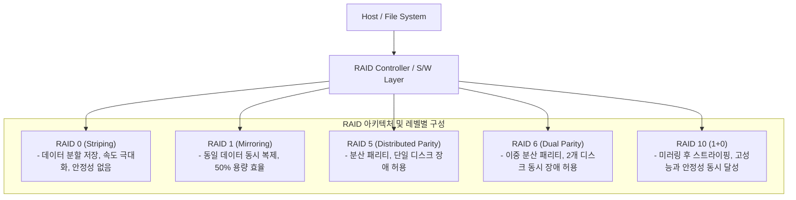

# RAID (Redundant Array of Independent Disks)

---

## I. 고성능·고가용성 스토리지 가상화, RAID의 개요

* **정의**: 복수의 물리적 디스크 드라이브를 논리적으로 하나로 통합하여, 입출력 성능 향상(Striping)과 데이터 중복성(Redundancy/Parity)을 동시에 제공하는 스토리지 [[가상화]] 기술
* **등장배경**: 단일 디스크의 성능 및 용량 한계 극복, 하드웨어 장애 발생 시 서비스 중단 및 데이터 유실을 방지하기 위한 고가용성([[HA(High Availability)|High Availability]]) 확보 필요성 대두
* **핵심 특징**: 스트라이핑(Striping)을 통한 병렬 I/O 성능 극대화, 미러링 및 패리티(Parity)를 통한 결함 허용(Fault Tolerance) 구현

---

## II. RAID의 아키텍처 및 핵심 기술 요소

### 가. RAID의 주요 레벨별 아키텍처 및 동작 원리

* 호스트의 I/O 요청을 RAID 컨트롤러가 받아 설정된 레벨의 알고리즘에 따라 데이터를 분할(Striping)하거나 중복(Parity/Mirror) 처리하여 물리 디스크에 분산 저장함.

### 나. RAID의 핵심 구성 요소 및 레벨별 특성

| 분류 | 요소기술(키워드) | 세부 설명 |
| --- | --- | --- |
| **기본 연산** | **Striping (스트라이핑)** | 데이터를 블록 단위로 쪼개어 여러 디스크에 분산 저장함으로써 동시 병렬 읽기/쓰기 성능 향상 |
| **기본 연산** | **Mirroring (미러링)** | 동일한 데이터를 2개 이상의 디스크에 실시간으로 중복 기록하여 완벽한 데이터 복구 보장 |
| **기본 연산** | **Parity (패리티)** | 데이터 유실 시 XOR 연산을 통해 손실된 데이터를 복원할 수 있도록 계산된 검사 코드 |
| **표준 레벨** | **RAID 0 / 1 / 5** | 최소 2~3개 디스크로 구성되며, 각각 최고 성능(0), 최고 안정성(1), 효율적 패리티 분산(5) 제공 |
| **고급 레벨** | **RAID 6 / 10** | 이중 패리티(6) 또는 미러링+스트라이핑(10)을 결합하여 대규모 엔터프라이즈 환경 대응 |
| **관리 기법** | **Hot Spare (핫 스페어)** | 디스크 장애 발생 시 즉시 투입되어 자동으로 리빌딩(Rebuilding)을 수행하는 예비 디스크 |
| **컨트롤러** | **Hardware RAID** | 전용 캐시 메모리와 배터리(BBU)를 탑재하여 연산 부하를 줄이고 데이터 정합성 보장 |
| **소프트웨어** | **Software RAID** | OS [[커널]] 레벨(Linux MDADM 등)에서 [[CPU]] 연산을 통해 가상 디스크 어레이를 구성하는 방식 |

---

## III. 전통적 RAID와 최신 클라우드 스토리지(Erasure Coding) 비교 및 향후 전망

### 가. 전통적 RAID와 Erasure Coding(EC) 비교

| 비교 항목 | 전통적 RAID (RAID 5/6) | Erasure Coding ([[이레이저 코딩]]) |
| --- | --- | --- |
| **적용 환경** | 로컬 스토리지, SAN/[[NAS]] 하드웨어 어레이 | 대규모 클라우드 오브젝트 스토리지 (Ceph 등) |
| **저장 효율** | 고정 비율 (RAID 5: $\frac{N-1}{N}$, RAID 6: $\frac{N-2}{N}$) | 가변적 고효율 (예: $8+4$ 코딩 시 33% 오버헤드) |
| **장애 대응** | 정해진 디스크 개수(1~2개) 동시 장애 허용 | 임의의 다중 노드/랙 단위 장애 유연한 허용 |
| **리빌딩 부하** | 대용량 디스크 교체 시 심각한 I/O 병목 및 부하 | 분산 복구(Distributed Recovery)를 통한 부하 분산 |

### 나. 최신 기술 동향 및 산업 적용 방향

* **NVMe 기반 고성능 소프트웨어 RAID**: 초고속 NVMe SSD 대중화에 따라 하드웨어 RAID 컨트롤러의 병목을 극복하고, 멀티코어 기반의 초고속 소프트웨어 정의 RAID(Software-Defined RAID) 및 NVMe-oF 아키텍처 확산
* **클라우드 스토리지의 Erasure Coding 전환**: 대규모 페타바이트(PB) 급 데이터 센터 및 클라우드 환경에서는 전통적 RAID의 리빌딩 시간 한계를 극복하기 위해 분산 수학적 [[알고리즘]] 기반의 이레이저 코딩(EC)이 사실상의 표준 스토리지 보호 기법으로 자리매김함

---

### 🔗 연관 토픽

- **소속 도메인**: [[00_컴퓨터구조_MOC|💻 컴퓨터구조]]
- **세부 분류**: `2. 캐시 & 메모리 계층 구조 · 스토리지`
- **핵심 연관 토픽**:
  - [[NAS]]
  - [[이레이저 코딩|이레이저 코딩(erasure coding)]]
  - [[HA(High Availability)]]
  - [[알고리즘]]
  - [[가상 메모리]]
