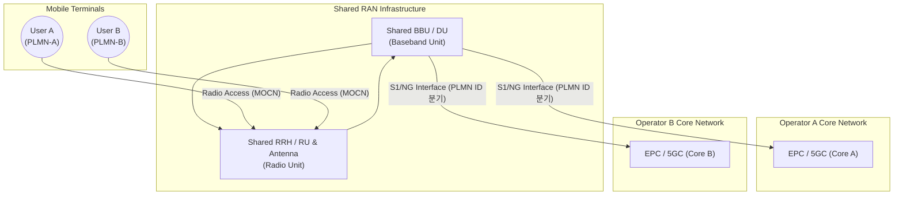

# RAN (Radio Access Network) Sharing

---

## I. 무선 인프라 비용 절감과 투자 효율화, RAN Sharing의 개요

* **정의**: 둘 이상의 통신 사업자가 기지국, 안테나, 주파수 등 무선 접속망(Radio Access Network) 인프라를 상호 공동으로 구축하고 사용하여 투자 비용(CAPEX)과 운영 비용(OPEX)을 획기적으로 절감하는 기술
* **등장배경**: 5G 전국망 구축에 따른 천문학적인 투자 비용 부담 가중, 도농 간 커버리지 격차 해소, 주파수 자원의 효율적 활용 및 중복 투자 방지 필요성 대두
* **핵심 특징**: 철탑 등 물리적 인프라 공유(Passive)부터 기지국 및 주파수 공유(Active)까지 단계별 적용 가능, 공정 경쟁 환경 속의 네트워크 자원 공유 모델 제공

---

## II. RAN Sharing의 아키텍처 및 핵심 기술 요소

### 가. RAN Sharing의 아키텍처 및 동작 원리

* 다수의 사업자 단말(UE A, UE B)이 동일한 물리적 무선 접속망(Shared RAN)에 접속하며, 기지국 레벨에서 PLMN ID(공중육상모바일망 식별자)를 기반으로 트래픽을 각 사업자의 코어 네트워크로 라우팅함.

### 나. RAN Sharing의 핵심 기술 요소 및 구성

| 분류 | 요소기술(키워드) | 세부 설명 |
| --- | --- | --- |
| **공유 유형** | **Passive Sharing** | 철탑(Tower), 전신주, 장비 랙, 전력 공급 설비 등 물리적 공간과 부대시설만 공유 |
| **공유 유형** | **Active Sharing (MORAN)** | 안테나, 철탑, RRH(무선신호부)를 공유하되, 사업자별로 주파수 대역을 분할하여 독립 사용 |
| **공유 유형** | **Active Sharing (MOCN)** | 기지국 장비(BBU/RRH) 및 주파수 대역까지 완전히 공동 공유하고, PLMN ID로 트래픽 분기 |
| **공유 유형** | **GWCN (Gateway Core)** | MOCN 구조에서 코어 네트워크의 일부 제어 노드(MME/AMF 등)까지 공동으로 공유하는 방식 |
| **제어 기술** | **PLMN ID 브로드캐스팅** | 단말이 기지국 접속 시 자신의 사업자 망을 식별하여 올바른 코어 네트워크와 연동되도록 지원 |
| **자원 할당** | **동적 대역 할당 ([[DSA]])** | 트래픽 밀도에 따라 사업자 간 무선 자원(PRB)을 유연하게 할당하여 스펙트럼 효율성 극대화 |
| **오픈 인프라** | **[[O-RAN]] 기반 공유** | 개방형 프론트홀 및 RIC(RAN Intelligent Controller)를 연계하여 가상화된 공유 RAN 제어 |
| **기대 효과** | **CAPEX / OPEX 절감** | 중복 투자 방지를 통한 구축 비용 절감 및 기지국 [[유지보수]] 효율화 달성 |

---

## III. RAN Sharing 유형 비교 및 향후 전망

### 가. Active RAN Sharing 주요 방식 비교 (MORAN vs MOCN)

| 비교 항목 | MORAN (Multi-Operator RAN) | MOCN (Multi-Operator Core Network) |
| --- | --- | --- |
| **주파수 공유 여부** | **각 사업자별 주파수 독립 사용** | **동일 주파수 대역을 완벽히 공동 공유** |
| **기지국 및 장비** | 안테나 및 철탑, 일부 RF 장비 공동 사용 | BBU 및 RRH 등 무선 기지국 장비 전면 공유 |
| **네트워크 구성** | 주파수 간섭 관리가 상대적으로 단순함 | 주파수 효율성이 극대화되나 구성이 복잡함 |
| **표준화 지원** | 3GPP 표준 기반 지원 | 3GPP 표준 기반 지원 (5G 환경에서 대중화) |
| **주요 활용 목적** | 초기 투자비용 절감 및 커버리지 공동 확장 | 주파수 부족 해소 및 극한의 자원 공유 극대화 |

### 나. 최신 동향 및 향후 전망

* **5G-Advanced 및 O-RAN 기반 지능형 공유**: 수동적 인프라 공유를 넘어, O-Cloud 기반의 가상화된 DU/CU 분할 아키텍처와 연계하여 AI 제어기(xApp/rApp)가 실시간으로 사업자 간 자원을 슬라이싱하고 최적화하는 방향으로 진화 중.
* **농어촌 5G 공동망 상용화 확대**: 통신 3사와 정부가 협력하여 도농 격차 해소를 위해 추진한 5G 공동 이용(Roaming/Sharing) 모델의 성공을 바탕으로, 향후 재난망 및 특화망(이음5G) 영역으로 공유 생태계가 다각화될 전망.

---

### 🔗 연관 토픽

- **소속 도메인**: [[00_네트워크_MOC|🌐 네트워크]]
- **세부 분류**: `4. 무선 및 차세대 이동통신 (5G/6G/Wi-Fi)`
- **핵심 연관 토픽**:
  - [[O-RAN]]
  - [[C-RAN(Centralized Cloud RAN)|C-RAN(Centralized / Cloud RAN)]]
  - [[유지보수]]
  - [[DSA]]
  - [[SDR (Software Defined Radio)]]
