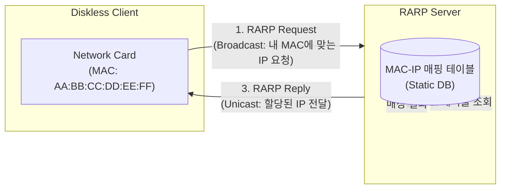

# RARP (Reverse Address Resolution Protocol)

---

## I. 역방향 주소 변환, RARP의 개요

* **정의**: 디스크가 없는(Diskless) 단말이 자신의 물리적 주소([[MAC]] 주소)를 기반으로 네트워크 서버로부터 동적으로 논리적 주소(IP 주소)를 할당받기 위해 사용하는 L2 기반 역방향 주소 변환 [[프로토콜]] (RFC 903)
* **등장배경**: 초기 네트워크 부팅 환경에서 IP 설정이 없는 클라이언트의 부트스트랩(Bootstrap) 지원 필요성 대두
* **특징**: 이더넷 프레임 레벨에서 동작, 브로드캐스트 기반 요청, [[DHCP]]의 등장으로 현재는 완전히 대체됨

---

## II. RARP의 개념도 및 핵심 기술 요소

### 가. RARP의 동작 원리 및 개념도

* 디스크 없는 클라이언트가 부팅 시 자신의 MAC 주소를 담은 RARP Request를 브로드캐스트하고, RARP 서버가 정적 매핑 테이블을 조회하여 할당된 IP를 유니캐스트로 응답함.

### 나. RARP의 핵심 기술 요소

| 분류 | 요소기술(키워드) | 세부 설명 |
| --- | --- | --- |
| **주소 체계** | **MAC Address** | 네트워크 카드에 내장된 하드웨어 고유 주소를 기반으로 호스트를 식별 |
| **통신 방식** | **Broadcast** | 네트워크 내 모든 장비에 패킷을 전송하여 RARP 서버의 존재를 탐색 (Request 단계) |
| **통신 방식** | **Unicast** | 서버가 클라이언트의 MAC 주소를 인지하고 1:1로 직접 IP 정보를 응답 (Reply 단계) |
| **서버 구성** | **RARP Server** | 클라이언트의 MAC 주소와 IP 주소의 쌍(Pair)을 정적(Static)으로 관리하는 데몬(rarpd) |
| **프로토콜** | **Ethernet Frame** | L3 IP 레이어가 아닌 L2 이더넷 프레임(Ethernet Type 0x8035) 직접 활용 |
| **한계성** | **Subnet 제한** | 라우터를 통과하지 못하므로 동일 브로드캐스트 도메인 내부에서만 동작 가능 |
| **정보 제한** | **IP Only 제공** | 오직 IP 주소만 제공하며 서브넷 마스크, [[게이트웨이]], [[DNS(Domain Name System)|DNS]] 등 추가 정보 제공 불가 |
| **대체 기술** | **BOOTP / DHCP** | 추가 구성 정보 제공 및 라우팅 지원이 가능한 후속 프로토콜로 완전히 대체됨 |

---

## III. RARP와 후속 프로토콜 비교 및 시사점

### 가. RARP와 BOOTP, DHCP 비교

| 비교 항목 | RARP (Reverse [[ARP]]) | BOOTP (Bootstrap Protocol) | DHCP (Dynamic Host Config) |
| --- | --- | --- | --- |
| **기반 계층** | [[데이터 링크 계층]] (L2) | 애플리케이션 계층 (UDP / L3) | 애플리케이션 계층 (UDP / L3) |
| **할당 정보** | 오직 IP 주소만 할당 | IP + 게이트웨이 + 부트 파일 | IP + 서브넷 + DNS + 다양한 확장 옵션 |
| **라우팅 지원** | **불가능** (브로드캐스트 도메인 한정) | 가능 (Relay Agent 활용) | **가능** (Relay Agent 및 라우팅 지원) |
| **주소 관리** | 수동 정적 매핑 (Static DB) | 수동 정적 매핑 | **동적 풀(Pool) 임대 및 회수 관리** |
| **현재 위상** | **폐기 (Deprecated)** | DHCP에 통합됨 | **현대 네트워크 표준 프로토콜** |

### 나. 시사점 및 현대적 의의

* 오늘날 [[TCP]]/IP 네트워크 환경에서는 사용되지 않으나, 네트워크 부트스트랩(PXE Boot) 및 IP 자동 할당 아키텍처의 역사적 기원으로서 의의를 가짐.

---

### 🔗 연관 토픽

- **소속 도메인**: [[00_네트워크_MOC|🌐 네트워크]]
- **세부 분류**: `1. OSI 7계층 & 데이터링크 계층 (L1/L2)`
- **핵심 연관 토픽**:
  - [[ARP]]
  - [[DHCP|DHCP(Dynamic Host Configuration Protocol)]]
  - [[데이터 링크 계층|데이터 링크 계층 (Data Link Layer)]]
  - [[TCP]]
  - [[네트워크 계층|네트워크 계층 (Network Layer)]]
