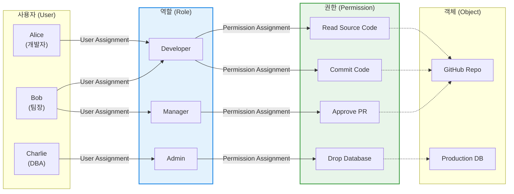

# RBAC (Role-Based Access Control, 역할 기반 접근통제)

---

## I. 엔터프라이즈 권한 관리의 표준, RBAC의 개요

* **정의**: 시스템에 대한 접근 권한을 개별 사용자(User)의 신분이 아닌, 조직 내에서 수행하는 역할(Role)을 기준으로 할당하여 접근을 통제하는 중앙집중형 비임의적 접근통제(Non-[[DAC]]) 모델
* **등장 배경 및 필요성**:
* **대규모 권한 관리의 한계**: 수천 명의 직원이 존재하는 기업 환경에서 개인별로 권한을 부여하고 회수하는 방식(DAC)은 관리 오버헤드가 극심하며, 인사이동(입/퇴사) 시 권한 회수 누락 등의 보안 공백 발생
* **[[MAC]]/DAC의 단점 보완**: 군사적 수준의 강제적 접근통제(MAC)가 가진 경직성과 임의적 접근통제(DAC)의 보안 취약점을 절충하여, 상업적/기업적 환경에 가장 적합한 유연성과 보안성을 동시에 확보하기 위해 도입

* **특징**:
* **최소 권한의 원칙(Least Privilege)**: 사용자는 자신의 역할을 수행하는 데 필요한 최소한의 권한만 부여받음
* **직무 분리(Separation of Duties, SoD)**: 상호 배타적인 역할(예: 구매 요청자와 구매 승인자)을 동일인에게 부여할 수 없도록 통제
* **권한 관리의 용이성**: 사용자와 권한을 직접 연결하지 않고 '역할'이라는 논리적 매개체를 통해 관리하여 결합도를 낮춤

---

## II. RBAC의 아키텍처 및 핵심 구성요소

### 가. RBAC의 다대다(N:M) 매핑 구조 및 동작 개념도

* 사용자 할당(User Assignment, UA)과 권한 할당(Permission Assignment, PA)이 분리되어 있어, 인사이동 시 사용자의 역할(Role)만 변경하면 해당 역할에 묶인 수많은 권한이 자동으로 부여/회수됨.

### 나. RBAC의 참조 모델(NIST 표준) 및 핵심 기술 요소

| 분류 | 요소기술(키워드) | 세부 설명 |
| --- | --- | --- |
| **기본 모델** | Core RBAC (RBAC_0) | 사용자, 역할, 권한, 세션의 필수 요소를 정의한 가장 기본적인 역할 기반 통제 모델 |
| **계층 모델** | Hierarchical RBAC (RBAC_1) | 역할 간의 상속(Inheritance) 관계를 정의. (예: '팀장' 역할은 '팀원' 역할의 모든 권한을 상속받음) |
| **제약 모델** | Constrained RBAC (RBAC_2) | 직무 분리(SoD) 등 이해충돌 방지를 위한 제약 조건을 추가한 모델 (정적/동적 직무 분리 지원) |
| **통합 모델** | Symmetric RBAC (RBAC_3) | RBAC_1(계층)과 RBAC_2(제약)를 모두 포함하는 통합 모델 |
| **핵심 구성** | [[세션]] ([[Session Layer|Session]]) | 사용자가 시스템에 접속하여 하나 이상의 역할(Role)을 활성화(Activate)한 런타임 [[인스턴스]] |
| **핵심 원칙** | 동적 직무 분리 (Dynamic SoD) | 사용자가 여러 역할을 가질 수는 있으나, 단일 세션 내에서는 상호 배타적 역할을 동시에 활성화할 수 없도록 통제 |

---

## III. 접근통제 모델 비교 및 현대적 발전 동향

### 가. 4대 접근통제(Access Control) 모델 비교

| 비교 항목 | DAC (임의적 접근통제) | MAC (강제적 접근통제) | RBAC (역할 기반 접근통제) | ABAC (속성 기반 접근통제) |
| --- | --- | --- | --- | --- |
| **통제 기준** | 객체의 **소유자(Owner)** 및 신분 | 주체와 객체의 **보안 등급(Label)** | 사용자의 조직 내 **역할(Role)** | 주체, 객체, 환경의 **속성(Attribute)** |
| **권한 부여권자** | 데이터 소유자 (Data Owner) | 시스템 관리자 (System Admin) | 시스템 관리자 / 보안 관리자 | 정책 결정자 (Policy Engine) |
| **장점** | 구현 용이, 유연성 극대화 | 군사/공공 수준의 강력한 [[기밀성]] | **관리 편의성, 인사 이동 대응 우수** | 컨텍스트(시간, 위치 등) 기반 세밀한 통제 |
| **단점** | 트로이 목마 등 악성코드에 취약 | 모든 객체 분류 필요, 관리 경직성 | **역할 폭발(Role Explosion) 발생 가능성** | 정책 설정의 복잡도 및 연산 오버헤드 |

### 나. 한계 극복 및 최신 보안 트렌드 (Zero Trust와의 결합)

* **역할 폭발(Role Explosion)의 한계**: 클라우드 인프라와 마이크로서비스 환경이 복잡해지면서, 특정 조건(예: "주말에는 접근 불가", "특정 IP에서만 승인")을 부여하기 위해 역할(Role)의 수가 기하급수적으로 늘어나는 문제가 발생함.
* **RBAC과 ABAC의 하이브리드 결합**: 최신 [[IAM]](Identity and Access Management) 솔루션 및 AWS IAM 등은 역할(Role)을 기본으로 권한의 큰 틀을 잡고, 시간·위치·디바이스 상태 등 환경 속성(Condition/Attribute)을 결합하여 접근을 동적으로 평가하는 **PBAC(Policy-Based Access Control) 또는 ABAC** 구조로 진화하고 있음.
* **제로 트러스트([[제로 트러스트 보안모델|Zero Trust]]) 아키텍처의 기반**: 내부망에 접근한 '사용자'나 '역할'이라 할지라도 단일 세션에서 비정상적인 행위(단말기 감염, 심야 시간 접속 등)가 감지되면 즉시 권한을 제한하는 동적 신뢰 평가 체계로 발전 중임.

---

### 🔗 연관 토픽

- **소속 도메인**: [[00_보안_MOC|🛡️ 보안]]
- **세부 분류**: `1. 정보보안 원칙 & 거버넌스 · 인증`
- **핵심 연관 토픽**:
  - [[기밀성]]
  - [[DAC]]
  - [[IAM]]
  - [[서버 접근 통제]]
  - [[접근 제어 접근 통제|접근 제어/접근 통제(Access Control)]]
