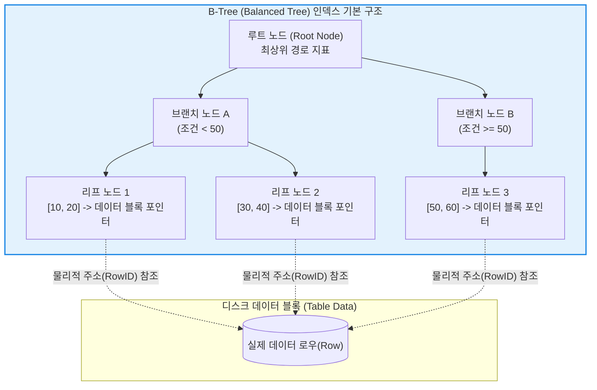

# RDBMS 인덱스 (Index)

---

## I. 데이터 검색 속도 최적화를 위한 핵심 자료구조, RDBMS 인덱스의 개요

* **정의**: 관계형 [[데이터베이스]] 관리 시스템(RDBMS)에서 테이블이나 뷰의 하나 이상의 열(Column)을 기준으로 구축되어, 데이터(행)를 빠르고 효율적으로 찾을 수 있도록 돕는 별도의 데이터 구조 체계.
* **등장 배경 및 필요성**:
* 데이터베이스의 규모가 커짐에 따라 원하는 데이터를 찾기 위해 테이블 전체를 처음부터 끝까지 뒤지는 풀 테이블 스캔(Full Table Scan) 방식은 막대한 디스크 I/O와 [[CPU]] 성능 저하를 유발함.
* 책의 맨 뒤에 있는 '색인(Index)'처럼 데이터의 물리적 위치(주소)를 미리 정렬된 상태로 매핑해 두어 검색 성능을 극대화하기 위해 고안됨.

* **특징**: 전체 쿼리 실행 시간 단축 및 I/O 감소라는 강력한 읽기 성능(Read Performance) 이점을 제공하지만, 데이터의 삽입/수정/삭제(INSERT/UPDATE/DELETE) 발생 시 인덱스 구조도 함께 갱신되어야 하므로 쓰기 성능 저하 및 추가적인 저장 공간(Storage) 오버헤드가 발생함.

---

## II. RDBMS 인덱스의 아키텍처 및 핵심 구성요소

### 가. B-Tree 기반 인덱스 구조 및 동작 개념도

* RDBMS의 기본적이고 가장 널리 쓰이는 인덱스 구조는 데이터를 정렬된 상태로 유지하며 스스로 균형을 맞추는 [[Balanced Tree B-Tree|B-Tree(Balanced Tree)]] 또는 B+-Tree 구조임.
* 리프 노드(Leaf Node)에 도달하면 해당 데이터가 물리적으로 저장된 디스크 상의 주소(Pointer/RowID)를 획득하여 단일 레코드를 빠르게 반환함.

### 나. 인덱스의 주요 알고리즘 및 구조적 기술 요소

| 분류 | 요소기술(키워드) | 세부 설명 |
| --- | --- | --- |
| **자료구조** | B-Tree / B+-Tree 인덱스 | 사실상 모든 RDBMS의 기본 인덱스로, 데이터를 계층형 트리 구조로 정렬하여 저장하므로 정확한 일치(=)뿐만 아니라 범위 검색(BETWEEN, >, <)에 매우 효율적임. |
| **자료구조** | 해시 인덱스 (Hash Index) | 해시 함수를 통해 데이터의 위치를 $O(1)$의 속도로 찾는 구조로, 정확한 값 일치(Exact Match) 쿼리에는 매우 빠르지만 데이터가 정렬되지 않으므로 범위 검색이나 정렬(ORDER BY)에는 사용할 수 없음 [cite: 1.1.1]. |
| **물리적 구조** | 클러스터형 인덱스 (Clustered) | 테이블의 실제 데이터(Row) 자체가 인덱스의 키 순서에 따라 물리적으로 정렬되어 저장되는 방식. 테이블당 단 1개만 생성 가능함 [cite: 1.2.2]. |
| **논리적 구조** | 비클러스터형 인덱스 (Non-clustered) | 데이터의 물리적 정렬과는 무관하게, 인덱스 키 값과 원본 데이터를 가리키는 포인터(주소)를 별도의 공간에 구성하는 방식. 여러 개 생성 가능함. |
| **검색 최적화** | 커버링 인덱스 (Covering Index) | 쿼리(SELECT)에서 요구하는 모든 컬럼이 하나의 인덱스 안에 모두 포함되어 있어, 실제 데이터 블록에 접근할 필요 없이 인덱스 스캔만으로 결과를 반환하는 고성능 기법 [cite: 1.2.5]. |
| **공간 최적화** | 팩트 프리 / 필 팩터 (Fill Factor) | 인덱스 페이지에 새로운 데이터가 삽입될 때 페이지 분할(Page Split)이 발생하는 것을 막기 위해 디스크 페이지 내에 미리 비워두는 여유 공간의 비율 [cite: 1.2.5]. |

---

## III. 인덱스 유형 비교 및 성능 튜닝(Tuning) 전략

### 가. 클러스터형 인덱스와 비클러스터형 인덱스 비교

| 비교 항목 | 클러스터형 인덱스 (Clustered Index) | 비클러스터형 인덱스 (Non-Clustered Index) |
| --- | --- | --- |
| **데이터 정렬 방식** | 테이블의 실제 데이터가 인덱스 키 기준 물리적으로 정렬됨 | 원본 데이터 정렬과 무관, 별도의 인덱스 페이지(사본) 생성 [cite: 1.2.2] |
| **생성 개수 제한** | 테이블당 **오직 1개** (주로 Primary Key에 할당) [cite: 1.2.2] | 테이블당 **여러 개** 생성 가능 |
| **검색 성능 (Read)** | 물리적으로 인접해 있어 범위(Range) 검색 시 압도적으로 빠름 [cite: 1.2.5] | 키 검색 후 실제 데이터 위치를 찾아가는 추가 비용(포인터 이동) 발생 |
| **갱신 오버헤드 (Write)** | 인덱스 컬럼 값 변경 시 물리적 데이터 이동이 발생하여 자원 소모 극심 [cite: 1.2.2] | 복사본 구조만 변경하면 되므로 비교적 수정 핸들링이 수월함 [cite: 1.2.2] |
| **적합한 컬럼 조건** | 변경될 확률이 거의 없는 고유값 (예: Identity, GUID, 주문번호) [cite: 1.2.2] | 빈번하게 검색 조건(WHERE, JOIN)으로 활용되는 일반 속성 |

### 나. 최신 데이터베이스 성능 튜닝(Performance Tuning) 동향

* **오버 인덱싱(Over-indexing) 경계 및 모니터링**: 인덱스가 많아질수록 조회는 빨라지지만, 데이터 삽입/수정 시 모든 인덱스가 함께 갱신(Maintain)되어야 하므로 쓰기 성능이 치명적으로 저하됨. 따라서 사용되지 않는 인덱스를 식별하여 제거하고 과도한 인덱스 생성을 피하는 것이 필수적임.
* **실행 계획(Execution Plan) 분석 기반 접근**: 데이터베이스 옵티마이저가 인덱스를 타는지 혹은 풀 테이블 스캔을 하는지 예측에만 의존하지 않고, 실제 쿼리 실행 계획(Actual Execution Plan)을 분석하여 인덱스 스캔의 효율성을 검증하는 방식이 성능 튜닝의 기본 원칙임.
* **분포도(Selectivity)를 고려한 인덱스 설계**: 특정 값을 가진 레코드의 비율이 너무 높을 경우(예: 성별, Y/N 플래그), 인덱스를 타는 것이 오히려 테이블을 직접 순차 스캔하는 것보다 느려질 수 있음. 따라서 고유한 값이 많은(분포도가 좋은) 컬럼을 선두 컬럼으로 설정하는 결합 인덱스(Composite Index) 설계가 중요함.

---

### 🔗 연관 토픽

- **소속 도메인**: [[00_데이터베이스_MOC|🗄️ 데이터베이스]]
- **세부 분류**: `2. 트랜잭션 & 동시성 제어 (Concurrency)`
- **핵심 연관 토픽**:
  - [[Balanced Tree B-Tree|Balanced Tree B-Tree (비트리)]]
  - [[DML]]
  - [[DB 성능 개선 방안|DB 성능 개선 방안 (Tuning)]]
  - [[데이터베이스 파티셔닝|데이터베이스 파티셔닝(Partitioning)]]
  - [[데이터 레이크하우스|데이터 레이크하우스(Data Lakehouse)]]
