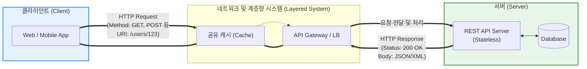

# REST 및 RESTful API 설계 6원칙

---

## I. 분산 시스템 아키텍처의 표준, REST의 개요

* **정의**: REST(Representational State Transfer)는 월드 와이드 웹(WWW)과 같은 분산 하이퍼미디어 시스템을 위한 소프트웨어 아키텍처의 한 형식이며, **RESTful API**는 로이 필딩(Roy Fielding)이 정의한 6가지 아키텍처 제약 조건(원칙)을 엄격하게 준수하여 설계된 웹 API를 의미함
* **등장 배경 및 필요성**:
* 2000년대 초반, 웹의 본래 설계 우수성을 최대한 활용하면서 이기종 시스템 간의 통신을 규격화하기 위해 제안됨
* 클라이언트(웹, 모바일, IoT 등)의 다변화에 따라 프론트엔드와 백엔드의 강한 결합을 끊어내고, 독립적인 진화와 확장을 지원할 수 있는 범용적 인터페이스 요구 증대

* **핵심 철학**: 자원(Resource)의 명시, 행위(HTTP Method)의 분리, 그리고 표현(Representation)을 통한 상태 전달

---

## II. REST 아키텍처 및 설계 6원칙 (6 Constraints)

### 가. RESTful 아키텍처 동작 개념도

* 클라이언트는 URI로 식별되는 자원에 대해 HTTP 메서드(GET, POST, PUT, DELETE)를 사용하여 조작을 요청함.
* 서버는 요청에 대한 처리 상태(State)를 보관하지 않으며(Stateless), 계층화된 시스템(Gateway, Proxy 등)을 거쳐 클라이언트에게 자원의 현재 상태([[JSON]], [[XML]] 등)를 반환함.

### 나. REST 아키텍처 설계 6원칙 (6 Constraints)

이 6가지 제약 조건을 모두 만족해야 진정한 의미의 **RESTful** 아키텍처로 인정받을 수 있습니다.

|**원칙 (Constraint)**|**핵심 개념**|**세부 설계 지침 및 의미**|
|---|---|---|
|1. 클라이언트-서버      (Client-Server)|**관심사의 분리 (Separation of Concerns)**|클라이언트는 UI와 사용자 상태 관리를 담당하고, 서버는 데이터 스토리지와 비즈니스 로직을 담당함. 이를 통해 양측이 서로 의존성 없이 독립적으로 진화할 수 있음.|
|2. 무상태성      (Stateless)|**서버의 컨텍스트 배제**|서버는 클라이언트의 상태 정보([[세션]] 등)를 저장하지 않음. 클라이언트의 각 요청은 처리에 필요한 **모든 정보(토큰, 파라미터 등)를 완전히 포함**해야 함. (서버의 수평 확장성 극대화)|
|3. 캐시 가능성      (Cacheable)|**네트워크 효율성 극대화**|HTTP 웹 표준을 그대로 사용하므로, 응답 데이터는 캐시 가능 여부(Cache-Control 등)를 명시해야 함. 캐싱을 통해 서버 부하를 줄이고 응답 지연을 최소화함.|
|4. 일관된 인터페이스      (Uniform Interface)|**컴포넌트 간 독립성 및 규격화**|URI로 자원을 식별하고, 메시지 스스로가 자신을 설명(Self-descriptive)해야 하며, 애플리케이션의 상태가 하이퍼링크를 통해 전이되어야 함(**HATEOAS**). REST의 가장 중요한 식별 원칙임.|
|5. 계층화된 시스템      (Layered System)|**아키텍처 유연성 및 은닉**|클라이언트는 대상 서버에 직접 연결되었는지, 중간 계층(프록시, 로드 밸런서, [[방화벽]])을 거치는지 알 수 없음. 보안, 로드 밸런싱, 공유 캐시 등을 투명하게 추가할 수 있음.|
|6. 주문형 코드      (Code on Demand)|**기능의 동적 확장 (선택적 원칙)**|서버가 자바스크립트 등 실행 가능한 코드를 클라이언트에게 전송하여, 클라이언트의 기능을 동적으로 확장할 수 있음. (유일하게 필수가 아닌 선택 조건임)|

---

## III. REST 성숙도 모델 및 마이크로서비스(MSA) 통신 트렌드

### 가. 리처드슨 성숙도 모델 (Richardson Maturity Model)

진정한 RESTful(일관된 인터페이스 원칙 충족)에 도달하기 위한 단계를 4단계로 분류한 모델입니다.

| 성숙도 단계 | 명칭 | 특성 및 예시 | RESTful 여부 |
| --- | --- | --- | --- |
| **Level 0** | The Swamp of POX | HTTP를 단순한 네트워크 터널링 용도로만 사용 (하나의 엔드포인트, 주로 POST만 사용. 예: SOAP, XML-RPC) | REST 아님 |
| **Level 1** | Resources | 자원(Resource) 개념 도입. 개별 자원에 대해 고유한 URI 부여 (`/users`, `/users/123`) | REST 아님 |
| **Level 2** | HTTP Verbs | 자원의 조작을 HTTP 메서드(GET, POST, PUT, DELETE)로 명시하고, 적절한 상태 코드(200, 201, 404 등) 사용 | **Pragmatic REST** (실무적 표준) |
| **Level 3** | **HATEOAS** | 응답에 다음 상태로 전이할 수 있는 하이퍼링크(Hypermedia)를 포함하여 클라이언트가 동적으로 탐색 가능 | **True RESTful** |

> **실무적 한계**: 엄격한 의미의 REST(Level 3, HATEOAS)는 응답 페이로드가 커지고 클라이언트 구현이 복잡해져, 대다수의 기업 실무에서는 **Level 2 수준을 RESTful API의 실질적 표준**으로 통용하여 사용하고 있습니다.

### 나. 마이크로서비스(MSA) 환경의 API 통신 발전 동향

* **REST의 오버페칭(Over-fetching) 한계와 GraphQL**: REST는 고정된 데이터 구조를 반환하므로 불필요한 데이터까지 전송받거나(오버페칭), 여러 번 요청해야 하는(언더페칭) 단점이 있습니다. 프론트엔드 중심의 유연한 조회가 필요한 영역에서는 페이스북이 개발한 **GraphQL**이 REST를 강하게 대체 및 보완하고 있습니다.
* **내부 서비스 간 통신과 gRPC**: 서버 간(Service-to-Service) 통신에서는 JSON 직렬화/역직렬화 오버헤드가 큰 REST 대신, HTTP/2 기반의 이진(Binary) 프로토콜을 사용하여 압도적인 성능과 타입 안정성을 제공하는 gRPC(Google RPC)가 [[MSA (Micro Service Architecture)|MSA]] 내부 통신의 표준 아키텍처로 자리매김하고 있습니다.

---

### 🔗 연관 토픽

- **소속 도메인**: [[00_디지털서비스_MOC|🚀 디지털서비스]]
- **세부 분류**: `4. 데이터 플랫폼 & 개방형 API 생태계`
- **핵심 연관 토픽**:
  - [[세션]]
  - [[JSON]]
  - [[Open API 및 API|Open API API]]
  - [[방화벽]]
  - [[XML]]
