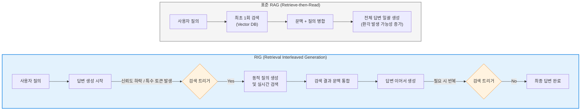

# RIG (Retrieval Interleaved Generation)

---

## I. 환각 최소화와 다단계 추론을 위한 차세대 AI 생성 기법, RIG의 개요

* **정의**: 거대 언어 모델([[초거대 언어 모델|LLM]])이 텍스트를 생성하는 과정(Decoding) 도중에, 필요한 시점마다 외부 지식베이스를 반복적·동적으로 검색(Retrieval)하고 그 결과를 문맥에 결합(Interleaved)하여 답변을 완성하는 차세대 검색 증강 생성(RAG) 아키텍처
* **등장 배경 및 필요성**:
* **단일 검색(Single-step Retrieval)의 한계**: 기존의 표준 RAG 시스템은 사용자 질의 초기에 단 한 번만 검색(Retrieve-then-Read)을 수행하므로, 질의가 복잡하거나 긴 문서를 생성할 때 후반부로 갈수록 문맥 유효성이 떨어지고 환각(Hallucination)이 발생하는 문제(Context Decay) 존재
* **다단계 추론 요구**: 한 번의 검색만으로는 파악할 수 없는 복합적인 질문(예: A의 출생지 시장이 속한 정당은?)을 해결하기 위해, 꼬리를 무는 방식의 능동적 정보 수집 필요성 대두

* **특징**: 모델 스스로 정보가 부족한 시점을 판단하여 검색을 트리거(Trigger)하는 능동적 검색(Active Retrieval), 토큰 및 문장 단위의 동적 문맥 업데이트를 통해 정보의 정확성과 최신성을 극대화함

---

## II. RIG의 아키텍처 및 핵심 구성요소

### 가. 기존 RAG와 RIG의 아키텍처 비교 및 동작 개념도

* RIG는 생성과 검색이 교차(Interleaved)하며 맞물려 돌아가는 루프 구조를 가집니다. 모델이 답변을 써 내려가다가, 확신이 없거나 구체적인 팩트 체크가 필요한 시점에 실행을 일시 중단하고 외부 지식을 가져와 다시 생성을 이어갑니다.

### 나. RIG의 핵심 기술 요소

| 분류 | 요소기술(키워드) | 세부 설명 |
| --- | --- | --- |
| **트리거 메커니즘** | 신뢰도/엔트로피 기반 (Confidence-based) | LLM이 다음 토큰을 예측할 때의 확률값(Logit)이나 엔트로피가 특정 임계치(Threshold)보다 낮아질 때(즉, 모델이 불확실함을 느낄 때) 검색을 트리거 |
| **트리거 메커니즘** | 특수 토큰 예측 (Token-based) | 학습 단계에서 `[RETRIEVE]`와 같은 특수 토큰을 삽입하도록 훈련하여, 모델이 특정 개체명이나 사실을 언급하기 직전에 스스로 검색 도구를 호출하도록 유도 |
| **질의 생성** | 예측 기반 질의 생성 (Forward-Looking) | 현재까지 생성된 텍스트와 앞으로 생성하려는 문장의 임시 초안(Draft)을 바탕으로, 검색 최적화된 새로운 검색어(Query)를 동적으로 합성 |
| **결과 통합** | 동적 컨텍스트 병합 (Context Fusion) | 검색된 새로운 문서를 기존 프롬프트의 컨텍스트 윈도우에 병합. 토큰 제한을 넘지 않도록 과거 문맥을 압축하거나 불필요한 정보를 가지치기(Pruning) |
| **최적화** | 디코딩 개입 (Constrained Decoding) | 검색 결과를 반영하기 위해 빔 서치(Beam Search) 등 디코딩 과정에 직접 개입하여 검색된 팩트와 일치하는 토큰의 확률을 증폭시킴 |

---

## III. 표준 RAG와의 비교 및 최신 연구 동향

### 가. 표준 RAG vs RIG 비교

| 비교 항목 | 표준 RAG (Standard RAG) | RIG (Retrieval Interleaved Generation) |
| --- | --- | --- |
| **검색 시점 및 횟수** | 생성 전 1회 (정적) | 생성 과정 중 다수 (동적, 교차) |
| **주요 목적** | 보유하지 않은 최신/내부 지식의 주입 | **복잡한 다단계 추론 및 롱테일 환각 완화** |
| **검색 쿼리 기준** | 사용자의 최초 원본 질의 | **LLM이 현재 생성 중인 중간 문맥 및 예측 초안** |
| **응답 지연시간 (Latency)** | 낮음 (생성 전 1회 병목만 존재) | **높음** (생성 도중 여러 번 네트워크 통신 발생) |
| **적합한 유즈케이스** | 단순 문서 QA, FAQ, 사내 규정 검색 | 심층 리서치, 다단계 복합 논리 QA, 긴 보고서 자동 작성 |

### 나. 한계 극복 및 최신 발전 동향 (Agentic RAG로의 진화)

* **대표적 연구 사례 (FLARE & Self-RAG)**: 능동적 검색의 대표적 방법론인 FLARE(Forward-Looking Active REtrieval)는 모델이 미래에 생성할 문장을 미리 예측해보고 확신이 없을 때만 검색을 수행합니다. 또한, Self-RAG는 모델이 직접 검색이 필요한지, 검색 결과가 유용한지, 생성된 문장이 검색 결과와 부합하는지를 스스로 비평(Critique)하는 토큰을 생성하도록 튜닝되어 정확도를 극적으로 향상시켰습니다.
* **Latency 오버헤드 극복**: RIG는 검색-생성 루프가 반복되면서 사용자 대기 시간이 길어지는 치명적인 단점이 있습니다. 이를 해결하기 위해 최근에는 비동기 병렬 검색, 캐싱(Caching), 작은 SLM을 활용한 라우팅 기법이 연구되고 있습니다.
* **Agentic Workflow 통섭**: 단순한 텍스트 검색을 넘어, 모델이 생성 도중에 웹 브라우저 플러그인을 호출하거나(Toolformer), [[SQL(Structured Query Language)|SQL]]을 실행해 데이터베이스를 조회하는 등 도구 사용(Tool-use) 능력이 결합된 에이전틱 RAG(Agentic RAG)의 근간 아키텍처로 자리매김하고 있습니다.

---

### 🔗 연관 토픽

- **소속 도메인**: [[00_인공지능_MOC|🤖 인공지능]]
- **세부 분류**: `4. 거대언어모델 (LLM) & 생성형 AI`
- **핵심 연관 토픽**:
  - [[초거대 언어 모델|초거대 언어 모델(Large Language Model)]]
  - [[SQL(Structured Query Language)]]
  - [[프롬프트 인젝션|프롬프트 인젝션(Prompt Injection)]]
  - [[Fine-Tuning]]
  - [[sLLM (Smaller Large Language Model)]]
