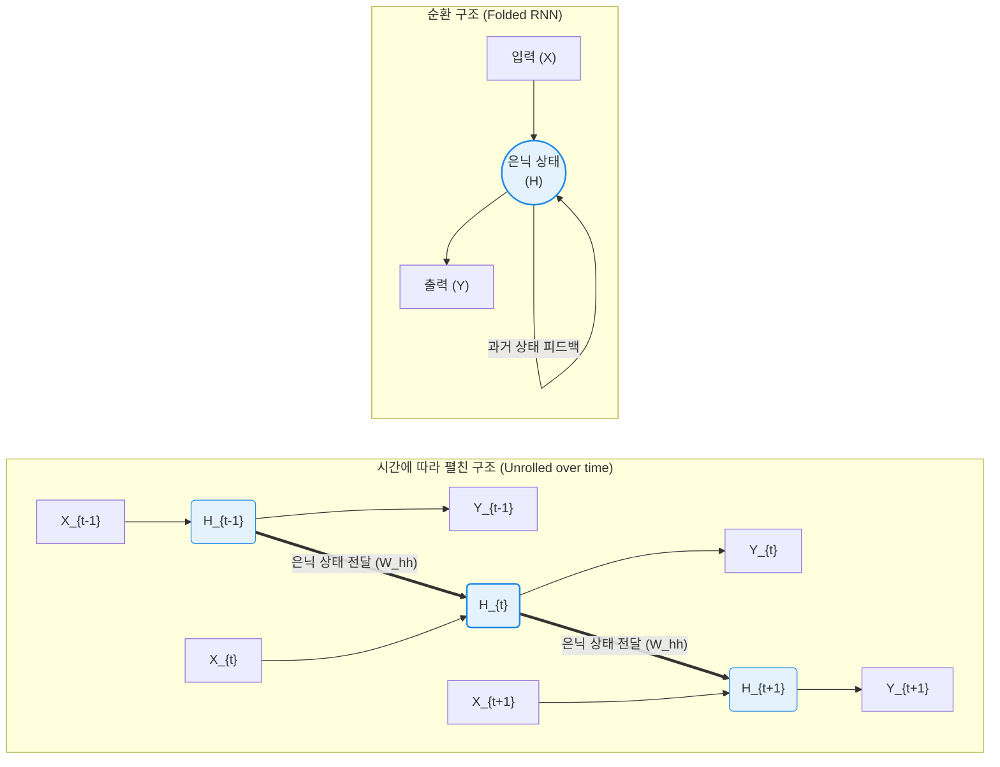

# RNN (Recurrent Neural Network, 순환 신경망)

---

## I. 순차 데이터 처리를 위한 딥러닝의 모태, RNN의 개요

* **정의**: 시간의 흐름에 따른 순차 데이터(Sequential Data)의 패턴을 인식하기 위해, 내부의 은닉층(Hidden Layer)의 출력값이 다시 동일한 은닉층의 입력으로 순환되는(Recurrent) 피드백 루프 구조를 가진 인공 신경망
* **등장 배경 및 필요성**:
* 기존의 순방향 신경망(FNN, [[CNN]] 등)은 입력 데이터가 서로 독립적이라는 가정하에 동작하므로, 문맥(Context)이 존재하는 텍스트, 음성, 주가 흐름과 같은 시계열 데이터를 처리할 수 없는 구조적 한계가 존재함.
* 과거의 정보가 현재의 입력에 영향을 미치는 동적(Dynamic)인 시스템을 신경망으로 모델링하기 위한 '메모리(Memory)'의 개념이 필요해짐.

* **특징**: 시간적 순서에 상관없이 가중치(Weights)를 공유하여 파라미터 수를 줄이고, 입력과 출력 데이터의 길이가 가변적인 상황(예: 번역, 텍스트 요약)에도 유연하게 대응할 수 있음.

---

## II. RNN의 아키텍처 및 핵심 구성요소

### 가. RNN의 순환 구조 및 시간 펼침(Unrolled) 개념도

* **순환(Feedback) 루프**: 은닉층의 노드는 현재 시점($t$)의 입력값($X_t$)과 이전 시점($t-1$)의 은닉 상태값($H_{t-1}$)을 함께 입력받아 현재의 은닉 상태($H_t$)를 갱신합니다.
* **시간 펼침(Unrolling)**: 위 다이어그램 우측처럼 RNN을 시간 축을 기준으로 펼쳐보면, 마치 정보가 왼쪽에서 오른쪽으로 흐르는 깊은(Deep) 신경망처럼 작동하는 것을 직관적으로 확인할 수 있습니다.

### 나. RNN의 핵심 알고리즘 및 구성 요소

| 분류 | 요소기술(키워드) | 세부 설명 |
| --- | --- | --- |
| **핵심 상태** | 은닉 상태 (Hidden State, $h_t$) | 과거 시점부터 현재 시점까지의 입력 데이터를 압축하여 기억하는 **메모리(Memory) 역할** 수행 |
| **학습 메커니즘** | 파라미터 공유 (Weight Sharing) | 모든 타임스텝($t$)에서 입력-은닉층($W_{xh}$), 은닉-은닉층($W_{hh}$), 은닉-출력층($W_{hy}$) 가중치를 동일하게 재사용하여 학습 효율성 증대 |
| **학습 [[알고리즘]]** | BPTT (Backpropagation Through Time) | 일반적인 오차역전파를 시간 축으로 확장한 개념으로, 출력층에서 발생한 오차를 시간의 역순(과거 타임스텝 방향)으로 거슬러 올라가며 가중치를 업데이트 |
| **활성화 함수** | $\tanh$ (하이퍼볼릭 탄젠트) | 은닉 상태 값이 반복적으로 곱해지며 발산하는 것을 막기 위해, 출력값을 -1과 1 사이로 정규화하는 비선형 활성화 함수를 주로 사용 |

---

## III. RNN의 치명적 한계 및 모델 진화 동향

### 가. RNN의 2대 구조적 한계 (BPTT의 부작용)

1. **기울기 소실 및 폭발 (Vanishing / Exploding Gradient)**
* BPTT 알고리즘 특성상, 시간 축을 거슬러 오차를 전파할 때마다 가중치 행렬과 활성화 함수의 미분값이 계속해서 곱해집니다.
* 이 값이 1보다 작으면 기울기가 0으로 수렴(소실)하여 과거의 가중치가 업데이트되지 않고, 1보다 크면 기울기가 무한대로 발산(폭발)하여 학습이 붕괴됩니다.

2. **장기 의존성 문제 (Long-Term Dependency)**
* 입력 시퀀스(문장 등)가 길어질수록, 과거 초기 시점의 정보가 현재 시점까지 온전히 전달되지 못하고 희석되어 잊혀지는 현상입니다. (예: "나는 프랑스에 살았다... (중략)... 그래서 나는 프랑스어를 유창하게 한다"를 예측할 때 '프랑스'라는 단어의 기억을 잃어버림)

### 나. 한계 극복을 위한 순차 데이터 모델의 진화 과정

| 발전 단계 | 모델명 | 개선된 핵심 메커니즘 및 특징 |
| --- | --- | --- |
| **1세대 (도입)** | **RNN** | 시계열 데이터 처리를 위한 최초의 순환 구조 도입 (장기 의존성 한계 존재) |
| **2세대 (개선)** | **[[LSTM (Long Short-Term Memory)|LSTM]] / GRU** | RNN 내부에 정보의 흐름을 조절하는 **게이트(Gate: Forget, Input, Output) 및 셀 상태(Cell State)**를 추가하여 기울기 소실을 막고 장기 의존성 문제 해결 |
| **3세대 (응용)** | **[[seq2seq|Seq2Seq]] + Attention** | 인코더-디코더 구조로 기계번역 성능을 향상시켰으며, 특정 시점에 중요한 정보에만 가중치를 주는 **어텐션(Attention) 메커니즘** 도입으로 컨텍스트 압축 병목 해결 |
| **4세대 (혁신)** | **Transformer** | 2017년 등장. 순환(Recurrence) 구조를 완전히 제거하고 **셀프 어텐션(Self-Attention)**만으로 시퀀스를 병렬 처리하여, 훈련 속도를 극대화하고 [[초거대 언어 모델]](LLM)의 기반을 확립 |

---

### 🔗 연관 토픽

- **소속 도메인**: [[00_인공지능_MOC|🤖 인공지능]]
- **세부 분류**: `3. 딥러닝 핵심 아키텍처 & 신경망`
- **핵심 연관 토픽**:
  - [[seq2seq]]
  - [[초거대 언어 모델|초거대 언어 모델(Large Language Model)]]
  - [[LSTM (Long Short-Term Memory)]]
  - [[딥러닝]]
  - [[인공지능]]
