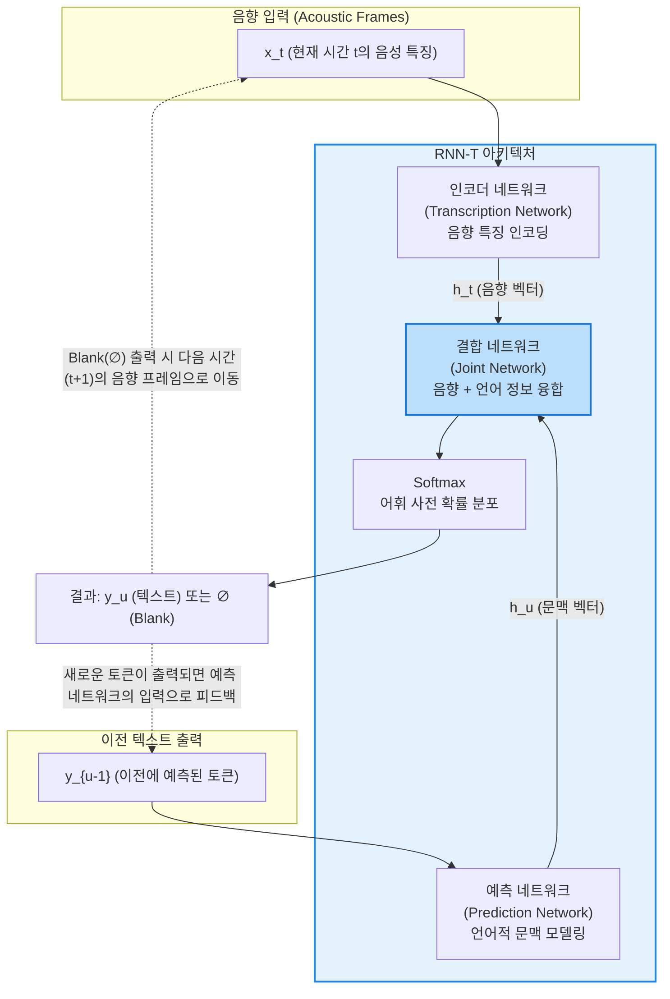

# RNN-T (Recurrent Neural Network Transducer)

---

## I. 실시간 엔드투엔드(End-to-End) 음성 인식의 핵심, RNN-T의 개요

* **정의**: 입력 시퀀스(오디오 프레임)와 출력 시퀀스(텍스트 토큰)의 길이가 다를 때 명시적인 정렬(Alignment) 없이 두 시퀀스를 매핑하며, 입력이 들어오는 즉시 실시간(Streaming)으로 출력을 생성할 수 있는 엔드투엔드([[End-to-End]]) 시퀀스 변환 모델
* **등장 배경 및 필요성**:
* **CTC(Connectionist Temporal Classification)의 한계**: 출력 토큰들이 서로 독립적이라는 조건부 독립(Conditionally Independent) 가정을 바탕으로 하여, 이전 출력 단어가 다음 단어 예측에 영향을 주지 못하는 언어적 문맥 파악의 한계 존재
* **[[seq2seq|Seq2Seq]](Attention)의 한계**: 문맥 파악은 탁월하나, 문장의 끝까지(전체 입력) 다 들은 후에야 번역/인식을 시작할 수 있어 지연 시간(Latency)이 길고 실시간 스트리밍 처리에 부적합함

* **특징**: 음향 모델(Acoustic Model)과 언어 모델(Language Model)의 역할을 하나의 단일 네트워크로 통합하였으며, '공백(Blank)' 토큰을 활용해 입력 데이터의 길이와 출력 데이터의 길이를 동적으로 맞추어 실시간(Online) 디코딩을 지원함

---

## II. RNN-T의 아키텍처 및 핵심 구성요소

### 가. RNN-T 아키텍처 및 데이터 흐름 개념도

* **동작 방식**: 현재 음성 프레임의 정보(인코더)와 지금까지 출력한 텍스트의 정보(예측 네트워크)를 융합(결합 네트워크)하여 다음 글자를 출력합니다. 만약 아직 발음이 끝나지 않아 출력할 글자가 없다면 공백($\emptyset$)을 출력하고 다음 음성 프레임으로 넘어가며 스트리밍을 유지합니다.

### 나. RNN-T의 3대 핵심 서브 네트워크

| 서브 네트워크 | 역할 및 기능 | 세부 설명 및 특징 |
| --- | --- | --- |
| **인코더 네트워크** 

 (Encoder Net) | **음향 모델(AM) 역할** | 연속적인 오디오 프레임($x_t$)을 입력받아 고차원의 음향 특징 표현($h_t$)으로 변환. 과거에는 [[LSTM (Long Short-Term Memory)|LSTM]]/[[RNN (Recurrent Neural Network)|RNN]]을 썼으나, 현재는 Conformer/Transformer 등으로 대체되는 추세 |
| **예측 네트워크** 

 (Prediction Net) | **언어 모델(LM) 역할** | 현재까지 예측된 Non-blank 레이블 시퀀스($y_{u-1}$)를 입력받아 다음 토큰에 대한 언어적 문맥 벡터($h_u$)를 생성. CTC의 조건부 독립성 한계를 해결하는 핵심 요소 |
| **결합 네트워크** 

 (Joint Net) | **정보 융합 및 최종 분류** | 인코더의 음향 특징과 예측 네트워크의 문맥 특징을 Feed-Forward 네트워크로 결합(보통 더하기 연산)한 후, Softmax를 통해 실제 어휘 토큰이거나 Blank($\emptyset$)일 확률을 계산 |

---

## III. 유사 음성 인식 아키텍처 비교 및 최신 동향

### 가. E2E 음성 인식(ASR) 아키텍처 비교 (CTC vs Seq2Seq vs RNN-T)

| 비교 항목 | CTC (Connectionist Temporal Classification) | [[LAS]] (Listen, Attend and Spell / Seq2Seq) | RNN-T (RNN-Transducer) |
| --- | --- | --- | --- |
| **실시간(Streaming) 처리** | **가능** (프레임 단위 독립적 매핑) | 불가능 (전체 문장을 들어야 디코딩 가능) | **가능** (입력이 들어오는 대로 즉각 디코딩) |
| **출력 간 의존성 (문맥)** | 없음 (토큰 간 독립성 가정으로 오타 잦음) | **매우 강함** (어텐션 기반 강력한 언어 모델링) | **강함** (예측 네트워크를 통한 자체 문맥 반영) |
| **정렬(Alignment) 방식** | 단방향 프레임별 독립적 매핑 (Blank 사용) | Attention 메커니즘을 통한 소프트 정렬 | Joint Network를 통한 동적 2D 격자(Lattice) 탐색 |
| **주요 장점** | 연산이 빠르고 지연 시간이 극도로 짧음 | 정확도가 가장 높고 컨텍스트 이해도가 뛰어남 | **정확도와 실시간 처리(Low Latency)의 최적 균형** |

### 나. 한계 극복 및 최신 발전 동향

* **메모리 병목 및 연산 비용 한계**: RNN-T의 훈련 과정은 인코더 프레임 수($T$)와 출력 텍스트 수($U$)의 모든 조합($T \times U$)을 메모리에 올려야 하므로 막대한 메모리가 소모됩니다. 이를 극복하기 위해 메모리 효율을 극대화한 **Fast RNN-T** 훈련 알고리즘이 적용되고 있습니다.
* **온디바이스(On-device) AI의 표준**: 네트워크 연결 없이 스마트폰 기기 내부에서 실시간으로 음성을 텍스트로 변환해야 하는 구글 어시스턴트, 애플 시리 등 모바일 환경에서 RNN-T는 온디바이스 ASR의 사실상 표준(De facto standard)으로 채택되어 사용 중입니다.
* **Conformer-T의 부상**: 초기에는 모든 네트워크가 LSTM 등 순환(RNN) 기반이었으나, 최근에는 음성 데이터의 지역적 특징([[CNN]])과 전역적 특징(Transformer)을 동시에 포착하는 Conformer(Convolution-augmented Transformer)를 인코더로 사용하는 **Conformer-Transducer** 구조가 정확도 측면에서 SOTA(State-of-the-Art)를 기록하고 있습니다.

---

### 🔗 연관 토픽

- **소속 도메인**: [[00_인공지능_MOC|🤖 인공지능]]
- **세부 분류**: `3. 딥러닝 핵심 아키텍처 & 신경망`
- **핵심 연관 토픽**:
  - [[RNN (Recurrent Neural Network)]]
  - [[seq2seq]]
  - [[LSTM (Long Short-Term Memory)]]
  - [[LAS]]
  - [[딥러닝]]
