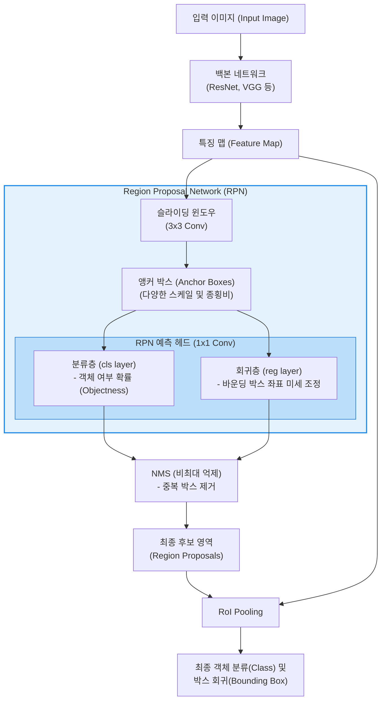

# RPN (Region Proposal Network)

---

## I. 객체 탐지(Object Detection)의 병목을 해결한 핵심 신경망, RPN의 개요

* **정의**: 입력된 이미지 내에서 객체(Object)가 존재할 만한 후보 영역(Region Proposals)을 빠르고 정확하게 찾아내기 위해, 백본(Backbone) [[CNN]]이 추출한 특징 맵(Feature Map) 위에서 동작하는 **완전 합성곱 신경망(Fully Convolutional Network, FCN)**
* **등장 배경 및 필요성**:
* 기존의 객체 탐지 모델(R-CNN, Fast R-CNN)은 후보 영역을 추출할 때 [[CPU]] 기반의 전통적인 컴퓨터 비전 알고리즘인 선택적 탐색(Selective Search)을 사용하여, 이 과정이 전체 처리 시간의 심각한 병목(Bottleneck)으로 작용함
* 후보 영역 추출 과정까지 [[딥러닝]] 네트워크([[GPU]]) 내부로 끌어들여, 특징 추출부터 영역 제안, 최종 분류까지를 하나의 통합된 네트워크로 묶는 **진정한 엔드투엔드([[End-to-End]]) 학습**을 달성하기 위해 고안됨 (Faster R-CNN의 핵심 모듈)

* **특징**: 다양한 크기와 비율의 참조 박스인 앵커 박스(Anchor Box)를 사용하여 다중 스케일의 객체를 효과적으로 탐지하며, 특징 맵을 후속 분류 네트워크와 공유하므로 연산 비용이 극적으로 감소함

---

## II. RPN의 아키텍처 및 핵심 구성요소

### 가. RPN 동작 메커니즘 및 Faster R-CNN 파이프라인 개념도

* RPN은 백본 네트워크가 만든 특징 맵 위를 슬라이딩 창(Sliding Window) 방식으로 훑으면서, 각 위치마다 사전에 정의된 여러 개의 **앵커 박스**를 투영합니다.
* 각 앵커 박스에 대해 이 영역이 배경인지 실제 객체인지(분류, cls) 판별하고, 실제 객체의 위치에 더 잘 맞도록 박스 좌표를 조정(회귀, reg)한 후, 가장 가능성 높은 영역들만 추려내어 다음 단계(RoI Pooling)로 전달합니다.

### 나. RPN의 4대 핵심 기술 요소

| 분류 | 요소기술(키워드) | 세부 설명 |
| --- | --- | --- |
| **참조 틀** | 앵커 박스 (Anchor Box) | 이미지의 각 픽셀 위치마다 씌워보는 사전 정의된 다양한 크기(Scale)와 비율(Aspect Ratio)의 바운딩 박스 (보통 3가지 스케일 x 3가지 비율 = 9개 사용) |
| **예측 1** | 객체성 점수 (Objectness Score) | 해당 앵커 박스 내부에 특정 [[클래스]](개, 고양이 등)가 아닌, **'어떤 객체든 존재하는가(Object)' 아니면 '배경(Background)인가'**를 판단하는 이진 분류 확률 (cls layer) |
| **예측 2** | 바운딩 박스 회귀 (Bbox Regression) | 앵커 박스의 중심 좌표(x, y)와 너비/높이(w, h)를 정답(Ground Truth) 상자에 최대한 밀착되도록 미세하게 보정하는 위치 조정 오프셋 연산 (reg layer) |
| **후처리** | NMS (Non-Maximum Suppression) | 동일한 객체를 가리키는 여러 개의 겹치는(IoU가 높은) 후보 박스들 중, 가장 객체성 점수가 높은 하나의 박스만 남기고 나머지는 제거하는 비최대 억제 [[알고리즘]] |

---

## III. 객체 탐지 패러다임 비교 및 최신 발전 동향

### 가. 후보 영역 추출 방식의 진화 (Fast R-CNN vs Faster R-CNN)

| 비교 항목 | Fast R-CNN | Faster R-CNN (RPN 도입) |
| --- | --- | --- |
| **후보 영역 추출 방식** | **Selective Search (선택적 탐색)** | **Region Proposal Network (RPN)** |
| **실행 주체 및 환경** | CPU 기반의 별도 외부 알고리즘 연산 | GPU 내부의 인공신경망 계층 연산 |
| **특징 맵 공유 여부** | 공유 불가능 (외부에서 추출한 박스를 매핑) | **공유 (백본 특징 맵을 RPN과 최종 분류기가 함께 사용)** |
| **처리 속도 (병목)** | 이미지당 약 2초 (실시간 처리 불가) | **이미지당 약 0.2초 이하 (Near Real-time 달성)** |
| **최적화 구조** | 영역 제안 부분은 학습 불가능 (Heuristic) | 전체 파이프라인이 하나의 손실 함수로 엔드투엔드(End-to-End) 학습 가능 |

### 나. 한계 극복 및 현대 객체 탐지(Object Detection)의 발전 동향

* **1-Stage Detector와의 경쟁 (YOLO, SSD)**: RPN을 사용하는 Faster R-CNN 계열(2-Stage Detector)은 정확도가 매우 높지만, 영역을 먼저 제안하고 이후에 분류를 수행하는 두 단계 구조 탓에 모바일 환경 등에서의 초고속 실시간 처리(FPS)에는 한계가 있었습니다. 이를 극복하기 위해 RPN 단계를 생략하고 이미지를 한 번만 보고 클래스와 위치를 동시에 예측하는 **YOLO(You Only Look Once)** 계열의 1-Stage 모델이 실시간 탐지의 주류로 자리 잡았습니다.
* **앵커 프리(Anchor-free) 모델의 대두**: 앵커 박스의 크기와 비율을 사전에 사람이 직접 설계(Hyperparameter)해야 하는 RPN의 번거로움을 없애기 위해, 객체의 중심점(Center Point)이나 특징점(Keypoint)만을 예측하여 바운딩 박스를 유추하는 **FCOS, CenterNet** 등의 앵커 프리(Anchor-free) 방식이 등장하여 아키텍처를 크게 단순화시켰습니다.
* **Vision Transformer (DETR)로의 진화**: 최근에는 RPN이나 NMS 같은 복잡한 합성곱 신경망의 휴리스틱(Heuristic) 구성 요소를 완전히 제거하고, [[트랜스포머]](Transformer)의 어텐션 메커니즘을 이용해 객체를 집합 예측(Set Prediction)하는 **DETR(DEtection TRansformer)** 구조가 등장하며 객체 탐지의 새로운 패러다임을 열고 있습니다.

---

### 🔗 연관 토픽

- **소속 도메인**: [[00_인공지능_MOC|🤖 인공지능]]
- **세부 분류**: `3. 딥러닝 핵심 아키텍처 & 신경망`
- **핵심 연관 토픽**:
  - [[딥러닝]]
  - [[트랜스포머|트랜스포머(Transformer)]]
  - [[GPU]]
  - [[알고리즘]]
  - [[초거대 언어 모델|초거대 언어 모델(Large Language Model)]]
