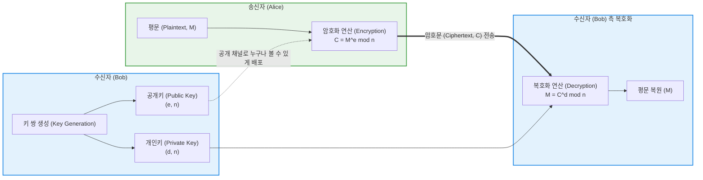

# RSA (Rivest Shamir Adleman)

---

## I. 현대 공개키 암호 인프라(PKI)의 근간, RSA의 개요

* **정의**: 두 개의 큰 소수(Prime Number)를 곱한 값을 소인수분해하는 것이 수학적으로 매우 어렵다는 사실(Computational Hardness)을 기반으로, 암호화용 공개키(Public Key)와 복호화용 **개인키(Private Key)** 쌍을 생성하여 데이터를 안전하게 전달하는 **비대칭키(Asymmetric Key) [[암호화]] [[알고리즘]]**
* **등장 배경 및 필요성**:
* 기존 대칭키(Symmetric Key) 암호 체계([[DES]], AES 등)의 치명적 약점인 **키 분배(Key Distribution) 문제**를 해결하기 위해 1977년 개발됨 (안전하지 않은 채널에서도 비밀키를 안전하게 공유할 방법이 필요)

* **특징**: 키 전달의 보안성은 완벽에 가깝지만, 복잡한 모듈러 거듭제곱 연산으로 인해 대칭키 대비 연산 속도가 약 1,000배 이상 느림. 따라서 대용량 데이터 암호화보다는 **대칭키 교환(Key Exchange)** 및 전자서명(Digital Signature)에 주로 사용됨.

---

## II. RSA의 아키텍처 및 수학적 동작 원리

### 가. RSA 암호화 및 복호화 통신 메커니즘

* 송신자(Alice)는 수신자(Bob)가 미리 배포한 **공개키**를 사용하여 데이터를 암호화합니다.
* 생성된 암호문은 오직 Bob이 안전하게 보관하고 있는 **개인키**로만 복호화할 수 있으므로, 중간에 해커가 암호문과 공개키를 가로채더라도 데이터를 해독할 수 없습니다.

### 나. RSA의 핵심 기술 요소 및 수학적 구조

| 분류 | 요소기술(키워드) | 세부 설명 및 공식 |
| --- | --- | --- |
| **키 생성** | 소수 선택 및 오일러 함수 | 두 개의 매우 큰 소수 $p, q$를 선택하여 $n = p \times q$를 계산. 오일러 피 함수 $\phi(n) = (p-1)(q-1)$를 산출함. |
| **키 도출** | 공개키($e$)와 개인키($d$) | $\phi(n)$과 서로소인 정수 $e$(공개키)를 선택하고, $(e \times d) \pmod{\phi(n)} = 1$을 만족하는 $d$(개인키)를 역원으로 계산함. |
| **보안 모델 1** | [[기밀성]] (Confidentiality) | 수신자의 **공개키로 암호화**하여 전송. 오직 수신자의 **개인키로만 복호화** 가능 (데이터 유출 방지). |
| **보안 모델 2** | 전자서명 (부인방지/인증) | 송신자의 **개인키로 암호화(서명)**하여 전송. 누구나 송신자의 **공개키로 복호화(검증)**할 수 있으므로, 해당 데이터가 특정 송신자로부터 작성되었음을 확고히 증명함. |
| **취약성 요인** | 소인수분해 공격 | 공격자가 공개된 $n$을 소인수분해하여 $p$와 $q$를 알아내면 개인키 $d$를 계산할 수 있음. 이를 방지하기 위해 최소 2048-bit 이상의 키 길이를 권장함. |

---

## III. 현대 암호 체계 비교 및 차세대 발전 동향

### 가. 3대 핵심 암호화 알고리즘 비교 (AES vs RSA vs ECC)

| 비교 항목 | AES ([[AES|Advanced Encryption Standard]]) | RSA (Rivest Shamir Adleman) | [[ECC]] (Elliptic Curve Cryptography) |
| --- | --- | --- | --- |
| **암호화 방식** | **대칭키** (비밀키 1개 공유) | **비대칭키** (공개키/개인키 쌍) | **비대칭키** (공개키/개인키 쌍) |
| **보안 기반 수학** | 혼돈(Confusion)과 확산(Diffusion) | **소인수분해의 난해성** | **타원곡선 이산대수 문제 (ECDLP)** |
| **연산 속도** | **매우 빠름** | 매우 느림 | 느림 (RSA보다는 훨씬 빠름) |
| **권장 키 길이** | 128 / 256 bit | **2048 / 4096 bit (키가 매우 큼)** | 256 bit (짧은 키로 동일 보안 수준 제공) |
| **현대 주요 용도** | 디스크, 파일, 페이로드 등 대용량 데이터 암호화 | 인증서(PKI), 전자서명, **대칭키(AES) 교환용 래핑** | 모바일 환경, 스마트카드, **[[01_IT Tech/블록체인]](비트코인 등)** |

### 나. 한계 극복 및 최신 암호학 발전 동향

* **TLS/SSL 하이브리드 암호화 체계**: RSA의 느린 처리 속도로 인해 전체 데이터를 RSA로 암호화하는 것은 불가능합니다. 따라서 현대의 HTTPS 웹 통신은 "핸드셰이크(초기 연결) 단계에서는 RSA를 이용해 안전하게 임시 대칭키([[세션]] 키)를 교환하고, 이후 실제 통신 데이터는 그 대칭키(AES)로 고속 암호화하는 하이브리드 구조"를 표준으로 사용합니다.
* **쇼어 알고리즘(Shor's Algorithm)과 양자 컴퓨터의 위협**: 양자 컴퓨터가 상용화되어 쇼어 알고리즘을 실행할 경우, 기존 슈퍼컴퓨터로 수만 년이 걸리던 소인수분해 연산을 불과 수 분~수 시간 내에 해결할 수 있어 RSA 암호 체계가 완전히 붕괴될 위험이 존재합니다.
* **양자 내성 암호 (PQC, Post-Quantum Cryptography)**: 양자 컴퓨터의 공격에도 안전한 새로운 수학적 난제(격자 기반 암호(Lattice), 다항식 등)를 활용한 차세대 암호화 표준 알고리즘(NIST PQC 표준 선정)으로의 전 세계적인 마이그레이션이 현재 진행 중입니다.

---

### 🔗 연관 토픽

- **소속 도메인**: [[00_보안_MOC|🛡️ 보안]]
- **세부 분류**: `2. 현대 암호학 & 키 관리 · 전자서명`
- **핵심 연관 토픽**:
  - [[ECC|ECC(Elliptic Curve Cryptography)]]
  - [[암호화|암호화 (Encryption)]]
  - [[기밀성]]
  - [[AES]]
  - [[FIPS (Federal Information Processing Standards)]]
