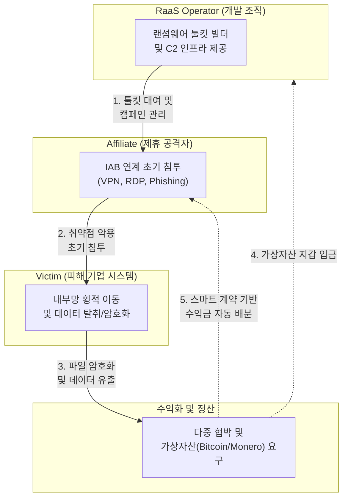

# RaaS (Ransomware as a Service)

---

## I. 서비스형 범죄 비즈니스 모델, RaaS의 개요

### 가. RaaS의 정의

* [[랜섬웨어]] 개발 능력이 없는 범죄자(Affiliate)가 구독 또는 수익 배분(Revenue Sharing) 형태로 랜섬웨어 툴킷과 인프라를 임대하여 악성 공격을 수행하는 '사이버범죄-서비스(CaaS)' 모델
* 다크웹을 통해 공격 도구, C2 서버, 피해자 협상 포털 등을 패키지 형태로 제공하여 사이버 공격의 진입 장벽을 극단적으로 낮춘 조직형 범죄 체계

### 나. RaaS의 등장배경 및 주요 특징

* **등장배경**: 개별 해커들의 개발 비용 및 기술 한계 극복, 기업화된 범죄 조직의 수익 극대화 및 역할 분담(전문화) 필요성 대두
* **주요 특징**:
* **제휴 모델(Affiliate Model)**: 개발자(Operator)와 실행자(Affiliate)가 협력하여 수익을 분배(보통 7:3 또는 8:2 비율)
* **다중 협박(Multi-Extortion)**: 파일 암호화뿐만 아니라 데이터 유출, [[DDOS|DDoS]], 제3자 협박을 결합한 고도화된 갈취 전략

---

## II. RaaS의 개념도 및 핵심 기술 요소

### 가. RaaS의 공격 생태계 및 동작 원리

* RaaS 오퍼레이터가 개발한 툴킷을 제휴자가 IAB(초기 침투 브로커) 등을 통해 기업에 주입하고, [[암호화]] 및 유출된 데이터를 기반으로 얻은 몸값을 자동 정산하는 구조임.

### 나. RaaS의 핵심 기술 요소 및 구성

| 분류 | 요소기술(키워드) | 세부 설명 |
| --- | --- | --- |
| **운영 모델** | **Affiliate Program** | 개발자(Operator)와 실행자(Affiliate)가 역할을 분담하고 서비스형 소프트웨어(SaaS) 형태로 범죄 수행 |
| **초기 침투** | **IAB 연계 (Initial Access)** | 취약점 계정, RDP 무차별 대입, 악성 스피어 피싱 등을 통해 기업 내부망에 최초로 교두보를 확보 |
| **우회 기술** | **Evasion Payload** | [[EDR(Endpoint Detection and Response)|EDR]] 및 백신 탐지를 회피하기 위해 안티 디버깅, 코드 [[난독화]], 드라이버 블랭킹(BYOVD) 적용 |
| **확산 기술** | **Lateral Movement** | 내부망 진입 후 권한 상승(Privilege Escalation) 및 액티브 디렉토리(AD) 장악을 통한 전사 확산 |
| **협박 전략** | **Triple / Quad Extortion** | 암호화 + 데이터 유출 + 고객/파트너 협박 + DDoS 공격을 병행하여 지불 압박 극대화 |
| **인프라** | **Tor & Crypto Mixing** | 추적을 차단하기 위해 Tor 네트워크 기반의 C2 서버 운영 및 가상자산 믹서(Mixer) 활용 |
| **관리 도구** | **RaaS Control Panel** | 가입자 관리, 감염 통계, 피해자별 몸값 협상(Chat Portal)을 제공하는 웹 기반 대시보드 |
| **방어 체계** | **[[XDR]] & [[SOAR (Security Orchestration, Automation and Response)|SOAR]] 연동** | 단말 이상 징후를 실시간 탐지하고, 격리(Isolation) 및 자동화된 플레이북으로 피해 확산 차단 |

---

## III. 전통적 랜섬웨어와 RaaS 비교 및 향후 대응 동향

### 가. 전통적 랜섬웨어와 RaaS 비교

| 비교 항목 | 전통적 랜섬웨어 (Traditional) | RaaS (Ransomware-as-a-Service) |
| --- | --- | --- |
| **공격 주체** | 독립된 해커 또는 소규모 해킹 그룹 | 조직화된 **오퍼레이터 + 다수의 제휴자(Affiliate)** 체계 |
| **개발 방식** | 자체 악성코드 개발 및 직접 유포 | 검증된 구독형 툴킷(Malware Kit) 임대 활용 |
| **공격 대상** | 주로 개인 사용자 및 무차별 불특정 다수 | 보안이 취약한 **대기업, 공공기관, 의료 시설 (표적형)** |
| **피해 규모** | 파일 암호화 및 단말 복구 비용 중심 | **기업 기밀 유출, 비즈니스 중단, 법적 리스크 등 파괴적** |

### 나. 최신 위협 동향 및 대응 방안

* **AI 기반 자동화 공격 가속화**: 최근 공격 그룹들은 생성형 AI를 활용하여 자연스러운 피싱 메일 작성 및 자동화된 취약점 스캐닝을 수행하므로, 기업은 AI 기반 위협 탐지 시스템(AI-Driven Security) 도입 필수
* **제로 트러스트([[제로 트러스트 보안모델|Zero Trust]]) 아키텍처 내재화**: "절대 믿지 말고, 항상 검증하라" 원칙에 따라 망분리, 마이크로세그멘테이션(Micro-segmentation), 다중 인증(MFA)을 적용하여 RaaS의 횡적 이동 원천 차단

---

### 🔗 연관 토픽

- **소속 도메인**: [[00_보안_MOC|🛡️ 보안]]
- **세부 분류**: `2. 현대 암호학 & 키 관리 · 전자서명`
- **핵심 연관 토픽**:
  - [[랜섬웨어]]
  - [[XDR|XDR(eXtended Detection Response)]]
  - [[제로 트러스트 보안모델|제로 트러스트 (Zero Trust) 보안모델]]
  - [[EDR(Endpoint Detection and Response)]]
  - [[APT(Advanced Persistent Threat) 공격]]
