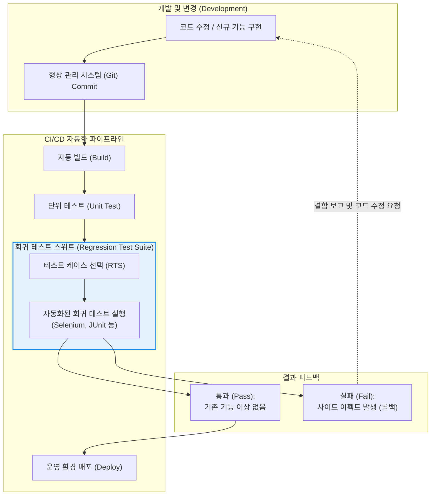

# 회귀 테스트 (Regression Test)

---

## I. 소프트웨어 변경에 따른 사이드 이펙트 방지 기술, 회귀 테스트의 개요

* **정의**: 소프트웨어의 특정 모듈이나 코드가 수정, 기능 추가, 패치된 이후, 이러한 **변경 사항이 기존에 정상적으로 동작하던 다른 기능에 의도치 않은 결함(Side Effect)을 유발하지 않았는지를 확인**하기 위해 기존 테스트 케이스를 재실행하는 [[소프트웨어 테스트]] 기법
* **등장 배경 및 필요성**:
* 소프트웨어의 복잡도가 증가함에 따라, 한 부분의 코드 수정이 시스템의 전혀 다른 영역에 연쇄적인 버그파급(Ripple Effect)을 일으키는 문제 발생
* 애자일([[Agile]]) 및 데브옵스([[DevOps]]) 환경에서 잦은 배포와 코드 변경이 일상화되면서, 지속적이고 반복적인 품질 검증의 자동화가 필수불가결해짐

* **특징**: 새롭게 발견된 버그를 찾는 것이 아니라 '기존 기능의 [[무결성]] 유지'가 목적이며, 반복적인 실행이 요구되므로 테스트 자동화(Test Automation)와 극도로 높은 결합성을 가짐

---

## II. 회귀 테스트의 동작 아키텍처 및 핵심 기술 요소

### 가. CI/CD 파이프라인 내 회귀 테스트 자동화 개념도

* 개발자가 코드를 커밋하면 CI(지속적 통합) 서버가 이를 감지하여 빌드하고, 사전에 스크립트로 작성된 **[[리그레션 테스트|회귀 테스트]] 스위트**를 자동으로 실행함.
* 기존 기능에 결함이 발생할 경우(Fail), 배포를 중단하고 개발자에게 즉각적인 피드백을 전달하여 결함의 운영 환경 유입을 차단함.

### 나. 회귀 테스트의 주요 접근 전략 및 기술 요소

| 분류 | 전략/기술명 (키워드) | 세부 설명 |
| --- | --- | --- |
| **테스트 범위** | Retest All (전체 회귀 테스트) | 기존에 작성된 모든 테스트 케이스를 전부 재실행. 가장 안전하지만 시간과 컴퓨팅 리소스가 막대하게 소모됨 |
| **테스트 범위** | Regression Test Selection (RTS) | 변경된 코드와 의존성(Dependency)이 있는 영향 범위를 분석하여, **관련된 테스트 케이스만 선택적(Selective)으로 실행** |
| **우선순위** | Test Case Prioritization | 리소스 제한 시, 비즈니스 중요도가 높거나 최근에 결함이 자주 발생했던 기능의 테스트 케이스를 최우선으로 실행 |
| **도구 및 환경** | 테스트 자동화 [[프레임워크]] | UI 회귀(Selenium, Cypress), API 회귀(Postman, REST Assured), 단위/통합(JUnit, TestNG) 등 계층별 도구 활용 |
| **품질 지표** | 결함 발견율 (Defect Detection Rate) | 전체 결함 중 회귀 테스트를 통해 포착된 결함의 비율로, 회귀 테스트 스위트의 신뢰성과 효율성을 평가하는 지표 |
| **분석 기법** | 영향도 분석 (Impact Analysis) | 특정 모듈의 변경이 시스템의 다른 부분에 미치는 영향을 추적하여 RTS 및 우선순위 선정의 논리적 근거 제공 |

---

## III. 유사 테스트 기법 비교 및 최신 발전 동향

### 가. 목적에 따른 주요 소프트웨어 테스트 비교 (ISTQB 기준)

| 비교 항목 | 회귀 테스트 (Regression Test) | 확인 테스트 (Re-testing / Confirmation) | [[단위 테스트]] (Unit Test) |
| --- | --- | --- | --- |
| **핵심 목적** | **기존 기능**이 망가지지 않았는지 확인 | **수정된 버그**가 제대로 고쳐졌는지 확인 | **개별 소스 코드** 모듈이 의도대로 동작하는지 확인 |
| **테스트 대상** | 변경되지 않은 시스템의 기존 영역 전체 | 결함이 보고되어 패치된 바로 그 특정 기능 | 함수, 메서드, [[클래스]] 등 가장 작은 단위의 코드 |
| **실행 시점** | 코드 병합(Merge) 및 빌드 시마다 반복 실행 | 버그 수정(Patch) 직후 해당 건에 한해 1회성 실행 | 개발자가 코드를 작성하는 즉시(혹은 [[TDD]] 적용 시 사전) |
| **자동화 의존도** | **매우 높음 (필수적)** | 상대적으로 낮음 (수동 검증 병행) | 매우 높음 |

### 나. 한계 극복 및 최신 테스트 엔지니어링(TE) 동향

* **테스트 스위트 비대화(Bloat) 문제**: 소프트웨어가 성장함에 따라 누적된 테스트 케이스의 양이 방대해져 CI 파이프라인의 병목(Bottleneck)이 되는 한계가 발생함.
* **AI 기반 스마트 회귀 테스트 (AI-driven RTS)**: 최근에는 머신러닝 알고리즘을 도입하여 소스 코드의 변경 패턴, 과거 결함 이력, [[코드 커버리지]] 데이터를 분석해 "이번 커밋(Commit)에서 실패할 확률이 가장 높은 최소한의 테스트 케이스"를 AI가 자동으로 선별하고 실행 순서를 최적화하는 지능형 파이프라인(예: Facebook의 Sapienz 등)이 엔터프라이즈 환경에 도입되고 있음.
* **시프트 레프트 (Shift-Left) 테스팅**: 테스트를 릴리즈 직전 단계로 미루지 않고, 개발 초기 단계(코드 작성 및 PR 단계)로 회귀 테스트를 극단적으로 앞당겨 결함 수정 비용(Cost of Quality)을 획기적으로 낮추는 데브옵스 실무 철학이 확산 중임.

---

### 🔗 연관 토픽

- **소속 도메인**: [[00_소프트웨어공학_MOC|🏗️ 소프트웨어공학]]
- **세부 분류**: `4. 아키텍처 스타일 & 객체지향 설계 원리`
- **핵심 연관 토픽**:
  - [[리그레션 테스트|리그레션(회귀, Regression) 테스트]]
  - [[소프트웨어 테스트|소프트웨어 테스트 (Software Test)]]
  - [[프레임워크]]
  - [[단위 테스트]]
  - [[TDD|TDD (Test Driven Development)]]
