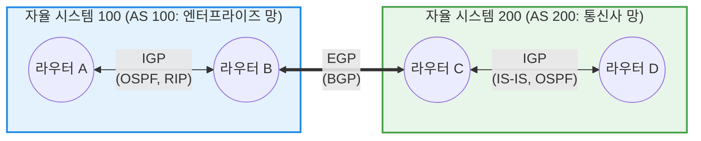

# 라우팅 프로토콜 (Routing Protocol)

---

## I. 최적의 데이터 전달 경로를 찾는 네트워크의 내비게이션, 라우팅 프로토콜의 개요

* **정의**: 네트워크 상에서 패킷(Packet)이 출발지에서 목적지까지 이동할 때, [[라우터]](Router) 간에 네트워크 토폴로지(Topology) 정보를 교환하여 **최적의 경로를 동적으로 결정하고 라우팅 테이블(Routing Table)을 유지·관리하는 통신 [[알고리즘]] 및 규약**
* **등장 배경 및 필요성**:
* 네트워크 규모가 커짐에 따라 관리자가 수동으로 경로를 입력하는 정적 라우팅(Static Routing)은 유지보수가 불가능해짐
* 특정 회선이나 라우터에 장애가 발생했을 때, 이를 즉각 감지하고 우회 경로를 자동으로 찾아내는 결함 허용(Fault Tolerance) 및 트래픽 분산 능력 필요

* **특징**: 메트릭(Metric, 비용 지표)을 기준으로 최단 혹은 최적 경로를 산출하며, 네트워크 상태 변화 시 모든 라우터가 동일한 라우팅 정보를 갖게 되는 **수렴(Convergence)** 과정이 필수적임

---

## II. 라우팅 프로토콜의 아키텍처 및 핵심 구성요소

### 가. 자율 시스템(AS) 기반 라우팅 계층 개념도

* **AS (Autonomous System, 자율 시스템)**: 동일한 관리 정책에 의해 통제되는 라우터들의 집합(예: 특정 통신사, 대기업 네트워크 망).
* 라우팅 프로토콜은 AS **내부**에서 경로를 찾는 IGP(Interior Gateway Protocol)와, AS와 AS **사이**의 경로를 연결하는 EGP(Exterior Gateway Protocol)로 엄격히 구분되어 동작함.

### 나. 라우팅 프로토콜의 핵심 알고리즘 및 기술 요소

| 분류 | 요소기술(키워드) | 세부 설명 |
| --- | --- | --- |
| **운영 영역** | IGP (내부 [[게이트웨이]] [[프로토콜]]) | 동일한 AS 내부에서 라우터 간 최적 경로를 교환하는 프로토콜 (RIP, OSPF, EIGRP 등) |
| **운영 영역** | EGP (외부 게이트웨이 프로토콜) | 서로 다른 AS 간의 라우팅 정보를 교환하여 글로벌 인터넷 망을 구성하는 프로토콜 ([[BGP]]가 유일한 표준) |
| **동작 방식** | 거리 벡터 (Distance Vector) | 인접한 라우터가 알려준 **거리(Hop Count)와 방향(Vector)**만을 기준으로 경로를 결정. 시야가 좁고 루핑(Looping) 취약성이 있음 |
| **동작 방식** | 링크 상태 (Link State) | 전체 네트워크 토폴로지 지도(맵)를 모든 라우터가 보유하고, **다익스트라([[다익스트라 알고리즘|Dijkstra]]) SPF 알고리즘**을 통해 최단 경로를 독자적으로 계산 |
| **평가 지표** | 메트릭 (Metric) | 최적 경로를 결정하는 판단 기준. 프로토콜에 따라 홉 수(Hop Count), 대역폭(Bandwidth), 지연 시간(Delay), 부하(Load) 등을 사용 |
| **성능 지표** | 수렴 시간 (Convergence Time) | 토폴로지 변화(장애 등) 발생 시, 네트워크 내 모든 라우터가 라우팅 테이블 업데이트를 완료하여 일관된 상태가 되기까지 걸리는 시간 |

---

## III. 주요 라우팅 프로토콜 비교 및 최신 네트워킹 동향

### 가. 3대 주요 라우팅 프로토콜 비교 (RIP vs OSPF vs BGP)

| 비교 항목 | RIP (Routing Information Protocol) | OSPF (Open Shortest Path First) | BGP (Border Gateway Protocol) |
| --- | --- | --- | --- |
| **적용 영역** | IGP (소규모 내부망) | **IGP (중대형 엔터프라이즈 망)** | **EGP (인터넷 망, 통신사 간 연동)** |
| **[[라우팅 알고리즘]]** | 거리 벡터 (Distance Vector) | **링크 상태 (Link State)** | 경로 벡터 (Path Vector) |
| **메트릭(비용) 기준** | 홉 수 (Max 15 제한) | **대역폭 (Cost = 10^8 / Bandwidth)** | 다양한 속성(AS-Path, MED, Local Pref) |
| **정보 교환 방식** | 30초 주기로 전체 테이블 브로드캐스트 | **변화 발생 시에만 해당 링크 정보 멀티캐스트** | [[TCP]] [[세션]](179) 기반으로 변경된 경로만 전송 |
| **수렴 속도** | 매우 느림 | **매우 빠름** | 느림 (방대한 글로벌 라우팅 테이블 처리) |
| **장/단점** | 설정이 쉽지만 대규모 망 적용 불가 | **확장성 및 효율성 우수, [[CPU]]/메모리 부하 큼** | 대규모 정책(Policy) 제어 가능, 설정 복잡 |

### 나. 한계 극복 및 최신 차세대 네트워킹(SDN) 동향

* **전통적 분산 라우팅의 한계**: OSPF나 BGP는 각 라우터가 제어 평면(Control Plane, 경로 계산)과 데이터 평면(Data Plane, 패킷 전달)을 동시에 수행하는 분산 처리 구조로, 클라우드 환경의 급격한 트래픽 변화나 중앙 집중적 트래픽 엔지니어링(Traffic Engineering) 요구에 신속하게 대응하기 어려움.
* **[[SDN(Software Defined Network)|SDN]] (Software Defined Networking) 패러다임 전환**: 최근의 데이터센터 및 통신사 코어망은 라우터에서 '제어 평면'을 물리적으로 분리하여 중앙의 **SDN 컨트롤러**에 집중시키고, 개별 [[스위치 (Layer 3 Switch)|스위치]]/라우터는 단순히 룰([[OpenFlow]] 등)에 따라 패킷만 전달하는(데이터 평면) 지능형 중앙 통제 아키텍처로 진화하고 있음.
* **세그먼트 라우팅 (Segment Routing, SR)**: MPLS와 RSVP-TE의 복잡한 시그널링 프로토콜을 제거하고, 출발지 노드가 패킷 헤더에 전체 전송 경로(Segment List)를 직접 기입하여 소스 라우팅(Source Routing)을 수행하는 SR-[[IPv6]](SRv6) 기반의 간소화된 라우팅 체계가 5G 및 클라우드 코어 망의 새로운 표준으로 확산 중임.

---

### 🔗 연관 토픽

- **소속 도메인**: [[00_네트워크_MOC|🌐 네트워크]]
- **세부 분류**: `1. OSI 7계층 & 데이터링크 계층 (L1/L2)`
- **핵심 연관 토픽**:
  - [[라우터]]
  - [[스위치 (Layer 3 Switch)]]
  - [[게이트웨이]]
  - [[BGP|BGP(Border Gateway Protocol)]]
  - [[OpenFlow]]
