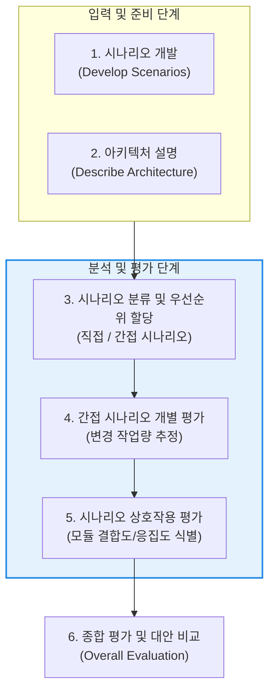

# SAAM (Software Architecture Analysis Method)

---

## I. 시나리오 기반 소프트웨어 아키텍처 평가의 시초, SAAM의 개요

* **정의**: 소프트웨어 아키텍처가 시스템이 요구하는 비기능적 품질 속성(Quality Attributes), 특히 변경 용이성(Modifiability)과 확장성을 얼마나 잘 지원하는지 시나리오(Scenario)를 기반으로 분석하고 평가하는 초기 아키텍처 평가 방법론
* **등장 배경 및 필요성**:
* 아키텍처 설계 단계의 오류나 결함은 개발 후반부나 운영 단계에서 막대한 수정 비용(Rework Cost)을 초래함
* 시스템 구현 이전에 설계된 아키텍처 대안들이 비즈니스 목표와 이해관계자의 요구사항을 충족하는지 객관적으로 검증할 수 있는 체계적인 도구의 필요성 대두 (1994년 카네기 멜런 대학 SEI 개발)

* **특징**: 특정 품질 속성(주로 유지보수성, 변경 용이성)에 집중하며, 여러 대안 아키텍처 간의 비교 평가가 용이함. 이후 품질 속성 간의 충돌을 다루는 [[ATAM]](Architecture Tradeoff Analysis Method) 모델의 모태가 됨

---

## II. SAAM의 아키텍처 평가 프로세스 및 핵심 구성요소

### 가. SAAM의 6단계 평가 프로세스 흐름도

### 나. SAAM의 핵심 평가 기준 및 기술 요소

| 분류 | 요소기술(키워드) | 세부 설명 |
| --- | --- | --- |
| **평가 척도** | 시나리오 (Scenario) | 이해관계자(사용자, 개발자, 관리자 등)가 시스템과 상호작용하는 구체적인 상황과 시스템의 예상 반응을 기술한 명세서 |
| **분류 1** | 직접 시나리오 (Direct) | **아키텍처의 변경 없이** 시스템이 기본적으로 제공하여 즉시 수용하고 실행 가능한 시나리오 |
| **분류 2** | 간접 시나리오 (Indirect) | 새로운 기능을 위해 **아키텍처 모듈의 수정이나 변경이 수반**되어야만 수용 가능한 시나리오 (변경 용이성 평가의 핵심 대상) |
| **결함 식별** | 시나리오 상호작용 (Interaction) | 두 개 이상의 서로 다른 간접 시나리오가 **'동일한 하나의 모듈'의 변경을 요구하는 현상**. 상호작용이 높을수록 해당 모듈은 응집도가 낮고 결합도가 높다는(구조적 설계가 불량하다는) 것을 암시함 |
| **산출물** | 변경 작업량 (Cost of Change) | 간접 시나리오를 수용하기 위해 수정해야 할 컴포넌트의 수와 복잡도를 추정하여 아키텍처 간의 비용을 정량적으로 비교 |

---

## III. 아키텍처 평가 방법론 비교 및 최신 동향

### 가. SEI의 3대 소프트웨어 아키텍처 평가 방법론 비교

SAAM의 한계를 극복하기 위해 품질 속성 간의 충돌(Trade-off)과 경제적 관점을 추가한 방법론들로 진화하였습니다.

| 비교 항목 | SAAM (SW Architecture Analysis Method) | ATAM (Architecture Tradeoff Analysis Method) | [[CBAM]] (Cost Benefit Analysis Method) |
| --- | --- | --- | --- |
| **평가 중심** | **변경 용이성** (Modifiability) 단일 초점 | **다양한 품질 속성** (성능, 보안, [[HA(High Availability)|가용성]] 등) 및 이들 간의 충돌 | **경제성 및 투자 대비 효과** (ROI) |
| **핵심 기법** | 직접/간접 시나리오 분석, 상호작용 식별 | **민감점(Sensitivity Point)**, **절충점(Trade-off)** 분석 | 비용-이익(Cost-Benefit) 곡선, 비즈니스 가치 평가 |
| **진화 단계** | 1세대 (개념적, 단편적 품질 평가) | 2세대 (포괄적 품질 속성 평가의 표준) | 3세대 (비즈니스 및 경제적 타당성 통합) |
| **주요 한계** | 여러 품질 속성이 얽힌 복잡한 현대 시스템 평가에는 한계가 있음 | 의사결정에 따른 재무적(비용) 타당성까지는 제시하지 못함 | 비용과 수익을 정확히 추정(정량화)하기가 매우 어려움 |

### 나. 현대 소프트웨어 공학의 아키텍처 평가 패러다임 동향

* **진화적 아키텍처(Evolutionary Architecture)의 대두**: 애자일([[Agile]]) 및 마이크로서비스([[MSA (Micro Service Architecture)|MSA]]) 환경에서는 초기에 완벽한 아키텍처를 설계하는 것이 불가능해짐에 따라, SAAM과 같은 정형화된 일회성(One-off) 평가 프로세스보다는 변화에 점진적으로 대응할 수 있는 아키텍처 설계가 주류를 이루고 있습니다.
* **적합도 함수(Fitness Functions)를 통한 자동화된 평가**: 기존의 사람 중심 시나리오 평가를 코드 레벨로 자동화하여, CI/CD 파이프라인 내에서 시스템의 의존성, 응답 시간, 순환 참조 등을 매 빌드 시점마다 테스트하는 **지속적 아키텍처 검증(Continuous Architecture Evaluation)** 방식으로 실무가 발전하고 있습니다.

---

### 🔗 연관 토픽

- **소속 도메인**: [[00_소프트웨어공학_MOC|🏗️ 소프트웨어공학]]
- **세부 분류**: `3. 요구사항 공학 & UML 객체지향 분석/설계`
- **핵심 연관 토픽**:
  - [[ATAM]]
  - [[SW 아키텍처 평가|SW 아키텍처 평가 (Software Architecture Evaluation)]]
  - [[CBAM|CBAM(Cost Benefit Analysis Method)]]
  - [[ARID]]
  - [[SW Architecture 평가]]
