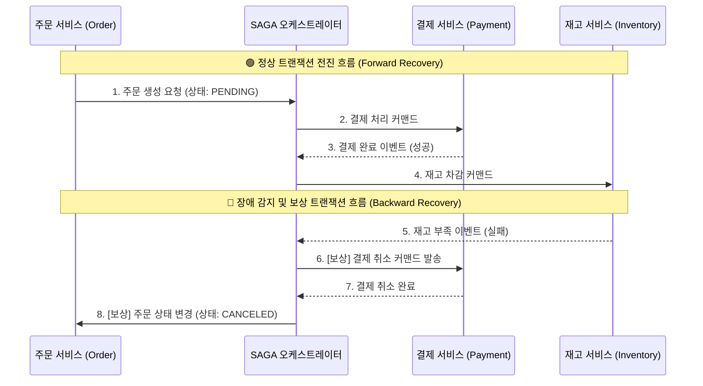

# SAGA 패턴 (SAGA Pattern)

---

## I. MSA 환경의 분산 트랜잭션 관리 표준, SAGA 패턴의 개요

* **정의**: 마이크로서비스 아키텍처([[MSA (Micro Service Architecture)|MSA]])와 같이 데이터베이스가 분리된 분산 환경에서, 여러 서비스에 걸친 하나의 비즈니스 트랜잭션을 **독립적인 로컬 [[트랜잭션]](Local Transaction)들의 연속적인 시퀀스로 분할**하여 데이터 일관성을 유지하는 아키텍처 패턴
* **등장 배경 및 필요성**:
* 기존 모놀리식(Monolithic) 시스템에서 사용하던 2PC(Two-Phase Commit) 방식은 [[데이터베이스]] 락(Lock)을 동반하는 동기식 블로킹 모델이므로, MSA 환경에서는 심각한 성능 저하와 서비스 간 강결합(Tight Coupling)을 유발함
* "Database per Service" 원칙에 따라 분산된 DB 환경에서 시스템의 가용성을 떨어뜨리지 않고(Lock-free) 결과적 일관성(Eventual Consistency)을 보장할 비동기 트랜잭션 관리 기법이 필수적으로 요구됨

* **특징**: 장애가 발생하면 전체 시스템을 롤백(Rollback)하는 대신, 이전까지 성공적으로 완료된 로컬 트랜잭션들의 결과를 역순으로 되돌리는 보상 트랜잭션(Compensating Transaction)을 실행하여 데이터의 정합성을 맞춤

---

## II. SAGA 패턴의 아키텍처 및 핵심 구성요소

### 가. 중앙 제어 방식(Orchestration) 기반 SAGA 동작 개념도

* 일반적인 데이터베이스 롤백과 달리, SAGA는 이미 커밋된(Committed) 데이터를 물리적으로 지우는 것이 아니라, 반대되는 비즈니스 로직(예: 결제 완료 -> 결제 취소)을 순차적으로 실행하여 논리적 원상복구를 수행합니다.

### 나. SAGA 패턴의 2대 구현 방식 및 핵심 구성 요소

| 분류 | 구현 방식 / 요소 | 세부 설명 |
| --- | --- | --- |
| **구현 모델** | **코레오그래피 (Choreography)** | 중앙 통제자 없이, 각 서비스가 로컬 트랜잭션을 완료한 후 이벤트를 발행(Publish)하고 다른 서비스가 이를 구독(Subscribe)하여 다음 작업을 수행하는 탈중앙화 방식. (서비스 2~4개 규모에 적합) |
| **구현 모델** | **오케스트레이션 (Orchestration)** | 'SAGA 오케스트레이터(SEC)'라는 중앙 컨트롤러가 전체 트랜잭션의 상태 머신(State Machine)을 관리하며, 각 서비스에 커맨드(Command)를 보내어 실행과 보상을 지휘하는 방식. (복잡한 비즈니스 로직에 적합) |
| **핵심 요소** | 로컬 트랜잭션 (Local Transaction) | 개별 마이크로서비스가 자신의 독립적인 데이터베이스 내에서 ACID 원칙을 지키며 수행하는 단위 트랜잭션 |
| **핵심 요소** | **보상 트랜잭션 (Compensating)** | [[프로세스]] 중단 시, 이전 단계들에서 수행 완료된 로컬 트랜잭션의 결과를 비즈니스적으로 상쇄(Undo)하기 위해 실행되는 역방향 트랜잭션 |
| **핵심 원칙** | 멱등성 (Idempotency) | 네트워크 지연이나 재시도(Retry)로 인해 동일한 보상 트랜잭션이 여러 번 호출되더라도 시스템 상태가 한 번 실행된 것과 동일하게 유지되어야 하는 성질 |

---

## III. 분산 트랜잭션 모델 비교 및 최신 아키텍처 동향

### 가. 2PC (Two-Phase Commit) vs SAGA 패턴 비교

| 비교 항목 | 2PC (2단계 커밋) | SAGA 패턴 (Orchestration/Choreography) |
| --- | --- | --- |
| **일관성 수준** | **강한 일관성 (Strong Consistency)** | **결과적 일관성 (Eventual Consistency)** |
| **처리 방식** | 동기식 (블로킹) | **비동기식 (논블로킹 / 메시지 큐 기반)** |
| **격리성 (Isolation)** | 완벽히 보장 (트랜잭션 중 타 서비스 접근 불가) | **보장 안 됨 (중간 상태 노출, PENDING 등으로 애플리케이션 레벨 통제 필요)** |
| **장애 시 복구** | 분산 트랜잭션 매니저를 통한 물리적 DB 롤백 | **애플리케이션 계층의 보상 트랜잭션 (논리적 복구)** |
| **적합한 아키텍처** | 단일 데이터베이스 내 논리적 분할, 강결합 RDBMS | **마이크로서비스 아키텍처(MSA), [[클라우드 네이티브]], [[NoSQL (CAP 이론 BASE 속성)|NoSQL]] 결합 환경** |

### 나. 한계 극복 및 최신 발전 동향

* **격리성(Isolation) 부족의 한계와 대안**: SAGA 패턴은 다수의 로컬 트랜잭션이 비동기로 진행되므로, 전체 트랜잭션이 끝나기 전에 다른 사용자에게 중간 데이터([[Dirty Read]])가 노출될 수 있습니다. 이를 방지하기 위해 데이터베이스 상태 컬럼에 `PENDING` 등 **시맨틱 락(Semantic Lock)** 플래그를 두어 애플리케이션 레벨에서 데이터 접근을 통제하는 기법이 동반됩니다.
* **트랜잭셔널 아웃박스(Transactional Outbox) 패턴과의 결합**: 데이터베이스 업데이트와 메시지 발행(Kafka 등)이 동시에 성공하는 것을 보장하기 위해, DB 내에 별도의 Outbox 테이블을 생성하여 비즈니스 데이터와 이벤트 메시지를 하나의 로컬 트랜잭션으로 묶어 커밋하고 별도의 릴레이 워커(Relay Worker)가 이벤트를 발행하는 조합이 SAGA 구현의 사실상 표준으로 자리 잡았습니다.
* **워크플로우 엔진의 부상**: 복잡한 오케스트레이션을 직접 코딩하는 대신, Uber에서 개발한 **Cadence**나 이를 잇는 **Temporal.io**, 혹은 **Camunda**와 같은 분산 워크플로우 엔진을 사용하여 복잡한 재시도(Retry), 타이머, 보상 트랜잭션을 손쉽게 구현하는 트렌드가 확산되고 있습니다.

---

### 🔗 연관 토픽

- **소속 도메인**: [[00_소프트웨어공학_MOC|🏗️ 소프트웨어공학]]
- **세부 분류**: `4. 아키텍처 스타일 & 객체지향 설계 원리`
- **핵심 연관 토픽**:
  - [[MSA (Micro Service Architecture)]]
  - [[데이터베이스]]
  - [[트랜잭션]]
  - [[프레임워크]]
  - [[클라우드 네이티브]]
