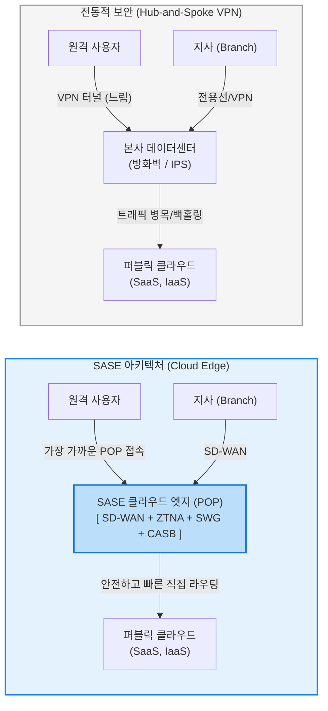

# SASE (Secure Access Service Edge)

---

## I. 클라우드 시대의 네트워크와 보안의 융합 패러다임, SASE의 개요

* **정의**: [[클라우드 네이티브]] 환경에서 기업의 광대역 네트워크(WAN) 역량과 포괄적인 네트워크 보안(Security) 기능을 하나의 통합된 클라우드 서비스 모델로 결합하여 제공하는 엔터프라이즈 보안 아키텍처 (2019년 가트너 제안)
* **등장 배경 및 필요성**:
* **전통적 경계(Perimeter) 보안의 붕괴**: 원격 근무 확산, 모바일 기기 증가, SaaS(Office 365, Salesforce 등) 및 클라우드 도입으로 인해 기업 데이터와 사용자가 사내 데이터센터 외부에 존재하는 비율이 압도적으로 높아짐.
* **트래픽 헤어피닝(Hairpinning) 문제 해소**: 외부 사용자가 클라우드 앱에 접속하기 위해 무조건 사내망([[VPN]])을 거쳤다가 다시 인터넷으로 나가는 비효율(병목 현상, 지연 시간 증가)을 제거할 아키텍처가 필요해짐.

* **특징**: 물리적 위치가 아닌 사용자 '신원(Identity)'과 디바이스 컨텍스트를 기반으로 보안 정책을 적용하며, 트래픽을 본사로 백홀링(Backhauling)하지 않고 사용자와 가장 가까운 '클라우드 엣지([[EDGE|Edge]])'에서 즉각적인 보안 검사를 수행함.

---

## II. SASE의 아키텍처 및 핵심 기술 구성 요소

### 가. 전통적 보안망과 SASE 아키텍처의 트래픽 흐름 비교

### 나. SASE를 구성하는 5대 핵심 기술 요소

SASE는 크게 네트워크 역량([[SD-WAN (Software-Defined Wide Area Network)|SD-WAN]])과 클라우드 보안 역량(SSE: Security Service Edge)으로 결합됩니다.

| 기술 분류 | 요소기술(약어) | 세부 설명 및 역할 |
| --- | --- | --- |
| **Network** | **SD-WAN** (Software-Defined WAN) | 트래픽 패턴을 분석하여 전용선, 브로드밴드, 5G 등 다양한 회선 중 최적의 경로를 소프트웨어 기반으로 동적 라우팅하는 지능형 네트워크 기술 |
| **Security** | **ZTNA** ([[제로 트러스트 보안모델|Zero Trust]] Network Access) | 전통적인 VPN을 대체하며, '신뢰하지 않고 항상 검증한다'는 제로 트러스트 원칙에 따라 사용자 신원 및 디바이스 상태 기반으로 최소 권한 접근만 허용 |
| **Security** | **SWG** (Secure Web Gateway) | 사용자가 인터넷 웹 사이트에 접속할 때 URL 필터링, 악성코드 차단, 트래픽 복호화 및 검사를 수행하여 웹 기반 위협으로부터 보호 |
| **Security** | **CASB** (Cloud Access Security Broker) | 기업이 사용하는 여러 클라우드(SaaS/IaaS) 애플리케이션의 가시성을 확보하고, 비인가 앱 사용(Shadow IT) 통제 및 데이터 유출 방지([[DLP]]) 수행 |
| **Security** | **FWaaS** (Firewall as a Service) | 물리적 [[방화벽]] 장비 없이, 클라우드 상에서 차세대 방화벽(NGFW) 기능을 서비스 형태로 제공하여 모든 엣지 지점의 트래픽을 검사 및 통제 |

---

## III. 전통적 네트워크 보안 모델과의 비교 및 최신 동향

### 가. 전통적 보안 네트워크 모델 vs SASE 모델 비교

| 비교 항목 | 전통적 모델 (Hub-and-Spoke / VPN) | SASE (Secure Access Service Edge) |
| --- | --- | --- |
| **아키텍처 구조** | 데이터센터 중심 (Data Center-centric) | **클라우드 엣지 중심 (Identity/Cloud-centric)** |
| **보안 검사 위치** | 중앙 허브(본사)로 모든 트래픽 집중 후 검사 | 사용자와 가장 가까운 클라우드 PoP(Point of Presence) |
| **접근 통제 방식** | IP 및 네트워크 세그먼트 기반 (내부망 접속 시 전체 신뢰) | **신원 및 컨텍스트 기반의 제로 트러스트 (ZTNA)** |
| **성능 및 지연시간** | 클라우드 접속 시 헤어피닝으로 인한 심각한 병목 발생 | 클라우드 서비스로 직접(Direct) 통신하여 지연 최소화 |
| **장비 및 관리 비용** | 지사마다 물리적 보안 장비(Appliance) 구매 및 설치 | 클라우드 구독 모델(OpEx)로 전환, 단일 콘솔 통합 관리 |

### 나. 현대 보안 아키텍처의 발전 동향

* **SSE (Security Service Edge)의 분리 도입**: 기존의 SD-WAN [[라우터]] 인프라를 전면 교체하기 부담스러운 기업들을 위해, 가트너는 SASE에서 네트워크(SD-WAN) 부분을 제외하고 **보안(ZTNA, SWG, CASB)만을 클라우드로 통합 제공하는 SSE**라는 하위 개념을 정의했습니다. 많은 기업이 먼저 SSE를 도입하여 보안을 현대화한 후, 점진적으로 SASE로 넘어가는 전략을 취하고 있습니다.
* **단일 벤더(Single-Vendor) 플랫폼 선호**: 과거에는 SD-WAN(Cisco 등), SWG(Zscaler 등), 방화벽(Palo Alto 등) 벤더를 각각 조합(Best-of-Breed)하여 사용했으나, 관리 복잡성과 장애 포인트 증가 문제로 인해 최근에는 네트워크와 보안을 하나의 통합 에이전트와 콘솔로 제공하는 **단일 벤더 SASE/SSE 플랫폼** 채택이 강력한 트렌드로 자리 잡았습니다.

---

### 🔗 연관 토픽

- **소속 도메인**: [[00_보안_MOC|🛡️ 보안]]
- **세부 분류**: `2. 현대 암호학 & 키 관리 · 전자서명`
- **핵심 연관 토픽**:
  - [[제로 트러스트 보안모델|제로 트러스트 (Zero Trust) 보안모델]]
  - [[방화벽]]
  - [[SD-WAN (Software-Defined Wide Area Network)]]
  - [[VPN|VPN(Virtual Private Network)]]
  - [[SDP(Software Defined Perimeter)]]
