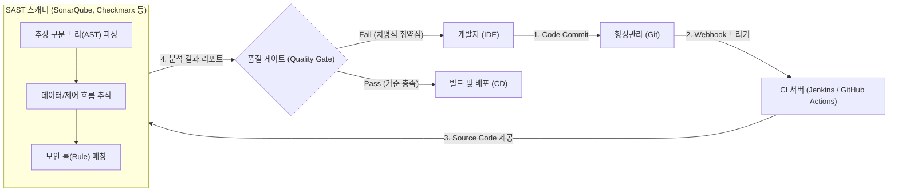

# SAST (Static Application Security Testing)

---

## I. 소스 코드 레벨의 화이트박스 보안 검증, SAST의 개요

* **정의**: 애플리케이션을 실행하지 않고(Static), 소스 코드, 바이트 코드 또는 컴파일된 바이너리를 직접 분석하여 보안 취약점([[SQL(Structured Query Language)|SQL]] 인젝션, [[XSS]] 등)과 코딩 표준 위배 사항을 찾아내는 **화이트박스(White-box) 보안 테스트 기법**
* **등장 배경 및 필요성**:
* 소프트웨어 개발 생명주기([[SDLC]])의 후반부(테스트/운영)에서 취약점이 발견될 경우, 이를 수정하고 재배포하는 데 막대한 비용과 시간이 소모됨
* 취약점 탐지 시점을 개발 초기 단계로 극단적으로 앞당기는 **시프트 레프트(Shift-Left)** 보안 전략을 CI/CD 파이프라인 내에서 자동화하기 위해 필수적으로 요구됨

* **특징**: 프로그래밍 언어에 종속적이며, 실행 환경(런타임)이나 별도의 인프라가 필요 없습니다. 단, 실제 런타임의 데이터 흐름을 완벽히 예측할 수 없어 **오탐(False Positive)** 비율이 상대적으로 높다는 단점이 있습니다.

---

## II. SAST의 아키텍처 및 핵심 분석 기법

### 가. DevSecOps 기반 SAST 동작 파이프라인

### 나. SAST의 4대 핵심 소스 코드 분석 기법

| 분석 기법 | 세부 동작 원리 및 특징 |
| --- | --- |
| **어휘 분석 (Lexical Analysis)** | 소스 코드를 토큰(Token) 단위로 분해하여 단순 패턴 매칭을 수행. 하드코딩된 비밀번호, API 키, 위험한 함수(예: `strcpy()`) 사용 여부를 빠르게 탐지함 |
| **구문 분석 (Syntax Analysis)** | 코드를 컴파일러처럼 **추상 구문 트리(AST, Abstract Syntax Tree)**로 변환하여, 구조적인 문법 오류와 취약한 코드 블록 패턴을 분석함 |
| **제어 흐름 분석 (Control Flow)** | 애플리케이션의 모든 가능한 실행 경로(조건문, 반복문, 함수 호출 등)를 그래프로 모델링하여, 도달할 수 없는 죽은 코드(Dead Code)나 로직 오류를 탐지함 |
| **데이터 흐름 분석 (Data Flow)** | **오염 분석(Taint Analysis)**이 대표적이며, 외부에서 입력된 신뢰할 수 없는 데이터(Source)가 적절한 검증/정제 없이 위험한 함수(Sink, 예: DB 쿼리 실행)로 흘러가는 경로를 추적함 |

---

## III. 애플리케이션 보안 테스팅(AST) 기법 비교

| 비교 항목 | SAST (정적 분석) | [[DAST]] (동적 분석) | IAST (대화형 분석) |
| --- | --- | --- | --- |
| **테스트 방식** | **화이트박스** (코드 내부 구조 분석) | **블랙박스** (외부에서 모의 해킹) | **그레이박스** (내부 에이전트 + 외부 테스트) |
| **실행 여부** | 코드를 실행하지 않음 (Static) | 애플리케이션을 런타임에 실행함 | 애플리케이션을 런타임에 실행함 |
| **적용 시점** | 개발(Coding) 및 빌드(Build) 단계 | 테스트(QA) 및 스테이징 단계 | 테스트(QA) 단계 (자동화 테스트와 연동) |
| **오탐률(False Positive)** | 상대적으로 높음 (실행 컨텍스트 부족) | 낮음 (실제 동작하는 취약점만 포착) | 매우 낮음 (코드와 런타임 메모리 동시 파악) |
| **언어 종속성** | **매우 강함** (도구가 해당 언어를 지원해야 함) | 없음 (웹 HTTP 응답과 프로토콜만 분석) | 있음 (런타임 에이전트 설치 가능 환경 한정) |

---

### 🔗 연관 토픽

- **소속 도메인**: [[00_프로젝트관리_MOC|📋 프로젝트관리]]
- **세부 분류**: `5. 애자일 프로젝트 관리 & 개발 운영 (Agile PM)`
- **핵심 연관 토픽**:
  - [[SDLC]]
  - [[DAST]]
  - [[DevSecOps]]
  - [[시큐어코딩]]
  - [[정적 분석 도구]]
