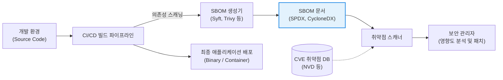

# SBOM (Software Bill of Materials)

---

## I. 소프트웨어 공급망 보안의 핵심 인프라, SBOM의 개요

* **정의**: 소프트웨어 애플리케이션을 구성하는 모든 오픈소스, 서드파티 컴포넌트, 라이브러리 및 이들 간의 의존성(Dependency) 관계를 기계가 읽을 수 있는(Machine-readable) 형태로 명세한 **'소프트웨어 자재 명세서'**
* **등장 배경 및 필요성**:
* 현대 소프트웨어의 80~90%가 오픈소스로 구성되면서, 특정 라이브러리의 취약점(예: Log4j 사태)이나 악성코드 삽입(SolarWinds 사태)이 전체 소프트웨어 공급망(Supply Chain)을 마비시키는 치명적 위협으로 대두됨.
* 2021년 미국 바이든 행정부의 행정명령(EO 14028)으로 연방정부 납품 소프트웨어에 대한 SBOM 제출이 의무화되면서 글로벌 보안 컴플라이언스의 표준으로 자리 잡음.

* **특징**: 취약점 발생 시 해당 라이브러리를 사용 중인 애플리케이션을 즉각적으로 식별할 수 있는 가시성(Visibility)과 투명성(Transparency)을 제공하며, 라이선스 위반(GPL 등) 리스크 관리 기능도 병행함.

---

## II. SBOM의 아키텍처 및 핵심 구성요소

### 가. CI/CD 파이프라인 내 SBOM 생성 및 활용 개념도

### 나. SBOM이 포함해야 할 필수 메타데이터 (NTIA 권고안 기준)

| 분류 | 메타데이터 항목 | 세부 설명 |
| --- | --- | --- |
| **식별 정보** | 컴포넌트 이름 및 버전 | 포함된 라이브러리/모듈의 정확한 명칭과 릴리스 버전 (예: `log4j-core`, `2.14.1`) |
| **식별 정보** | 고유 식별자 | 컴포넌트를 유일하게 식별할 수 있는 값 (CPE, PURL, SWID 등) |
| **출처 정보** | 작성자(Author) 및 공급자 | 해당 오픈소스나 컴포넌트를 개발하고 배포한 주체 |
| **관계 정보** | 의존성 트리 (Dependency) | 컴포넌트 간의 포함 관계(A가 B를 포함하고, B가 C를 포함하는 구조) 명시 |
| **추적 정보** | 타임스탬프 (Timestamp) | SBOM이 언제, 어떤 도구에 의해 생성되었는지에 대한 기록 |

---

## III. SBOM 표준 포맷 비교 및 최신 동향

### 가. 3대 글로벌 SBOM 표준 포맷 비교

| 비교 항목 | SPDX (Software Package Data Exchange) | CycloneDX | SWID (Software Identification) |
| --- | --- | --- | --- |
| **주관 기관** | 리눅스 재단 (Linux Foundation) | OWASP (개방형 웹 어플리케이션 보안 프로젝트) | ISO/IEC (국제표준화기구) |
| **설계 목적** | **오픈소스 라이선스 컴플라이언스 준수**에 특화되어 출발 | **보안 취약점 분석 및 공급망 보안**에 최적화 | 설치된 **상용 소프트웨어 자산 관리** 및 라이선스 추적 |
| **포맷 지원** | Tag:Value, RDF, [[JSON]], [[XML]], YAML | XML, JSON | XML |
| **현재 위상** | ISO 표준(ISO/IEC 5962)으로 등록된 가장 포괄적인 포맷 | 보안 커뮤니티와 [[DevSecOps]] 툴체인에서 가장 빠르고 널리 채택됨 | 엔터프라이즈 자산 관리 솔루션(ITAM)에서 주로 활용 |

### 나. 한계 극복 및 최신 공급망 보안 동향

* **VEX (Vulnerability Exploitability eXchange)의 결합**: SBOM을 통해 발견된 취약점([[CVE]]) 중 실제로 해당 애플리케이션 환경에서 악용 가능한(Exploitable) 취약점은 일부에 불과합니다. 불필요한 보안 알람 피로도(Alert Fatigue)를 줄이기 위해, **해당 취약점이 우리 시스템에 실제로 영향을 미치는지를 명시한 VEX 문서**를 SBOM과 함께 배포하는 것이 글로벌 보안 표준으로 급격히 부상하고 있습니다.
* **[[컨테이너]] 및 클라우드 네이티브로의 확장**: 단순히 소스 코드의 라이브러리뿐만 아니라, 도커([[도커|Docker]]) 이미지의 베이스 OS 패키지, 런타임 환경 구성 등 [[클라우드 네이티브]] 환경 전체의 구성 요소를 스캐닝하여 SBOM을 생성하는 정밀한 분석 도구(Trivy, Syft 등)가 DevSecOps의 필수 요소로 자리 잡았습니다.

---

### 🔗 연관 토픽

- **소속 도메인**: [[00_소프트웨어공학_MOC|🏗️ 소프트웨어공학]]
- **세부 분류**: `6. 소프트웨어 테스팅 & 품질 보증 (QA/QC)`
- **핵심 연관 토픽**:
  - [[DevSecOps]]
  - [[오픈소스 SW 보안위협]]
  - [[XML]]
  - [[오픈소스 거버넌스]]
  - [[컨테이너|컨테이너 (Container)]]
