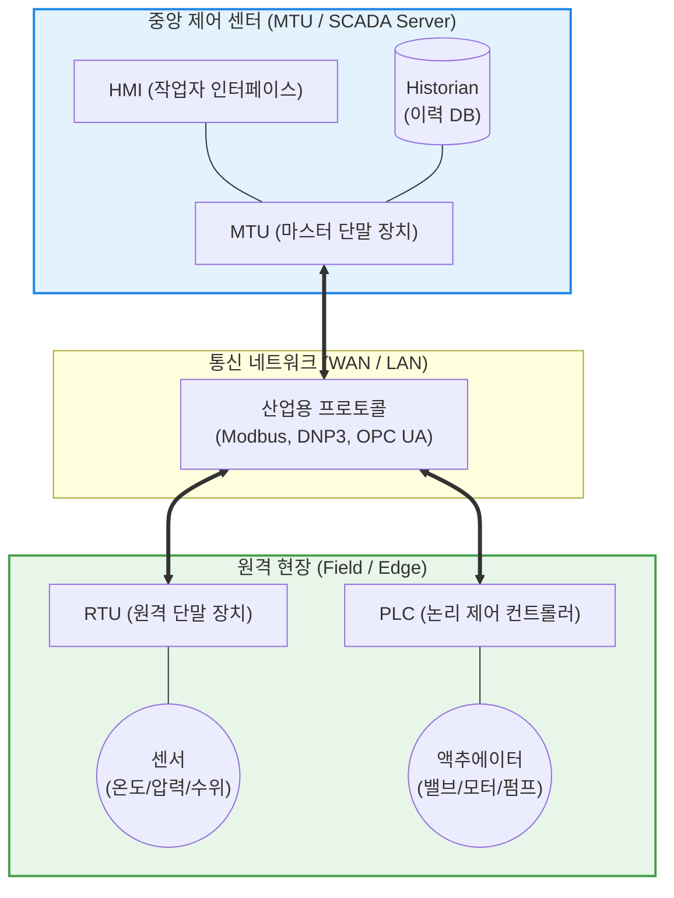

# SCADA (Supervisory Control and Data Acquisition)

---

## I. 국가 및 산업 인프라의 신경망, SCADA의 개요

* **정의**: 발전소, 수처리 시설, 가스관, 대규모 스마트 팩토리 등 **물리적으로 광범위하게 분산된 산업 제어 시스템(ICS) 장비들을 중앙에서 감시(Supervisory)하고 제어(Control)하며, 원격지의 실시간 데이터를 수집(Data Acquisition)하는 소프트웨어 및 하드웨어 통합 아키텍처**
* **등장 배경 및 필요성**:
* 과거에는 현장 작업자가 직접 밸브를 열거나 수치를 기록해야 했으나, 인프라 규모가 커지면서 수백 km 떨어진 설비를 중앙에서 즉각적으로 모니터링하고 제어할 필요성 대두
* 이상 징후(예: 파이프라인 압력 초과) 발생 시 즉각적인 알람 발생 및 신속한 장애 대응 체계 구축

* **특징**: 인간과 기계 간의 상호작용을 위한 HMI(Human-Machine Interface)와 대규모 시계열 데이터를 저장하는 **Historian(이력 DB)** 기능이 핵심이며, 기업의 IT(정보 기술) 망과 OT(운영 기술) 망을 연결하는 최상위 접점 역할을 수행함

---

## II. SCADA의 아키텍처 및 핵심 구성요소

### 가. SCADA 시스템 계층 및 통신 아키텍처

### 나. SCADA의 핵심 기능 및 구성 하드웨어/소프트웨어

| 분류 | 요소명 (키워드) | 세부 설명 및 역할 |
| --- | --- | --- |
| **소프트웨어** | HMI (Human-Machine Interface) | 복잡한 텍스트 데이터 대신 펌프, 밸브, 파이프의 상태를 직관적인 그래픽(GUI) 및 애니메이션으로 시각화하여 작업자에게 제공하는 대시보드 화면 |
| **소프트웨어** | Historian (이력 [[데이터베이스]]) | 현장에서 초/밀리초 단위로 수집되는 방대한 시계열(Time-series) 센서 데이터를 장기 저장하고 트렌드 분석 및 보고서 생성을 지원하는 특수 목적 DB |
| **하드웨어** | MTU (Master Terminal Unit) | 중앙 통제실에 위치하는 SCADA 서버. 하위 RTU/PLC를 폴링(Polling)하여 데이터를 수집하고 제어 명령을 하달함 |
| **하드웨어** | RTU (Remote Terminal Unit) | 원격지 현장의 센서/액추에이터와 직접 연결되어 아날로그 신호를 디지털로 변환하고 MTU와 통신하는 독립형 단말 장치 (가혹한 환경 견딤) |
| **하드웨어** | PLC (Programmable Logic Controller) | 릴레이 스위치를 대체하여 개별 기계나 조립 라인의 순차적(Sequential)이고 논리적인 제어를 담당하는 고속 산업용 컴퓨터 |
| **네트워크** | 산업용 통신 [[프로토콜]] | 이기종 장비 간의 통신을 위해 Modbus, DNP3(전력망 표준), OPC UA(플랫폼 독립적 통신 표준) 등을 사용 |

---

## III. 산업용 제어 시스템(ICS) 비교 및 최신 동향

### 가. 3대 산업 제어 시스템 (SCADA vs DCS vs PLC) 비교

| 비교 항목 | SCADA (Supervisory Control and Data Acquisition) | DCS (Distributed Control System) | PLC (Programmable Logic Controller) |
| --- | --- | --- | --- |
| **핵심 목적** | **데이터 수집 및 상태 감시 (Data Gathering)** | **연속 공정의 [[신뢰성]] 제어 (Process Control)** | **개별 기계 단위의 논리 제어 (Machine Control)** |
| **적용 범위** | **광역 네트워크 (수백 km 이상)** | **단일 공장 내 근거리 망 (Local Area)** | 개별 장비 또는 조립 라인 |
| **주요 산업군** | 전력망(그리드), 송유관, 수자원 관리, 철도망 | 정유, 화학 공장, 원자력/화력 발전소 플랜트 | 자동차 조립, 반도체 장비, 포장 기계 |
| **장애 시 영향** | 통신이 끊겨 감시가 중단되어도 현장의 RTU/PLC가 독립적으로 제어 유지 | 컨트롤러(Node) 고장 시 해당 공정 정지 가능성 있음 | 특정 기계의 즉각적인 정지(Shut down) |

### 나. SCADA의 한계 극복 및 최신 OT(운영 기술) 동향

* **폐쇄망의 붕괴와 OT 보안 위협 (Stuxnet 이후)**: 과거 SCADA는 인터넷과 물리적으로 분리된 에어갭(Air-gap) 형태의 폐쇄망으로 운영되었으나, 최근 ERP 연동 및 원격 유지보수를 위해 외부망과 연결되면서 랜섬웨어와 국가 지원 해커의 주요 타겟이 되고 있습니다. 이에 따라 OT 네트워크에도 **네트워크 분할(Segmentation) 및 제로 트러스트([[제로 트러스트 보안모델|Zero Trust]]) 보안 아키텍처** 도입이 의무화되고 있습니다.
* **클라우드 SCADA와 IIoT (산업용 사물인터넷) 융합**: 기존의 무겁고 비싼 On-Premise 구축 방식에서 벗어나, 현장의 센서 데이터를 [[MQTT (Message Queuing Telemetry Transport)|MQTT]] 등으로 직접 클라우드에 쏘아 올리고 웹 브라우저나 모바일로 감시하는 **클라우드 기반 SCADA**가 확산 중입니다.
* **[[디지털 트윈|디지털 트윈 (Digital Twin)]] 연계**: SCADA에서 수집된 실시간 데이터를 3D 가상 공장(Digital Twin) 모델에 동기화하여, 향후 발생할 병목현상이나 기계 고장을 AI 알고리즘으로 사전 예측(Predictive Maintenance)하는 고도화가 진행되고 있습니다.

---

### 🔗 연관 토픽

- **소속 도메인**: [[00_디지털서비스_MOC|🚀 디지털서비스]]
- **세부 분류**: `3. 사물인터넷 (IoT) & 스마트 플랫폼 · 메타버스`
- **핵심 연관 토픽**:
  - [[디지털 트윈|디지털 트윈 (Digital Twin)]]
  - [[프로토콜]]
  - [[MQTT (Message Queuing Telemetry Transport)]]
  - [[Smart Factory|Smart Factory/스마트 팩토리(공장)]]
  - [[CPS]]
