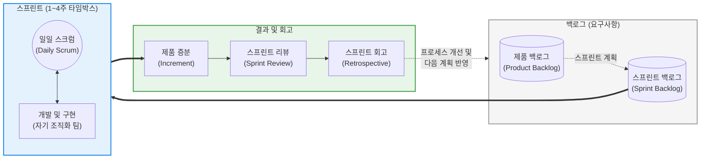

# 스크럼 (Scrum)

---

## I. 경험주의에 기반한 애자일(Agile) 제품 개발의 표준, 스크럼의 개요

* **정의**: 복잡한 환경에서 제품을 개발하고 유지보수하기 위해, 짧고 고정된 주기의 **반복적(Iterative)이고 점진적인(Incremental) 접근 방식**을 사용하여 고객 가치를 지속적으로 창출하는 경량형 애자일 [[프레임워크]]
* **등장 배경 및 필요성**:
* 요구사항이 완벽히 고정된다고 가정하는 전통적 [[워터폴|폭포수]](Waterfall) 모델은 시장의 빠른 변화에 대응하지 못하고, 프로젝트 후반부에 통합 리스크가 집중되는 치명적 한계 존재
* 불확실성이 높은 소프트웨어 개발 환경에서, 기민하게 요구사항 변경을 수용하고 작동하는 소프트웨어(Working Software)를 빠르게 고객에게 인도할 필요성 대두

* **특징**: 투명성(Transparency), 검사(Inspection), 적응(Adaptation)이라는 3대 경험주의 기둥을 바탕으로 하며, '3가지 역할, 3가지 산출물, 5가지 이벤트 (3-3-5)'라는 명확하고 엄격한 규칙 구조를 가짐

---

## II. 스크럼의 아키텍처 및 핵심 구성요소

### 가. 스크럼 스프린트 라이프사이클 및 동작 개념도

### 나. 스크럼의 3-3-5 프레임워크 핵심 기술 요소

|**분류**|**요소명 (키워드)**|**세부 설명 및 역할**|
|---|---|---|
|**3대 역할**      (Roles)|**제품 소유자 (PO, Product Owner)**|제품의 비전과 가치(ROI)를 극대화하는 책임자. 사용자 스토리 작성, 요구사항 우선순위 결정 및 **제품 백로그의 유일한 관리자** 역할을 수행함|
|**3대 역할**|**[[스크럼]] 마스터 (SM, Scrum Master)**|팀이 스크럼 원칙을 준수하도록 돕는 서번트 리더(Servant Leader). 외부 간섭을 차단하고 업무 장애물(Impediment)을 제거하여 프로세스를 촉진함|
|**3대 역할**|**개발자 (Developers)**|UX/UI 디자이너, 프로그래머, 테스터 등을 모두 포함하는 교차 기능(Cross-functional) 팀. 스프린트 내 목표 달성을 위해 **자기 조직화(Self-Organizing)**하여 작업함|
|**3대 산출물**      (Artifacts)|**제품 백로그 (Product Backlog)**|제품에 필요한 모든 기능, 개선 사항, 버그 수정 등을 우선순위대로 나열한 동적인 요구사항 목록|
|**3대 산출물**|**스프린트 백로그 (Sprint Backlog)**|이번 스프린트 목표를 달성하기 위해 제품 백로그에서 선택된 항목들과 이를 수행하기 위한 세부 작업(Task) 계획|
|**3대 산출물**|**증분 (Increment)**|스프린트 종료 시 완성되어 즉시 배포 및 사용 가능한 수준(Done)의 누적된 제품 가치|
|**5대 이벤트**      (Events)|**스프린트 (Sprint) 외 4개**|전체를 감싸는 타임박스인 **스프린트**를 중심으로, **계획(Planning)**, 매일의 진행상황을 동기화하는 **일일 스크럼(Daily)**, 결과물을 시연하는 **리뷰(Review)**, 팀 프로세스를 개선하는 **회고(Retrospective)**로 구성됨|

---

## III. 제품 개발 방법론 비교 및 최신 동향

### 가. 소프트웨어 개발 및 프로젝트 관리 방법론 비교 (폭포수 vs 스크럼 vs 칸반)

| 비교 항목 | 폭포수 (Waterfall) | 스크럼 (Scrum) | 칸반 (Kanban) |
| --- | --- | --- | --- |
| **작업 흐름** | 순차적, 단계적 (Phase-gate) | **반복적 (고정된 길이의 스프린트)** | 연속적 (Continuous Flow) |
| **변화 수용성** | 매우 낮음 (엄격한 변경 통제 필요) | **높음 (다음 스프린트에 즉각 반영 가능)** | 매우 높음 (언제든 작업 추가 가능) |
| **핵심 통제 도구** | 간트 차트(Gantt Chart), [[WBS]] | **타임박스 (Time-box), 속도(Velocity)** | WIP(Work In Progress) 제한, 리드 타임 |
| **역할 정의** | PM 주도, 세분화된 직군 | **PO, SM, Developers (엄격한 3역할)** | 기존 역할(직군) 유지 (유연함) |
| **적합한 환경** | 요구사항이 명확하고 변동이 없는 SI 프로젝트 | **요구사항 변화가 심한 신규 프로덕트 개발** | [[유지보수]](운영), 티켓 기반의 헬프데스크 |

### 나. 한계 극복 및 최신 애자일(Agile) 동향

* **대규모 애자일(Scaling [[Agile]]) 프레임워크의 도입**: 스크럼은 10명 이하의 단일 팀에 최적화되어 있어, 수백 명의 인력이 투입되는 엔터프라이즈 환경에서는 병목이 발생합니다. 이를 극복하기 위해 다수의 스크럼 팀을 동기화하는 **SAFe (Scaled Agile Framework)**, LeSS, Scrum of Scrums 체계가 글로벌 대기업을 중심으로 표준화되고 있습니다.
* **스크럼반(Scrumban)의 확산**: 스크럼의 지나치게 엄격한 이벤트 중심 구조와 고정된 타임박스의 단점을 보완하기 위해, 스크럼의 기틀(PO/SM 역할, 리뷰/회고)은 유지하되 칸반의 **WIP 제한(진행 중인 작업 수 제한)** 원칙을 도입하여 유연성을 높인 하이브리드 모델이 실무에서 각광받고 있습니다.
* **PO 중심의 제품 주도 성장(PLG)**: 프로젝트가 아닌 '프로덕트(Product)' 중심의 조직 개편이 가속화되면서, 프로젝트 관리자(PM)보다 비즈니스 가치와 UX를 결합하여 백로그의 가치를 극대화하는 제품 소유자(PO) 및 프로덕트 매니저(PM)의 역할이 애자일 팀의 성공을 좌우하는 핵심 동력으로 격상되었습니다.

---

### 🔗 연관 토픽

- **소속 도메인**: [[00_프로젝트관리_MOC|📋 프로젝트관리]]
- **세부 분류**: `1. PMBOK 표준 & 프로젝트 거버넌스`
- **핵심 연관 토픽**:
  - [[스크럼|스크럼 (SCRUM)]]
  - [[Agile]]
  - [[PMBOK 프로세스 그룹 (5단계)]]
  - [[애자일 선언문]]
  - [[연동계획|연동계획 (Rolling Wave Planning)]]
