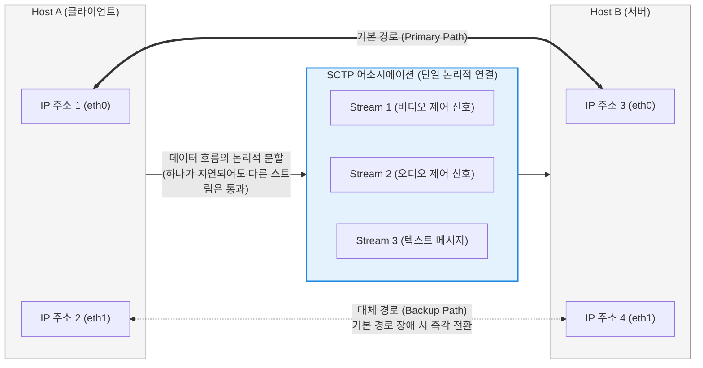

# SCTP (Stream Control Transmission Protocol)

---

## I. 고가용성과 병렬 전송을 보장하는 차세대 전송 계층 프로토콜, SCTP의 개요

* **정의**: [[TCP]]의 신뢰성과 UDP의 메시지 지향성(Message-oriented) 특성을 결합하고, 멀티 호밍(Multi-homing)과 멀티 스트리밍(Multi-streaming) 기능을 추가하여 설계된 국제 인터넷 표준(IETF RFC 4960)의 **[[전송 계층]](Layer 4) [[프로토콜]]**
* **등장 배경 및 필요성**:
* 기존 통신망의 신호 제어 데이터(SS7)를 IP 네트워크로 전송(SIGTRAN)하기 위해 개발됨.
* TCP는 패킷 하나가 손실되면 뒤따르는 모든 데이터의 처리가 중단되는 **헤드 오브 라인 블로킹(Head-of-Line Blocking)** 현상이 발생하며, 단일 IP 주소에 종속되어 네트워크 카드(NIC) 장애 시 세션이 끊어지는 치명적 한계가 존재함.

* **특징**: 연결(Connection) 대신 어소시에이션(Association)이라는 개념을 사용하며, 다중 경로를 통한 장애 복원력과 4-Way Handshake를 통한 SYN 플러딩(Flooding) 공격 방어 기능을 내장하여 강력한 보안성과 신뢰성을 제공함.

---

## II. SCTP의 아키텍처 및 핵심 구성요소

### 가. 멀티 호밍 및 멀티 스트리밍 아키텍처 개념도

### 나. SCTP의 4대 핵심 기술 요소

| 분류 | 요소명 (키워드) | 세부 설명 및 역할 |
| --- | --- | --- |
| **연결 단위** | 어소시에이션 (Association) | SCTP에서 두 종단 간의 논리적인 연결을 부르는 명칭. 하나의 어소시에이션은 양단에 **여러 개의 IP 주소**를 가질 수 있음. |
| **경로 [[다중화]]** | 멀티 호밍 (Multi-homing) | 단말 장비가 여러 개의 네트워크 인터페이스(IP)를 보유할 때, 주 경로(Primary Path)에 장애가 발생하면 [[세션]] 단절 없이 대기 중인 대체 경로(Backup Path)로 즉각 페일오버(Failover)하는 [[HA(High Availability)|고가용성]] 기술. |
| **흐름 분할** | 멀티 스트리밍 (Multi-streaming) | 단일 어소시에이션 내에 여러 개의 독립적인 논리적 스트림을 생성. **특정 스트림에서 패킷 손실이 발생하더라도 다른 스트림의 데이터는 대기하지 않고 정상 처리(HoL Blocking 방지)**됨. |
| **데이터 구조** | 청크 (Chunk) | SCTP 패킷의 페이로드 단위. 하나의 SCTP 패킷 안에 제어 정보를 담은 'Control Chunk'와 실제 데이터를 담은 'Data Chunk'를 여러 개 묶어서(Bundling) 전송 가능. |
| **보안 메커니즘** | 4-Way Handshake & [[쿠키]] | 연결 설정 시 클라이언트가 보낸 INIT에 대해 서버가 자원을 즉시 할당하지 않고 **상태 쿠키(State Cookie)**를 반환. 클라이언트가 쿠키를 다시 에코(Echo)해야만 자원을 할당하므로 [[DoS (Denial of Service)|DoS]] 공격에 강력함. |

---

## III. 4계층 전송 프로토콜 비교 및 최신 동향

### 가. 전송 계층 통신 프로토콜 (TCP vs UDP vs SCTP) 비교

| 비교 항목 | TCP (Transmission Control Protocol) | UDP (User Datagram Protocol) | SCTP (Stream Control Transmission Protocol) |
| --- | --- | --- | --- |
| **[[신뢰성]] 보장** | 높음 (재전송 및 순서 제어) | 낮음 (재전송 안 함, 순서 무관) | **높음 (TCP 수준의 신뢰성 제공)** |
| **데이터 전송 단위** | 바이트 스트림 (경계가 없음) | 데타그램 (독립적 메시지) | **메시지 지향 (UDP처럼 메시지 경계 보존)** |
| **네트워크 경로 수** | 단일 (Single-homing) | 단일 (Single-homing) | **다중 (Multi-homing, 고가용성)** |
| **HoL Blocking** | 발생함 (순서가 맞을 때까지 애플리케이션 대기) | 발생 안 함 | **발생 안 함 (멀티 스트리밍으로 회피)** |
| **연결 설정 과정** | 3-Way Handshake (SYN 플러딩에 취약) | 연결 과정 없음 | **4-Way Handshake (쿠키 메커니즘으로 방어)** |

### 나. SCTP의 최신 산업 적용 동향

* **이동통신 코어망(Core Network)의 핵심 표준**: 4G LTE망에서 과금 및 인증 신호를 처리하는 Diameter 프로토콜, 그리고 5G Core(5GC) 네트워크에서 기지국과 AMF 간의 신호(NGAP)를 전달하는 전송 계층으로 SCTP가 글로벌 통신 표준으로 채택되어 사용되고 있습니다. (무중단 통신이 생명인 통신사 망에서 멀티 호밍의 가치가 극대화됨)
* **WebRTC 데이터 채널 (Data Channel)**: 브라우저 간 플러그인 없이 화상회의와 실시간 통신을 지원하는 WebRTC 표준에서, 미디어(음성/영상)는 UDP(RTP)를 사용하지만, 파일 전송이나 텍스트 채팅과 같은 데이터 전송은 신뢰성이 필요하므로 **SCTP over DTLS**를 전송 프로토콜로 사용합니다.

---

### 🔗 연관 토픽

- **소속 도메인**: [[00_네트워크_MOC|🌐 네트워크]]
- **세부 분류**: `1. OSI 7계층 & 데이터링크 계층 (L1/L2)`
- **핵심 연관 토픽**:
  - [[전송 계층|전송 계층 (Transport Layer)]]
  - [[프로토콜]]
  - [[TCP]]
  - [[Session Layer|Session]]
  - [[세션]]
