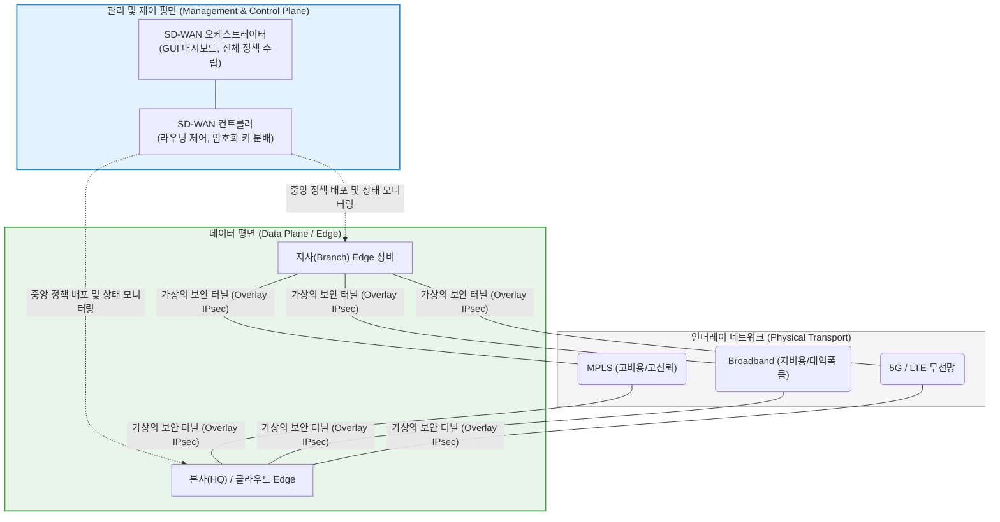

# SD-WAN (Software-Defined Wide Area Network)

---

## I. 광대역 네트워크의 가상화 및 지능화, SD-WAN의 개요

* **정의**: 소프트웨어 정의 네트워킹([[SDN(Software Defined Network)|SDN]]) 기술을 광대역 네트워크(WAN)에 적용하여, 제어 평면(Control Plane)과 데이터 평면(Data Plane)을 분리하고 중앙 집중식 제어 소프트웨어를 통해 트래픽을 동적이고 지능적으로 라우팅하는 차세대 네트워크 아키텍처
* **등장 배경 및 필요성**:
* 기존 엔터프라이즈 망은 비싼 MPLS(전용선)에 의존하고, 모든 지사(Branch) 트래픽이 본사 데이터센터를 거쳐 인터넷으로 나가는 **헤어피닝(Hairpinning)** 구조로 인해 클라우드(SaaS) 접속 시 심각한 병목 현상이 발생함
* 장비마다 관리자가 직접 CLI(Command Line Interface) 명령어를 입력해야 하는 분산 관리 체계의 한계 극복 필요성 대두

* **특징**: 전송망 독립성(Transport Agnostic)을 보장하여 MPLS, 일반 인터넷(Broadband), 4G/5G 등 물리적 회선의 종류에 구애받지 않고 가상의 오버레이(Overlay) 네트워크를 구성하며, 애플리케이션 유형에 따라 최적의 경로를 자동으로 선택함

---

## II. SD-WAN의 아키텍처 및 핵심 구성요소

### 가. 제어/데이터 평면 분리 및 오버레이-언더레이 아키텍처

### 나. SD-WAN의 핵심 기술 요소

| 분류 | 요소기술(키워드) | 세부 설명 및 역할 |
| --- | --- | --- |
| **핵심 구조** | 오버레이 네트워크 (Overlay) | 물리적 인프라(Underlay) 위에 소프트웨어적으로 구성된 가상의 논리적 네트워크 (일반적으로 [[IP Sec|IPsec]] [[VPN]] 터널링으로 암호화됨) |
| **동적 제어** | 애플리케이션 인식 라우팅 (Application-Aware Routing) | 단순 목적지 IP가 아닌 딥 패킷 인스펙션(DPI)을 통해 애플리케이션(예: 화상회의, 파일 전송)을 식별하고, 실시간 회선 품질(지연, 지터, 패킷 손실)을 평가해 최적 경로를 동적 할당 |
| **설치 자동화** | ZTP (Zero-Touch Provisioning) | 지사에 장비를 배송하여 전원과 랜선만 꽂으면, 장비가 오케스트레이터와 자동 통신하여 정책을 다운로드하고 즉시 개통되는 플러그 앤 플레이 방식 |
| **운영 관리** | 중앙 집중식 오케스트레이션 | 전 세계에 흩어진 수백~수천 대의 지사 장비를 단일 클라우드 대시보드(Single Pane of Glass)에서 일괄적으로 펌웨어 업데이트, 정책 변경, 모니터링 |
| **클라우드 연계** | 로컬 인터넷 브레이크아웃 (Local Internet Breakout) | 지사에서 Office 365, Salesforce 등의 클라우드(SaaS)로 접속할 때 본사를 거치지 않고 지사의 로컬 인터넷 회선을 통해 직접 접속하여 트래픽을 분산 |

---

## III. 전통적 WAN과의 비교 및 최신 동향

### 가. 전통적 WAN (MPLS 중심) vs SD-WAN 비교

| 비교 항목 | 전통적 WAN (Legacy WAN) | SD-WAN (Software-Defined WAN) |
| --- | --- | --- |
| **라우팅 제어** | 각 라우터가 독립적으로 경로를 결정 (분산 제어) | **컨트롤러가 전체 네트워크를 조망하여 결정 (중앙 집중 제어)** |
| **전송 회선** | 고가의 MPLS 전용선 의존도 높음 | **저렴한 일반 인터넷망, LTE/5G를 Active-Active로 혼용 (비용 절감)** |
| **클라우드 성능** | 트래픽 백홀링(Backhauling)으로 인한 병목 및 지연 | **로컬 브레이크아웃을 통한 클라우드 최적화 (성능 향상)** |
| **배포 및 관리** | 관리자가 현장 방문 후 CLI 스크립트 수동 입력 | **ZTP를 통한 원격 자동 배포, GUI 기반 통합 관리** |
| **보안 아키텍처** | 본사 중앙 방화벽에 보안 통제 의존 | 각 지사 [[EDGE|Edge]] 장비에 차세대 [[방화벽]](NGFW) 기능 통합 또는 SASE 연동 |

### 나. 한계 극복 및 최신 네트워킹 동향

* **SASE ([[SASE(Secure Access Service Edge)|Secure Access Service Edge]])로의 융합**: SD-WAN은 빠르고 유연한 연결성을 제공하지만, 지사에서 인터넷으로 직접 나가는 트래픽에 대한 분산 보안(Security) 통제가 취약해집니다. 이를 해결하기 위해 SD-WAN의 라우팅 역량과 클라우드 기반 보안(ZTNA, SWG, CASB)을 하나로 결합한 **SASE 플랫폼**으로 엔터프라이즈 인프라가 진화하고 있습니다.
* **AIOps (AI for IT Operations) 적용**: 네트워크 상태 로그, 텔레메트리(Telemetry) 데이터를 머신러닝으로 분석하여 회선 장애나 품질 저하가 발생하기 전에 선제적으로 트래픽을 우회시키는 AI 기반의 자가 치유(Self-healing) 네트워크 기술이 상용화되고 있습니다.
* **NaaS (Network as a Service) 모델 확산**: 기업이 직접 SD-WAN 장비(CPE)를 구매하고 관리하는 대신, 통신사([[CSP]])나 매니지드 서비스 사업자(MSP)가 라우팅, 보안, [[유지보수]] 전체를 구독형 서비스로 제공하는 모델이 중견기업을 중심으로 확대되고 있습니다.

---

### 🔗 연관 토픽

- **소속 도메인**: [[00_네트워크_MOC|🌐 네트워크]]
- **세부 분류**: `2. 네트워크 계층 & 라우팅 프로토콜 (L3)`
- **핵심 연관 토픽**:
  - [[SDN(Software Defined Network)]]
  - [[SASE(Secure Access Service Edge)]]
  - [[IP Sec]]
  - [[방화벽]]
  - [[CSP|CSP (Cloud Service Provider)]]
