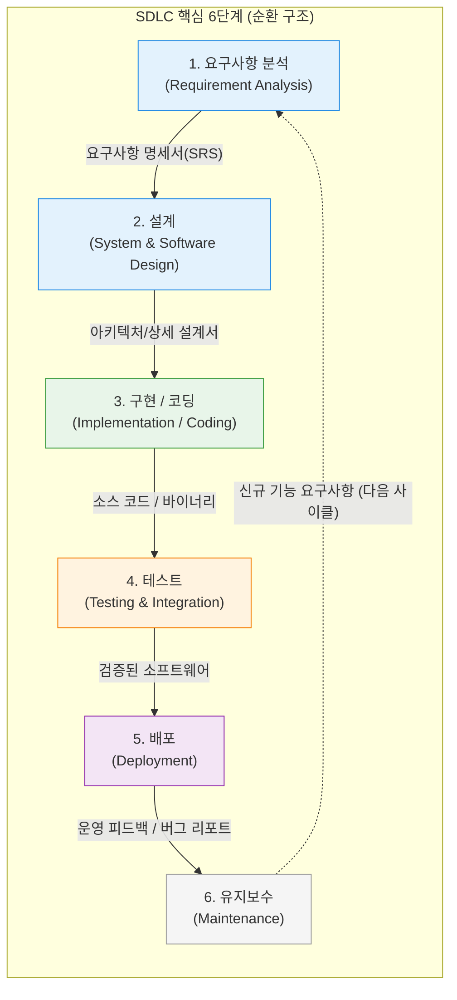

# SDLC (Software Development Life Cycle, 소프트웨어 개발 생명주기)

---

## I. 고품질 소프트웨어 개발의 체계적 청사진, SDLC의 개요

* **정의**: 고객의 요구사항을 수집하는 시점부터 소프트웨어를 설계, 구현, 테스트, 배포하고 운영 및 폐기할 때까지의 전 과정을 통제하는 **체계적인 소프트웨어 엔지니어링 [[프로세스]] [[프레임워크]]**
* **등장 배경 및 필요성**:
* 1960년대 '소프트웨어 위기(Software Crisis)' 이후, 주먹구구식 개발(Build-and-Fix)로 인한 일정 지연, 예산 초과, 품질 저하 문제를 해결하기 위해 공학적 접근 방식 도입
* 이해관계자(고객, 기획자, 개발자, 테스터) 간의 명확한 의사소통 기준을 마련하고, 각 단계별 산출물(Artifact)을 통해 프로젝트의 가시성과 통제력을 확보하기 위함

* **특징**: 프로젝트의 규모, 도메인 특성, 팀의 성숙도에 따라 [[워터폴|폭포수]](Waterfall), 프로토타이핑(Prototyping), 나선형(Spiral), 애자일([[Agile]]) 등 다양한 세부 모델로 변형되어 적용됨

---

## II. SDLC의 공통 프로세스 아키텍처 및 핵심 구성요소

### 가. SDLC 6단계 핵심 프로세스 흐름도

### 나. SDLC 단계별 주요 활동 및 산출물

| 단계 (Phase) | 핵심 활동 내용 | 주요 산출물 (Artifacts) |
| --- | --- | --- |
| **1. 요구사항 분석** | 고객의 비즈니스 목적 파악, 타당성 검토(비용/일정), 기능적/비기능적 요구사항 수집 및 구체화 | [[요구사항 명세서]] (SRS), 타당성 분석 보고서 |
| **2. 설계** | 요구사항을 구현 가능한 기술적 구조로 변환. HLD(고수준 아키텍처 설계) 및 LLD(저수준 모듈/DB/UI 설계) 수행 | 시스템 아키텍처 정의서, DB ERD, UI/UX 와이어프레임 |
| **3. 구현 (코딩)** | 설계 문서를 바탕으로 실제 프로그래밍 언어를 사용하여 소스 코드를 작성. (버전 관리 시스템 활용) | 소스 코드 (Git Repository), 컴파일된 빌드 파일 |
| **4. 테스트** | 코드가 요구사항을 충족하는지, 결함(Bug)이 없는지 검증. (단위 $\rightarrow$ 통합 $\rightarrow$ 시스템 $\rightarrow$ [[인수 테스트]]) | 테스트 케이스/시나리오, 결함(Defect) 추적 리포트 |
| **5. 배포** | 테스트를 통과한 소프트웨어를 실제 운영 환경(Production)에 릴리스하여 사용자가 접근할 수 있도록 조치 | 릴리스 노트, 사용자 매뉴얼, 배포 파이프라인 구성 |
| **6. [[유지보수]]** | 운영 중 발생하는 버그 패치(수정 유지보수), 환경 변화 대응(적응 유지보수), 신규 기능 추가(완전 유지보수) | 패치 노트, 이슈 트래커 기록 |

---

## III. SDLC 모델의 패러다임 변화 및 최신 동향

### 가. 3대 핵심 SDLC 모델 비교 (Waterfall vs Agile vs DevOps)

| 비교 항목 | [[폭포수 모델]] (Waterfall) | 애자일 모델 (Agile / [[SCRUM|Scrum]]) | [[DevOps|데브옵스 (DevOps)]] |
| --- | --- | --- | --- |
| **진행 방식** | 단계별 순차적 하향식 진행 (이전 단계 완벽 종료 필수) | 짧은 주기(Sprint)의 점진적/반복적 개발 | 개발(Dev)과 운영(Ops)의 경계를 허문 무한 루프 |
| **변화 수용성** | 매우 낮음 (후반부 변경 비용 막대함) | 높음 (고객 피드백을 매 주기마다 수용) | **매우 높음** (실시간 모니터링 및 즉각적 코드 반영) |
| **핵심 가치** | 완벽한 사전 계획과 철저한 문서화 | 작동하는 소프트웨어와 고객과의 협력 | **협업 문화, 도구의 자동화(CI/CD), 측정** |
| **배포 주기** | 수개월 ~ 수년 (빅뱅 릴리스) | 수주 ~ 1개월 (스프린트 종료 시점) | **수시 (하루에도 수십 번 배포 가능)** |

### 나. 현대 소프트웨어 공학의 SDLC 최신 발전 동향

* **[[DevSecOps]]의 내재화 (Shift-Left)**: 보안 테스트([[SAST]], [[DAST]], SCA)를 배포 직전이 아닌, 요구사항 분석과 코딩 단계 등 **SDLC의 가장 좌측(초기 단계)으로 끌어당겨(Shift-Left)** 파이프라인에 자동화하는 패러다임이 엔터프라이즈의 표준으로 정착하고 있습니다.
* **AI-Augmented SDLC (생성형 AI 결합)**: GitHub Copilot, ChatGPT 등을 활용하여 요구사항 명세서 초안 작성, 코드 자동 완성, 보일러플레이트 코드 생성, 테스트 케이스 자동 추출 등 SDLC 전 단계에 걸쳐 개발자의 생산성을 증폭시키는 AI 기반 공학으로 진화 중입니다.
* **클라우드 네이티브와 지속적 배포 (CI/CD)**: 마이크로서비스([[MSA (Micro Service Architecture)|MSA]])와 [[컨테이너]] 기술([[도커|Docker]]/Kubernetes)의 결합으로, 거대한 SDLC 주기를 갖던 모놀리식 시스템이 수십 개의 작은 서비스 단위로 쪼개져 각자의 독립적이고 초고속화된 SDLC 사이클을 돌리는 형태로 아키텍처가 변화하고 있습니다.

---

### 🔗 연관 토픽

- **소속 도메인**: [[00_소프트웨어공학_MOC|🏗️ 소프트웨어공학]]
- **세부 분류**: `1. 소프트웨어 개발 생명주기(SDLC) & 방법론`
- **핵심 연관 토픽**:
  - [[폭포수 모델]]
  - [[SAST]]
  - [[Agile]]
  - [[단위 테스트]]
  - [[정적 분석 도구]]
