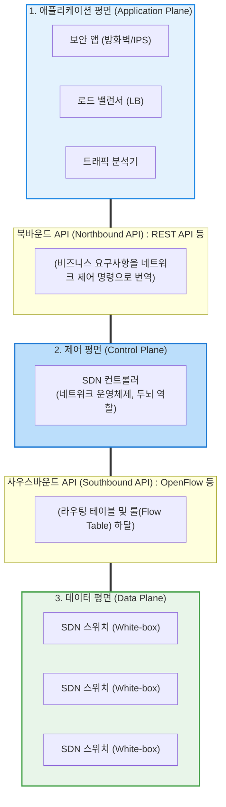

# SDN (Software Defined Network)

---

## I. 네트워크 제어권의 가상화와 중앙 집중화, SDN의 개요

* **정의**: 하드웨어 장비([[라우터]], [[스위치 (Layer 3 Switch)|스위치]])에 내장되어 있던 **네트워크 제어 기능(Control Plane)을 분리**하여 중앙의 소프트웨어 컨트롤러로 집중시키고, 네트워크 인프라는 단순히 패킷을 전달(Data Plane)만 하도록 재구성한 차세대 네트워크 아키텍처
* **등장 배경 및 필요성**:
* 기존 네트워크는 시스코(Cisco) 등 특정 벤더의 전용 하드웨어와 폐쇄적인 운영체제에 종속(Vendor Lock-in)되어 유연한 확장과 관리가 불가능했음.
* 클라우드 컴퓨팅과 가상 머신(VM)의 확산으로 트래픽 패턴이 동적으로 변함에 따라, 관리자가 명령줄(CLI)로 일일이 장비를 설정하는 대신 API를 통해 네트워크 대역폭과 경로를 프로그래밍(Programmability)할 수 있는 민첩한 통제 환경이 요구됨.

* **특징**: 네트워크의 논리적 뷰(전체 지도)를 중앙에서 확보하며, 통신 표준 [[프로토콜]]([[OpenFlow]] 등)을 통해 값싼 범용 장비(White-box)로 고성능 인프라를 구축할 수 있음.

---

## II. SDN의 아키텍처 및 핵심 구성요소

### 가. SDN 3계층 아키텍처 개념도

### 나. SDN 아키텍처의 핵심 기술 요소

| 분류 | 요소기술(키워드) | 세부 설명 및 역할 |
| --- | --- | --- |
| **제어 평면** | **SDN 컨트롤러 (Controller)** | 전체 네트워크의 위상(Topology)과 상태를 실시간으로 파악하여 최적의 경로를 계산하고 스위치에 지시하는 중앙 관제 센터 (대표 플랫폼: ONOS, OpenDaylight) |
| **데이터 평면** | 덤 스위치 (Dumb Switch) | 라우팅 경로를 스스로 계산하지 못하고, 컨트롤러가 내려준 규칙(Flow Table)에 따라 들어온 패킷을 매칭하여 포워딩만 수행하는 범용 네트워크 장비 |
| **인터페이스** | **OpenFlow (사우스바운드)** | 제어 평면과 데이터 평면 간의 통신을 규정한 최초이자 가장 대표적인 개방형 표준 프로토콜. 스위치의 포워딩 테이블을 조작함 |
| **인터페이스** | REST API (북바운드) | 컨트롤러가 상위 애플리케이션에 네트워크 자원과 상태 정보를 제공하고 제어 명령을 수신하기 위해 사용하는 API 프로그래밍 인터페이스 |
| **핵심 규칙** | 플로우 테이블 (Flow Table) | 패킷의 매치 조건(IP, Port, [[MAC]] 등), 수행할 행동(Action: 통과, 폐기, 전송), 통계(Counters) 정보로 구성된 지시서. 컨트롤러가 스위치에 배포함 |

---

## III. 전통적 네트워크와의 비교 및 최신 네트워킹 패러다임 동향

### 가. 레거시 네트워크 vs 소프트웨어 정의 네트워크(SDN) 비교

|**비교 항목**|**전통적 네트워크 (Legacy Network)**|**SDN (Software Defined Network)**|
|---|---|---|
|**제어 방식**|**분산 제어 (Distributed)**      개별 장비가 각자 [[라우팅 알고리즘]](OSPF, [[BGP]]) 수행|**중앙 제어 (Centralized)**      SDN 컨트롤러가 전체 망을 조망하고 경로 계산|
|**아키텍처**|제어(Control)와 데이터(Data) 평면이 장비 내에 결합됨|**제어와 데이터 평면의 물리적/논리적 분리**|
|**장비 종속성**|특정 벤더(Cisco, Juniper 등)의 고가 전용 ASIC 하드웨어 종속|개방형 표준(OpenFlow)과 범용 하드웨어(White-box) 활용|
|**운영 자동화**|CLI (Command Line) 기반의 수동 개별 장비 설정|**API 기반 프로그래밍을 통한 트래픽 동적 제어 및 자동화**|
|**주요 한계**|경직된 확장성, 트래픽 폭증 시 동적 라우팅 대처 미흡|컨트롤러 자체의 장애 시 네트워크 전체 마비(SPOF) 위험|

### 나. SDN 기반 현대 통신 인프라의 발전 동향

* **[[NFV]](네트워크 기능 [[가상화]])와의 시너지**: SDN이 네트워크의 '경로(제어)'를 가상화한다면, NFV는 라우터, [[방화벽]], 로드 밸런서 같은 '네트워크 장비 기능 자체'를 서버의 가상 머신(VM)이나 컨테이너로 가상화합니다. 이 두 기술이 결합되어 현재 통신사의 **5G 코어망([[네트워크 슬라이싱]])** 인프라의 근간을 형성하고 있습니다.
* **IBN ([[IBN(Intent-Based Networking)|Intent-Based Networking]], [[인텐트 기반 네트워킹]])**: SDN이 API로 네트워크를 "어떻게(How)" 제어할지 프로그래밍하는 단계였다면, 최신 네트워킹 패러다임인 IBN은 관리자가 "비디오 트래픽 지연시간을 50ms 이하로 유지하라"는 '의도(What)'만 입력하면 AI가 스스로 네트워크를 설정하고 지속적으로 상태를 검증하는 [[Smart Car(자율주행)|자율주행]] 네트워크(Autonomous Network)로 진화하고 있습니다.
* **엔터프라이즈의 [[SD-WAN (Software-Defined Wide Area Network)|SD-WAN]] 및 SASE 적용**: 데이터센터 내부 망을 관리하던 SDN 기술이 광대역망으로 확장된 **SD-WAN**, 그리고 보안 기술과 엣지 컴퓨팅이 융합된 SASE([[SASE(Secure Access Service Edge)|Secure Access Service Edge]])가 글로벌 엔터프라이즈 통신 아키텍처의 표준으로 확산되었습니다.

---

### 🔗 연관 토픽

- **소속 도메인**: [[00_네트워크_MOC|🌐 네트워크]]
- **세부 분류**: `2. 네트워크 계층 & 라우팅 프로토콜 (L3)`
- **핵심 연관 토픽**:
  - [[라우팅 알고리즘|라우팅 알고리즘(Routing Protocol, 거리벡터, 링크상태)]]
  - [[SD-WAN (Software-Defined Wide Area Network)]]
  - [[라우터]]
  - [[NFV]]
  - [[네트워크 슬라이싱]]
